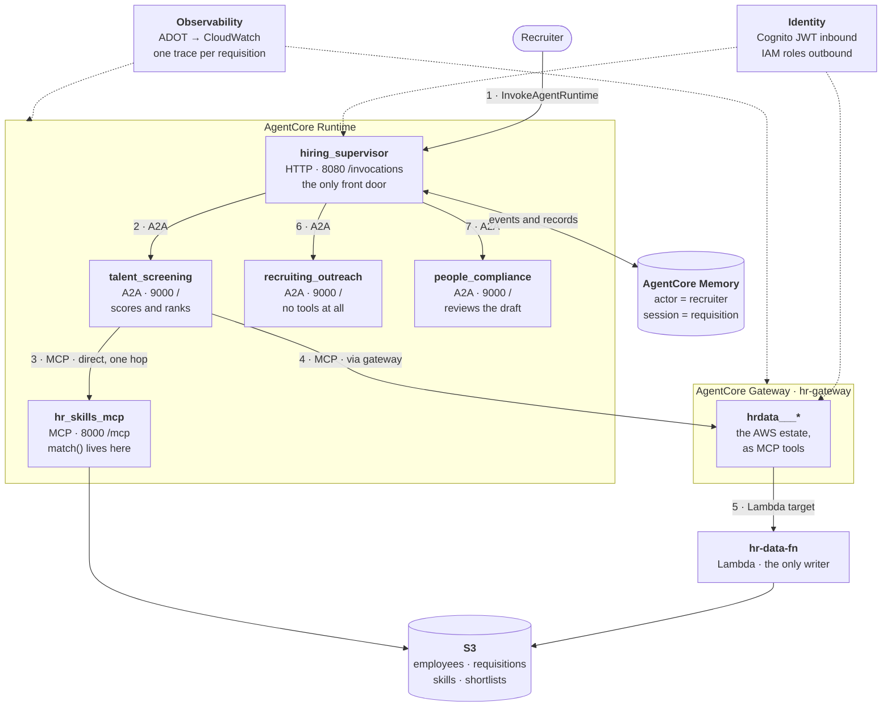
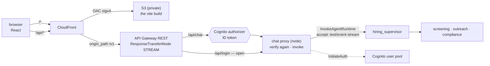
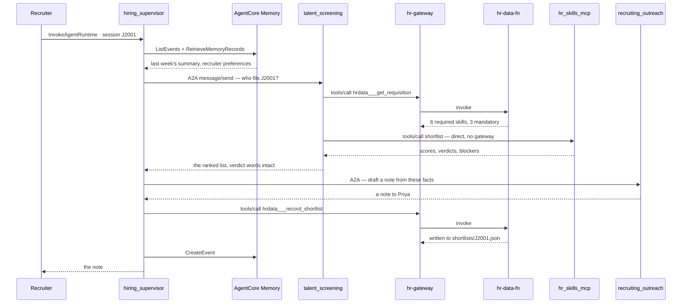

# AgentCore — architecture

The same hiring system you already ran on your laptop, moved onto **Amazon Bedrock
AgentCore**: four agents and one MCP server in Runtime, one Gateway in front of a Lambda
and an S3 bucket, one Memory resource, Cognito at the edge, and every hop landing in a
single CloudWatch trace.

The domain does not change. **Employees have skills rated 1–5, requisitions require
skills at a minimum level, and some of those are mandatory.** A candidate below a
mandatory bar is *blocked* — no score saves them. Moving to AWS changes where `match()`
runs. It does not change who has to defend the number.

> **The one line.** Locally, a port told you which agent you were talking to. On
> AgentCore an ARN does, and a **session id** — which here is the requisition id — is the
> only thread tying memory, three A2A hops and one distributed trace together.

## Table of contents

- [Context](#context)
- [Architecture](#architecture)
- [What runs where](#what-runs-where)
- [Runtime](#runtime)
- [Gateway, Lambda and S3](#gateway-lambda-and-s3)
- [Memory](#memory)
- [Identity](#identity)
- [Observability](#observability)
- [The chat UI](#the-chat-ui)
- [End to end: filling J2001](#end-to-end-filling-j2001)
- [Where lesson 17's seven layers go](#where-lesson-17s-seven-layers-go)
- [Terraform](#terraform)
- [Build order](#build-order)
- [Decisions and their reasons](#decisions-and-their-reasons)
- [Gotchas](#gotchas)
- [Remember](#remember)
- [Next steps](#next-steps)

---

## Context

Two projects in this repo already run most of this system, locally:

- [`a2a-strands/`](../a2a-strands/README.md) — a **Hiring Orchestrator** discovers a
  **Talent Screening Agent** on `:9001` and a **Recruiting Outreach Agent** on `:9002`
  over A2A, plus a **People Compliance Reviewer** on `:9007`. Three terminals, one local
  llama, nothing leaves the machine.
- [`mcp-server/`](../mcp-server/README.md) — the `hr-skills` MCP server, four tools, on
  `:8000`.

Both import the same [`_shared/hr_data.py`](../strands-ai/app/_shared/hr_data.py) — 12
employees, 6 open requisitions, 24 canonical skills with aliases, and a `match()` whose
comment reads *"Deliberately boring arithmetic, not a model call."*

Everything that makes that system work on a laptop is exactly what breaks in production:
the data is a module-level Python list, the ports are hard-coded `127.0.0.1`, the
conversation dies with the process, and when the screening agent loops the only evidence
is in somebody else's terminal.

AgentCore answers each of those, and this document maps them one to one.

---

## Architecture



**Only the supervisor is reachable from outside.** Everything else is an ARN that one
IAM principal is allowed to invoke.

Note edges 3 and 4: the screening agent holds **two** MCP connections. One goes straight
to a runtime it owns; the other goes through a Gateway to reach things it does not.
[Why that split](#why-two-mcp-connections-and-not-one) is the load-bearing decision in
this design.

---

## What runs where

| Runtime | `server_protocol` | Port · path | Replaces |
|---|---|---|---|
| `hiring_supervisor` | `HTTP` | 8080 · `/invocations` | [`orchestrator.py`](../a2a-strands/app/orchestrator.py) — a client, now a service |
| `talent_screening` | `A2A` | 9000 · `/` | [`screening_agent.py`](../a2a-strands/app/screening_agent.py) `:9001` |
| `recruiting_outreach` | `A2A` | 9000 · `/` | [`outreach_agent.py`](../a2a-strands/app/outreach_agent.py) `:9002` |
| `people_compliance` | `A2A` | 9000 · `/` | [`server.py`](../a2a-strands/app/server.py) `:9007` |
| `hr_skills_mcp` | `MCP` | 8000 · `/mcp` | [`mcp-server/app/main.py`](../mcp-server/app/main.py) |

Four agents and a tool server, five Runtime resources. Read the port column: **the three
A2A agents all listen on 9000 at `/`.** Locally the port was the address. Here the port
is a container detail nobody outside the container ever sees, and the ARN is the address.

The orchestrator changing from a script to a service is the other structural move. A
`hiring_supervisor` that anything can call needs a bounded turn count, an identity to
check, and a trace id — none of which a script in terminal 3 needed.

---

## Runtime

AgentCore Runtime is a serverless container host with per-session isolation. You give it
an image (or a zip), it gives you an ARN and an endpoint.

### The protocol contract

Runtime does not care what framework you used. It cares that your process listens on the
right port at the right path:

| Protocol | Port | Mount path | Discovery |
|---|---|---|---|
| `HTTP` | 8080 | `/invocations` | none |
| `MCP` | 8000 | `/mcp` | `tools/list` |
| `A2A` | 9000 | `/` | Agent Card at `/.well-known/agent-card.json` |
| `AGUI` | 8080 | `/invocations` (SSE) | none |

Pick the wrong one and the container starts, passes no health check, and the runtime
reports nothing useful. This table is the first thing to check when a deploy "works" but
never answers.

### The three agents that speak A2A

`serve_a2a` is the AgentCore SDK helper that wraps a Strands agent as a
Bedrock-compatible A2A server. It handles the `/ping` health endpoint, serves the Agent
Card, reads `AGENTCORE_RUNTIME_URL`, propagates the Bedrock headers, and binds 9000:

```python
from strands import Agent
from strands.multiagent.a2a.executor import StrandsA2AExecutor
from bedrock_agentcore.runtime import serve_a2a

agent = Agent(
    model=make_model(),
    system_prompt=SCREENING_PROMPT,
    tools=gateway_tools,          # from the Gateway, not from local imports
    hooks=[ToolBudget(max_calls=3)],
)

if __name__ == "__main__":
    serve_a2a(StrandsA2AExecutor(agent))
```

Compare that with [`screening_agent.py`](../a2a-strands/app/screening_agent.py), which
builds an `A2AServer(agent_factory=build_screener, host=HOST, port=PORT, skills=[...])`.
Two things carry over and one does not:

- **`hooks=[ToolBudget(max_calls=3)]` carries over, and matters more.** The reason it
  exists locally — `A2AServer` invokes the agent for you, so there is no call site at
  which to pass `limits={"turns": n}` — is exactly true of `serve_a2a`. A looping service
  behind an ARN is worse than a looping script: the caller sees a request that never
  returns, and now the evidence is in CloudWatch rather than a terminal you can see.
- **`agent_factory` does not carry over as written.** Locally it exists so two callers
  never share history. Runtime already gives you session isolation per
  `X-Amzn-Bedrock-AgentCore-Runtime-Session-Id`, so a per-context factory is belt and
  braces — keep it if you want the same code to run both ways, drop it if you do not.
- The declared `AgentSkill` (`candidate_screening`, `candidate_outreach_note`,
  `outreach_compliance_review`) is unchanged. It is what a caller reads off the card.

### The MCP server that becomes a runtime

[`mcp-server/app/main.py`](../mcp-server/app/main.py) today ends:

```python
mcp.run(transport="http", show_banner=False, port=8000)   # serves /mcp/
```

Runtime needs three settings changed, and none is cosmetic:

```python
mcp.run(transport="streamable-http", host="0.0.0.0", port=8000,
        path="/mcp", stateless_http=True, show_banner=False)
```

`host="0.0.0.0"` because a container that binds loopback is unreachable from outside
itself. `stateless_http=True` because Runtime injects an `Mcp-Session-Id` header on any
request that lacks one and load-balances across instances; a stateful server will hand a
second request to an instance that has never heard of its session. Use
`stateless_http=False` only if you need elicitation, sampling or progress notifications.

**Watch where those arguments go.** Every AWS example writes them on the constructor —
`FastMCP(host="0.0.0.0", stateless_http=True)` — because it uses the FastMCP bundled
inside the `mcp` SDK. This repo uses the standalone `fastmcp` package, which moved both
to `run()` at 3.0. On `fastmcp` 3.4.7 the constructor form raises
`TypeError: FastMCP() no longer accepts 'host'` before the server ever binds.

The four tools carried over from `mcp-server/` — `find_by_skill`, `get_requisition`,
`score_match`, `shortlist` — behave identically, but they no longer live together: the
first two are the Lambda's, reached through the Gateway, and only the last two are served
here. This split is the point of the whole layer, and it is why the counts below differ
per endpoint. So is the rule that **a returned `{"error": ...}` beats a raised exception**,
because the return value is the next thing the model reads.

### Artifacts: zip or image

```
agent_runtime_artifact {
  code_configuration {                       # no Docker involved
    entry_point = ["main.py"]
    runtime     = "PYTHON_3_13"
    code { s3 { bucket = "...", prefix = "talent_screening.zip" } }
  }
}
```

or `container_configuration { container_uri = "<ecr>:v1" }` when you need system
packages or a non-Python runtime. Start with the zip; move to ECR when you cannot.

---

## Gateway, Lambda and S3

A Gateway is a managed MCP server that fronts things which are not MCP servers. It takes
a Lambda, an OpenAPI spec, a Smithy model or an API Gateway stage and makes each one
speak `tools/list` and `tools/call`.

`hr-gateway` has exactly one target:

| Target | Kind | Backed by | Tools |
|---|---|---|---|
| `hrdata` | MCP · Lambda | `hr-data-fn` | `find_by_skill`, `get_requisition`, `list_bench`, `record_shortlist` |

```text
hrdata___find_by_skill        hrdata___list_bench
hrdata___get_requisition      hrdata___record_shortlist
```

**The Gateway is a protocol adapter, not a router.** A Lambda cannot speak MCP; the
Gateway is what makes it able to. That is the whole job, and it is why nothing that
*already* speaks MCP goes through it.

### Why two MCP connections and not one

`hr_skills_mcp` is already an MCP server on a URL. Putting it behind the Gateway too
would buy one merged `tools/list` at the price of a permanent extra hop on the hottest
call path in the system — and scoring is called once per candidate, per requisition.

| | `hr_skills_mcp` | `hr-data-fn` |
|---|---|---|
| Already speaks MCP | yes | no — it is a Lambda |
| How the agent reaches it | direct, one hop | Gateway translates |
| Auth | SigV4 with the runtime execution role | SigV4 in (`AWS_IAM`), `gateway_iam_role` out |
| Tool names | bare: `score_match` | prefixed: `hrdata___find_by_skill` |
| Adding a tool | redeploy, visible immediately | redeploy **and** update the target schema |

**Put a thing behind the Gateway when it cannot speak MCP on its own.** Everything else
is a hop you are paying for and a schema you are maintaining twice. Two clients in the
agent is a smaller cost than either.

The direct connection is ordinary Strands:

```python
runtime_url = (f"https://bedrock-agentcore.{REGION}.amazonaws.com"
               f"/runtimes/{quote(SKILLS_ARN, safe='')}/invocations?qualifier=DEFAULT")

# `auth=`, not a hand-built Authorization header: httpx re-signs per request and
# SigV4 covers a hash of the body, so one header would be wrong after the first call.
skills  = MCPClient(lambda: streamablehttp_client(runtime_url, headers=auth_headers(), auth=signer()))
gateway = MCPClient(lambda: streamablehttp_client(GATEWAY_URL, headers=auth_headers(), auth=signer()))

with skills, gateway:                  # both blocks load-bearing — see the gotchas
    agent = Agent(
        model=make_model(),
        system_prompt=SCREENING_PROMPT,
        tools=skills.list_tools_sync() + gateway.list_tools_sync(),
        hooks=[ToolBudget(max_calls=3)],
    )
```

The agent gets one flat tool list either way. The difference is where the merge happens —
in your process, for free, or in a managed service, for a hop.

### The three-underscore prefix

Gateway namespaces every tool as `{target}___{tool}` — **three** underscores — so two
targets can both export a `get_requisition` without colliding. The prefix arrives at your
Lambda and you strip it yourself:

```python
def lambda_handler(event, context):
    delimiter = "___"
    original = context.client_context.custom["bedrockAgentCoreToolName"]
    tool = original[original.index(delimiter) + len(delimiter):]

    if tool == "find_by_skill":
        return find_by_skill(event["skill"], event.get("min_level", 3))
    if tool == "record_shortlist":
        return record_shortlist(event["job_id"], event["employee_id"])
    return {"error": f"unknown tool {tool!r}"}
```

`event` is a flat map of your `inputSchema` properties — `{"skill": "pyspark",
"min_level": 4}` — not an API Gateway envelope. The context also carries
`bedrockAgentCoreGatewayId`, `bedrockAgentCoreTargetId` and
`bedrockAgentCoreMcpMessageId`, which are worth logging.

### S3 is the system of record

```
s3://hr-skills-<account>-<region>/
├── employees/employees.json        12 records, the shape in _shared/hr_data.py
├── requisitions/requisitions.json  6 open reqs: min_level · mandatory · weight
├── skills/skills.json              24 canonical skills + the alias table
├── shortlists/{job_id}.json        written by record_shortlist
├── offload/{session_id}/           ContextOffloader spill
└── artifacts/                      runtime code zips
```

`skills.json` is the file that earns its place. It is why `find_by_skill("pyspark", 4)`
returns people whose records say *"Apache Spark"*:

```text
find_by_skill(pyspark, 4) -> ['E1002', 'E1005']
```

The alias table does that — not the model, and not a fuzzy match. It also already knows
`msk` → Apache Kafka, `mwaa` → Apache Airflow and `eks` → Kubernetes, which is a happy
accident of an HR dataset written by people who work on AWS.

### Semantic tool search

`search_type = "SEMANTIC"` adds `x_amz_bedrock_agentcore_search`, letting an agent ask
for *"something that looks up an open role"* instead of reading every tool description.

Four tools do not need it. Set it anyway, because it **can only be enabled when the
gateway is created** — there is no update path, and turning it on later means recreating
the gateway and every target under it. This is the cheapest decision in the document to
get right and one of the more annoying to reverse.

---

## Memory

Two things wear the name "memory" and they behave differently.

**Short-term** is the event log. Every turn becomes a `CreateEvent`; `ListEvents`
replays a session. This is what makes a conversation survive a restart.

**Long-term** is asynchronous extraction. After events land, AgentCore extracts and
consolidates insights in the background into *memory records*, retrieved with
`RetrieveMemoryRecords` — a semantic search, not a keyword scan.

`hr_hiring_desk` carries three strategies:

| `type` | Namespace template | Holds |
|---|---|---|
| `USER_PREFERENCE` | `/recruiters/{actorId}/preferences` | "this recruiter never shortlists below 70%" |
| `SEMANTIC` | `/requisitions/{sessionId}/facts` | "E1005 is blocked on Python and SQL for J2001" |
| `SUMMARIZATION` | `/summaries/{actorId}/{sessionId}` | a week of work on one requisition, in a paragraph |

### actorId is the recruiter, sessionId is the requisition

This is the decision the whole design hangs on, and it is
[lesson 17](../strands-ai/app/17_memory_and_persistence/README.md)'s rule unchanged:
**`session_id` is a business key, not plumbing.** One conversation per open requisition.

Pick these badly and everything downstream is wrong in a way that looks like a model
problem. `sessionId = uuid4()` gives you a system that forgets J2001 between Tuesday and
Thursday. `actorId = "agent"` gives you one shared preference profile for the whole
recruiting team.

Wiring it into a Strands agent:

```python
from bedrock_agentcore.memory.integrations.strands.config import (
    AgentCoreMemoryConfig, RetrievalConfig,
)
from bedrock_agentcore.memory.integrations.strands.session_manager import (
    AgentCoreMemorySessionManager,
)

config = AgentCoreMemoryConfig(
    memory_id=MEMORY_ID,
    actor_id="recruiter-nk",       # who is working
    session_id="J2001",            # what they are working on
    batch_size=10,
    retrieval_config={
        "/requisitions/J2001/facts": RetrievalConfig(top_k=5, relevance_score=0.4),
    },
)

with AgentCoreMemorySessionManager(config, region_name=REGION) as session_manager:
    agent = Agent(system_prompt=SUPERVISOR_PROMPT, session_manager=session_manager)
```

Install with `pip install 'bedrock-agentcore[strands-agents]'`.

The `with` block is load-bearing whenever `batch_size > 1` — buffered messages that are
never flushed are simply lost. Same shape as the `with hr:` block around an `MCPClient`,
and the same failure: everything looks fine until the history has a hole in it.

---

## Identity

**One rule: a person presents a token, a machine presents a role.** The boundary between
those two is the supervisor, and it is the only place in the system where both meet.

| Direction | Mechanism | Guards |
|---|---|---|
| Browser → API Gateway | Cognito **ID** token, `COGNITO_USER_POOLS` authorizer | who may open the chat |
| Proxy → `hiring_supervisor` | the same token, relayed unchanged (`CUSTOM_JWT`) | who may start a hiring conversation |
| Supervisor → A2A runtimes | SigV4 with the supervisor's execution role | only the supervisor may delegate |
| `talent_screening` → `hr_skills_mcp` | SigV4 with the screening runtime's execution role | only the screener may score |
| `talent_screening` → `hr-gateway` | SigV4 with the same role (`AWS_IAM` gateway) | who may read the estate |
| Gateway → Lambda | `gateway_iam_role` | Gateway assumes its own role |
| Lambda → S3 | Lambda execution role | the only writer to `shortlists/` |
| `hr_skills_mcp` → S3 | Runtime execution role, **read-only** | scoring cannot mutate the record |

The last two rows are the interesting ones. Two computes read the same bucket for two
different reasons, and exactly one of them can write. **A scoring engine that can edit
the employee record is a scoring engine nobody will trust.**

Rows four and five used to be the price of the direct connection: the screener held a
Cognito token for the Gateway *and* a role for everything else, and that was the strongest
argument for putting everything behind one door. Setting `authorizer_type = "AWS_IAM"` on
the Gateway removed the argument rather than answering it. Both hops are now the same
credential, and **nothing in this system stores a password except the one Cognito user a
human logs in as.**

The reason a token could never work between services is worth keeping in view, because it
is not obvious and it costs a day to rediscover: **AgentCore consumes the `Authorization`
header at its edge and never passes it to the container.** So a runtime cannot forward the
caller's token, and it cannot mint its own — a workload access token is documented as
usable only against first-party AgentCore identity services. The only credential a
container has is the role it is already running as, which is why every inner hop is SigV4.

That has a happy consequence for start-up: SigV4 signs each request as it is sent, so a
connection opened at container boot keeps working and botocore refreshes the role's
credentials unasked. A bearer token would have to exist *before* the first request, and
`screening_toolset()` opens its MCP connections while the container is still starting.

**IAM is therefore the entire authorization model between services** — there is no second
check behind it. `05_runtimes` writes the call graph out as `local.callees` and grants
`InvokeAgentRuntime` on exactly those edges; the three leaves get no grant at all.

Set the authorizer on the runtime and it applies to every protocol — an A2A server behind
`CUSTOM_JWT` returns a `401` with a `WWW-Authenticate` header pointing at the
protected-resource metadata, per RFC 7235, rather than a JSON-RPC error.

`aws_bedrockagentcore_workload_identity` is what a runtime uses to obtain tokens for
downstream resources on behalf of a user, and is where you go when a specific recruiter's
credentials — not the agent's — must reach a downstream system.

---

## Observability

Runtime, Gateway, Memory and Identity all emit built-in CloudWatch metrics with no work
from you. Traces and spans take three steps.

**1. Turn on CloudWatch Transaction Search — once per account and region.** Nothing else
works until this is done, including the console's GenAI Observability dashboard. The traces
delivery in step 3 fails outright without it:

```
ValidationException: X-Ray Delivery Destination is supported with CloudWatch Logs
as a Trace Segment Destination
```

The docs and the console both make this look like one switch. It is two — and the second
one is invisible, because clicking "enable" in the console writes a CloudWatch Logs
**resource policy** for you that the API call does not:

```
AccessDeniedException: XRay does not have permission to call PutLogEvents
on the aws/spans Log Group
```

Note what that is *not*: there is no role to fix. The grant is attached to the log group,
not to an identity, so searching IAM for the missing permission finds nothing.
`06_observability` does both halves:

```hcl
# Half one — let X-Ray write spans. aws/spans is not created here; the service
# makes it on first write, and a policy may name a log group that does not exist.
resource "aws_cloudwatch_log_resource_policy" "xray_spans" {
  policy_name     = "TransactionSearchXRayAccess"
  policy_document = data.aws_iam_policy_document.xray_spans[0].json   # xray.amazonaws.com
}                                                                    # logs:PutLogEvents

# Half two — the switch, which fails with the 403 above unless half one landed.
resource "aws_xray_trace_segment_destination" "cwl" {
  depends_on  = [time_sleep.policy_propagation]
  destination = "CloudWatchLogs"
}
```

```bash
# the second half by hand; there is no CLI one-liner for the first
aws xray update-trace-segment-destination --destination CloudWatchLogs
```

The `time_sleep` is the same lesson as the gateway role: a policy that exists is not yet a
policy that every service can see, and X-Ray checks this one synchronously.

Worth pausing on: this is the only resource in the stack whose blast radius is the account
rather than the stack. It bills — spans are ingested as CloudWatch Logs — and a `terraform
destroy` sets the account back to X-Ray-only, which silently stops traces for anything else
relying on it. `enable_transaction_search = false` skips it and the three traces resources
together, leaving logs working, for accounts you do not own.

**2. Instrument each container.** Add to `requirements.txt`:

```
aws-opentelemetry-distro>=0.18.0
boto3
```

and start the process through the auto-instrumentor:

```dockerfile
CMD ["opentelemetry-instrument", "python", "main.py"]
```

Strands already emits OTEL GenAI semantic-convention spans, so tool calls, model calls
and token counts appear without further code. `0.18.0` is a floor, not a suggestion:
earlier versions silently ignore the span destination and write to the shared `aws/spans`
log group.

**3. Keep the session id on every hop.** Set
`X-Amzn-Bedrock-AgentCore-Runtime-Session-Id: J2001` on the inbound call and ADOT
propagates it downstream. Because the supervisor's A2A calls carry the same header, one
requisition produces **one trace across five runtimes**.

Logs land per agent:

```
/aws/bedrock-agentcore/runtimes/<agent_id>-<endpoint_name>
   ├── runtime-logs     stdout and structured logs
   └── spans            with UNIFIED_TRACES_DESTINATION_ENABLED=true
```

**Runtime creates its log group for you. Gateway and Memory do not.** They need an
explicit delivery — `put_delivery_source`, `put_delivery_destination`, `create_delivery`
— and until you configure it, the Gateway is the least observable thing in the diagram
while also being the busiest.

What this buys you concretely: the screening-agent loop that
[`a2a-strands/README.md`](../a2a-strands/README.md) describes — *"the caller just sees a
request that never returns, and all the evidence is in someone else's terminal"* — now
shows up as six identical `rank_for_requisition` spans on one trace, next to the token
count they cost.

---

## The chat UI

Everything above is reachable from a terminal. `ui/` is the same pipeline behind a chat box
on CloudFront, and its whole shape is forced by two constraints that between them rule out
every simpler design.

**A browser cannot call `InvokeAgentRuntime`.** It is a SigV4-signed AWS API call, not a
bearer-token endpoint, and AWS service endpoints send no CORS headers — so the tempting
design, where a Cognito **identity pool** hands the page real temporary credentials and the
JS SDK calls the runtime directly, dies at the preflight rather than at the permission
check. Something server-side has to make the call.

**That something cannot be Python.** Lambda response streaming works on Node.js managed
runtimes and custom runtimes only; there is no `streamifyResponse` for the Python managed
runtime. A full run is three remote delegations and a minute or two, so buffering it into
one JSON reply means a browser showing nothing at all until the end. `ui/proxy/index.mjs`
is the single Node file in this repo, and that is the entire reason for it.

In front of that Lambda is **API Gateway REST**, which is what actually exposes the
supervisor — throttling, access logs, a Cognito authorizer that rejects unauthenticated
traffic before any Lambda runs, and a `/api/*` surface any client can call, not just the
browser.



### Two layers, not one

`07_api` and `08_ui` are separate directories, and the boundary is a real one rather than a
filing convention: **07 has no browser in it.**

| | `07_api` | `08_ui` |
|---|---|---|
| answers | how does an HTTP client reach an AgentCore runtime? | how does a web page reach that API without a CORS problem? |
| contains | the proxy Lambda, API Gateway, the Cognito authorizer | S3, CloudFront, the OAC |
| callers | anything — curl, a service, CI, and the page | a browser |

Apply 07 on its own and you have a working API and no website. That it is a legitimate
place to stop is the test for whether a layer deserves its own directory — the same test
that puts Memory at 04, before the runtimes that need its id.

The dependency runs 07 → 08 and only one way: 08 needs `api_domain` and `api_stage` to
point CloudFront at the API. They are two outputs rather than one invoke URL because
CloudFront wants them in two different arguments, and splitting a URL back apart in HCL is
how `https://` ends up inside a `domain_name`.

### Why API Gateway is possible here at all

Until November 2025 it was not. API Gateway REST buffered every Lambda response and
fixed the integration timeout at 29 seconds, so a pipeline that runs for one to two
minutes did not fit through it — the only streaming-capable front door was a Lambda
function URL. [`response_transfer_mode = "STREAM"`](https://aws.amazon.com/about-aws/whats-new/2025/11/api-gateway-response-streaming)
changed that.

Note which half matters. The timeout was raised for buffered integrations too (300
seconds, and 900 with streaming), so a buffered API would now *finish* the run — and
still show the browser nothing until the last delegation returned. It is the streaming
that this design needs, not the ceiling.

Streaming integrations invoke through `InvokeWithResponseStream`, which is a different
API version **and** a different action in the integration URI:

```
arn:aws:apigateway:{region}:lambda:path/2021-11-15/functions/{fn-arn}/response-streaming-invocations
                                          ^^^^^^^^^^                 ^^^^^^^^^^^^^^^^^^^^^^^^^^^^^^
                                     not 2015-03-31              not /invocations
```

Pairing `STREAM` with the ordinary proxy URI is not a graceful fall back to buffered.
It is a 500.

The output format is a JSON metadata prelude, then **eight null bytes**, then the
payload. Nothing in `ui/proxy/index.mjs` writes that delimiter, because
`awslambda.HttpResponseStream.from()` emits it automatically — which is also why the
same handler worked unchanged behind a function URL.

### ID tokens, not access tokens

A `COGNITO_USER_POOLS` authorizer has two modes, and the docs give each one sentence:
the **ID** token authorizes on identity claims, the **access** token on custom scopes.
Leaving `authorization_scopes` unset selects the first. Sending an access token to an
authorizer with no scopes is the configuration that half-works and then fails
per-request; making it work properly means a Cognito resource server, a custom scope,
and that scope allowed on the app client — three resources to avoid one word.

So `/api/login` returns `IdToken`, and the proxy verifies `token_use === "id"`.

Two details that bite if you ever switch back:

- **The audience claim moves.** An ID token carries `aud`; an access token carries
  `client_id`. Checking the wrong one passes silently for any token from the right pool.
- **No `Bearer ` prefix.** The authorizer is documented only as *"include the token in
  the Authorization header"*, and the bare form is the one that reliably passes. A
  prefix is a 401 with nothing in it to say why. The proxy strips an optional prefix
  regardless, so the local path tolerates both.

### One distribution, two origins

Serving the API from the same distribution as the page is not tidiness. It is what removes
CORS **entirely** — there is no second origin for the browser to be told about, so there is
no preflight, no `Access-Control-Allow-Origin`, and no credentialed-cross-origin problem.
Split them and you spend an afternoon on headers.

Three settings on that `/api/*` behaviour are load-bearing, and two of them look like
performance tuning:

| Setting | Must be | Because |
|---|---|---|
| `response_transfer_mode` | `STREAM` | `BUFFERED` collects the whole SSE stream and delivers it at the end. The deploy looks fine and the progress feed never appears. |
| `compress` | `false` | CloudFront buffers in order to compress. Same symptom, arriving via a checkbox that reads like a speed-up. |
| origin request policy | `AllViewerExceptHostHeader` | API Gateway routes on the `Host` header. Forward the viewer's and every request is a 403 that reads like a permissions bug. |
| `origin_path` | `/{stage}` | The stage is a path segment on `execute-api`. Without it the origin is asked for `/api/chat` and the API only answers at `/v1/api/chat`. |

Putting the stage in `origin_path` rather than in the React is what keeps it invisible to
the browser — and keeps `npm run dev`, which has no stage at all, calling the same paths.

**Only S3 gets an OAC.** CloudFront's origin access control has no `apigateway` origin
type, so unlike the function URL it replaced, the API is reachable directly on its
`execute-api` domain. That is the trade you accept when you expose an API on purpose: the
Cognito authorizer is the gate now, not network placement. It is also why the stage
carries a throttle — `/api/login` is unauthenticated by necessity, since it is where you
get the token.

### The entrypoint becomes a generator

This is the only change the streaming required on the agent side:

```python
@app.entrypoint
async def invoke(payload, context):          # async def + yield
    async for event in stream_pipeline(...):
        yield event
```

`bedrock_agentcore` inspects the entrypoint, sees an async generator, and returns
`StreamingResponse(media_type="text/event-stream")` rather than a JSON body. Make it a
plain `def` returning a dict and everything still works — it just shows nothing until the
last delegation finishes.

The events come from `Agent.stream_async`, and dedupe is on **`toolUseId`, not the tool
name**. `current_tool_use` is re-yielded on every chunk while a tool's arguments accumulate,
so a pass-through announces one delegation thirty times; keying on the name fixes that and
hides the *second* legitimate call to the same tool, which is exactly what happens when
outreach is asked again with the corrective message.

Those repeats are real, and the UI groups them per agent with a count rather than pretending
they did not happen:

```
  ✓ Screening Agent — ranking candidates          ×4
  ✓ Outreach Agent — drafting the note
  • Compliance Reviewer — checking it against the record
```

### Two gotchas with no warning attached

**`runtimeSessionId` has a minimum length of 33 characters.** The obvious value to send is
the requisition id, and `J2001` comes back as a `ValidationException`. The browser keeps one
id per chat thread instead — which is better anyway, because the memory namespace is
templated on `{sessionId}`, so a thread is what makes a follow-up question remember the
answer before it.

**Chunk boundaries are not frame boundaries.** `EventSource` cannot send an `Authorization`
header, so the client is `fetch` plus a manual reader — which puts SSE framing in our hands.
A single `read()` can deliver half a frame or three and a half. Parsing each chunk as one
message passes every manual test against localhost and drops events in production;
`ui/src/api.test.js` feeds the parser splits mid-JSON, between the two terminating newlines,
and one byte at a time.

### Local, without any of it

`scripts/ui_server.py` serves the same two routes over the same paths against the local
supervisor, so `ui/src` is written once and never learns which world it is in. No Cognito,
no AWS, and no authentication at all — the same reason `auth_headers()` sends nothing to an
A2A server on `127.0.0.1`, and the same reason you would not expose either.

---

## End to end: filling J2001



Count the hops on the two tool calls: `hrdata___get_requisition` goes
agent → gateway → Lambda, and `shortlist` goes agent → runtime. Same flat tool list from
the model's point of view; one fewer network segment on the call that runs per candidate.

What comes back from `shortlist`, verified against
[`hr_data.py`](../strands-ai/app/_shared/hr_data.py):

```text
E1002 Priya Raman     100% strong    blockers=[]
E1003 Rahul Menon      61% blocked   blockers=['Apache Spark']
E1005 Vikram Iyer      50% blocked   blockers=['Python', 'SQL']
```

Rahul is second by score and cannot be hired. **The ranking is by score; the decision is
the verdict.** For the final note to be correct, four things must hold across five
runtimes, and they are the same four as on the laptop:

1. `match()` computes the blocker — arithmetic, in `hr_skills_mcp`, not a model call.
2. The screening agent uses the verdict word **exactly**: `blocked` is never softened.
3. The supervisor passes the screening text through **verbatim**, not summarised.
4. The outreach agent refuses to write to a candidate with blockers.

Break any one and you send a warm note to someone who cannot do the job. Distribution
adds a fifth failure mode the laptop did not have: a `SUMMARIZATION` memory strategy
paraphrasing "blocked on Apache Spark" into "some gaps" and feeding *that* back next
Tuesday. **Every hop is a chance to paraphrase, and paraphrase drops the blocker** — which
is why the facts go into the A2A message body verbatim and memory is read for context,
never for verdicts.

---

## Where lesson 17's seven layers go

[Lesson 17](../strands-ai/app/17_memory_and_persistence/README.md) taught seven
persistence layers over one `Storage` interface. Six of them are unchanged by AgentCore —
they run inside your container. This table is the answer to *"I did lesson 17, what
actually changes?"*

| Lesson 17 layer | Local | On AgentCore |
|---|---|---|
| `invocation_state` | dict passed to `agent(...)` | unchanged — one `InvokeAgentRuntime` call |
| `agent.state` | in-process dict | unchanged, rehydrated by the session manager |
| Conversation management | `SlidingWindow` / `Summarizing` | unchanged — runs in your container |
| Context management | `ContextOffloader` → `.run/offload/` | same offloader, S3 backend |
| Session | `FileSessionManager` | `AgentCoreMemorySessionManager` → `CreateEvent` |
| Snapshots | `SnapshotSessionManager` | still yours; the blob goes to S3 |
| Memory | `TestMemoryStore` — one JSON file, keyword overlap | Memory strategies — `RetrieveMemoryRecords`, semantic |
| Storage | `LocalFileStorage` | S3 |

**Only the bottom four rows move.** Everything above the line is a decision about what
the model reads, and AgentCore has no opinion about it.

The `MemoryStore` protocol is `search` plus optionally `add` — which is why lesson 17's
`main.py` can say *"Swap for `BedrockKnowledgeBaseStore` and nothing else changes."* The
same seam takes an AgentCore-backed store.

---

## Terraform

The AWS provider **6.58.0** already vendored in [`terraform/`](../terraform/) has every
resource this design needs. Representative blocks — one per capability.

> The complete inventory — every variable, data source, resource and output in all eight
> modules, and the dependency graph between them — is
> [`terraform/README.md`](terraform/README.md). What follows here is the interesting
> subset, chosen to explain the design rather than to enumerate it.

### An A2A runtime

```hcl
resource "aws_bedrockagentcore_agent_runtime" "talent_screening" {
  agent_runtime_name = "talent_screening"
  role_arn           = aws_iam_role.runtime_screening.arn

  agent_runtime_artifact {
    code_configuration {
      # Two elements. Drop `opentelemetry-instrument` and you lose every span —
      # the agent still works, so nothing tells you.
      entry_point = ["opentelemetry-instrument", "main.py"]
      runtime     = "PYTHON_3_13"
      code {
        s3 {
          bucket = aws_s3_bucket.hr.id

          # **Content-addressed, not a fixed key.** A runtime points at its code
          # as bucket + prefix, so with a constant prefix a rebuilt zip replaces
          # the bytes in S3 and changes nothing here: no diff, no new version,
          # and the container keeps running whatever it started with. Nothing
          # reports it — the apply looks clean and the artifact really is in the
          # bucket. The only tell is an `agent_runtime_version` that never moves.
          prefix = "artifacts/talent_screening-${filemd5(local.zip)}.zip"
        }
      }
    }
  }

  protocol_configuration { server_protocol = "A2A" }
  network_configuration  { network_mode    = "PUBLIC" }

  environment_variables = {
    AGENT_OBSERVABILITY_ENABLED          = "true"
    UNIFIED_TRACES_DESTINATION_ENABLED   = "true"
    GATEWAY_URL                          = aws_bedrockagentcore_gateway.hr.gateway_url
  }

  # No authorizer_configuration: omit it and the runtime takes SigV4, which is
  # what every caller inside the account can actually present.
}

```

`hr_skills_mcp` is the same block with `server_protocol = "MCP"`. `hiring_supervisor` is
`"HTTP"` **and** the one runtime that adds an authorizer, because the caller is a person:

```hcl
  authorizer_configuration {
    custom_jwt_authorizer {
      discovery_url = local.cognito_discovery_url
      # `allowed_audience`, NOT `allowed_clients`. They check different claims:
      # `aud` on an ID token, `client_id` on an access token. This stack uses ID
      # tokens end to end, so `allowed_clients` rejects the very token the API
      # Gateway authorizer just accepted — with a bare 401.
      allowed_audience = [aws_cognito_user_pool_client.hr.id]
    }
  }
```

**Do not declare a `DEFAULT` endpoint.** `CreateAgentRuntime` makes one as part of the same
call, so an `aws_bedrockagentcore_agent_runtime_endpoint` named `DEFAULT` does not adopt it
— it tries to create a second, and every apply fails:

```
ConflictException: An endpoint with the specified name already exists
```

Waiting does not help; the endpoint really does exist. Invoking with a runtime ARN and no
`--qualifier` uses `DEFAULT` anyway. Declare an endpoint only when you want a *named* alias
(`prod`) to repoint across runtime versions.

### The gateway

```hcl
resource "aws_bedrockagentcore_gateway" "hr" {
  name            = "hr-gateway"
  role_arn        = aws_iam_role.gateway.arn
  protocol_type   = "MCP"

  # A Gateway takes AWS_IAM too — it is not CUSTOM_JWT-only, which is the
  # assumption that makes people ship a machine password in a container. The only
  # caller is the screening runtime, and it has a role.
  #
  # **`authorizer_type` is immutable.** Changing it replaces the gateway and every
  # target under it, and the replacement has a new `gateway_url`.
  authorizer_type = "AWS_IAM"

  # authorizer_configuration is omitted entirely for AWS_IAM. Set
  # gateway_authorizer_type = "CUSTOM_JWT" to get the Cognito block back — the one
  # reason to, since it is what MCP Inspector can present.

  protocol_configuration {
    mcp {
      instructions = "HR skills matching: employee records, open requisitions, and scoring."
      search_type  = "SEMANTIC"
    }
  }
}
```

### The Lambda target

```hcl
resource "aws_bedrockagentcore_gateway_target" "hrdata" {
  name               = "hrdata"
  gateway_identifier = aws_bedrockagentcore_gateway.hr.gateway_id

  credential_provider_configuration {
    gateway_iam_role {}
  }

  target_configuration {
    mcp {
      lambda {
        lambda_arn = aws_lambda_function.hr_data.arn

        tool_schema {
          inline_payload {
            name        = "find_by_skill"
            description = "Employees with a skill at or above a level. Accepts aliases: 'pyspark' resolves to 'Apache Spark'."
            input_schema {
              type = "object"
              property {
                name        = "skill"
                type        = "string"
                description = "Skill name or alias"
                required    = true
              }
              property {
                name        = "min_level"
                type        = "integer"
                description = "1-5, default 3"
              }
            }
          }
        }
      }
    }
  }
}
```

One `inline_payload` per tool — five blocks for the Lambda's five. The description is not
decoration — it is the only thing the model reads when deciding whether to call this
instead of `score_match`.

**This is the schema you now maintain twice**: once in the Lambda's Python and once in
HCL. Nothing checks them against each other. It is the tax the Gateway charges for making
a Lambda speak MCP, and it is the reason to route only the things that need routing.

### Handing the runtime URL to the screening agent

There is no `hrskills` gateway target. The screening agent connects to `hr_skills_mcp`
directly, so what Terraform provides is an environment variable:

```hcl
resource "aws_bedrockagentcore_agent_runtime" "talent_screening" {
  # ...
  environment_variables = {
    SKILLS_MCP_ARN = aws_bedrockagentcore_agent_runtime.hr_skills_mcp.agent_runtime_arn
    GATEWAY_URL    = aws_bedrockagentcore_gateway.hr.gateway_url
    AWS_REGION     = var.region
  }
}
```

The agent builds the invocation URL from the ARN at start-up. Had the MCP server gone
behind the Gateway instead, the equivalent block would be:

```hcl
target_configuration {
  mcp {
    mcp_server {
      endpoint = "https://bedrock-agentcore.${var.region}.amazonaws.com/runtimes/${urlencode(ARN)}/invocations?qualifier=DEFAULT"
    }
  }
}
```

Keep it in your back pocket. The day a second agent — or a partner team, or Claude
Desktop — needs the scoring tools without an execution role that can invoke the runtime,
that block is the answer, and no code changes.

### Memory and its strategies

```hcl
resource "aws_bedrockagentcore_memory" "hiring_desk" {
  name                      = "hr_hiring_desk"
  event_expiry_duration     = 90
  memory_execution_role_arn = aws_iam_role.memory.arn
}

resource "aws_bedrockagentcore_memory_strategy" "facts" {
  name                = "candidate_facts"
  memory_id           = aws_bedrockagentcore_memory.hiring_desk.id
  type                = "SEMANTIC"
  description         = "Facts about candidates and requisitions"
  namespace_templates = ["/requisitions/{sessionId}/facts"]
}

resource "aws_bedrockagentcore_memory_strategy" "preferences" {
  name                = "recruiter_preferences"
  memory_id           = aws_bedrockagentcore_memory.hiring_desk.id
  type                = "USER_PREFERENCE"
  namespace_templates = ["/recruiters/{actorId}/preferences"]
}

resource "aws_bedrockagentcore_memory_strategy" "summaries" {
  name                = "requisition_summary"
  memory_id           = aws_bedrockagentcore_memory.hiring_desk.id
  type                = "SUMMARIZATION"
  namespace_templates = ["/summaries/{actorId}/{sessionId}"]
}
```

**Terraform's `type` values are not the API's field names.** Terraform wants
`SEMANTIC` / `SUMMARIZATION` / `USER_PREFERENCE` / `EPISODIC` / `CUSTOM`; boto3 wants
`semanticMemoryStrategy` / `summaryMemoryStrategy` / `userPreferenceMemoryStrategy` /
`episodicMemoryStrategy` nested under `memoryStrategies`. You will meet both, often in
the same afternoon. Note especially that "summary" and `SUMMARIZATION` are different
words for the same thing.

### The rest

| Resource | Purpose |
|---|---|
| `aws_s3_bucket` + `aws_s3_object` | the bucket and the seed JSON |
| `aws_lambda_function` `hr-data-fn` | the data tools |
| `aws_lambda_permission` | lets `bedrock-agentcore.amazonaws.com` invoke it |
| `aws_iam_role` × 6 | one per runtime, one for the gateway, one for Lambda, one for memory |
| `aws_cognito_user_pool` + `_client` | inbound JWT |
| `aws_cloudwatch_log_group` | vended-log destinations for gateway and memory |
| `aws_bedrockagentcore_workload_identity` | on-behalf-of tokens |
| `aws_xray_trace_segment_destination` + `aws_cloudwatch_log_resource_policy` | Transaction Search — the two halves of one console checkbox |
| `aws_cloudfront_distribution` + two `_origin_access_control` | the chat UI: S3 and the proxy under one domain |
| `aws_lambda_function_url` | `RESPONSE_STREAM`, `AWS_IAM` — reachable only through CloudFront |

---

## Build order

Each step is verifiable on its own. Do not proceed past a step you cannot prove.

1. **S3 + seed data.** `aws s3 cp` the three JSON files. Verify with `aws s3 ls`.
2. **Lambda `hr-data-fn`.** Test with `aws lambda invoke` and a hand-written
   `client_context`. Verify `find_by_skill("pyspark", 4)` returns `['E1002', 'E1005']`.
3. **Cognito pool + client.** Verify the discovery URL resolves. The token it mints is for
   the supervisor's front door; nothing between services needs one.
4. **Gateway + the `hrdata` target.** `make gateway` — it opens a SigV4-signed MCP session
   and lists what the Gateway publishes. **MCP Inspector cannot be used here**: it sends a
   bearer token and cannot sign SigV4, so it only works if you set
   `gateway_authorizer_type = "CUSTOM_JWT"`.
5. **`hr_skills_mcp` runtime.** Test locally on `:8000/mcp` first, then deploy and probe the
   runtime URL — `scripts/probe_gateway.py --url <runtime url>`, since this runtime has no
   authorizer either and so also wants SigV4 rather than the Inspector. `tools/list` must
   show four **unprefixed** tools — that difference is the whole design in one screen.
6. **Both clients in one process.** A twenty-line script with two `MCPClient`s and no
   agent: assert the merged list has **nine** tools and no duplicate names — three from
   `hr_skills_mcp`, five `hrdata___*` from the Gateway, and one you did not write.
   `x_amz_bedrock_agentcore_search` is added by the Gateway itself; count on eight and this
   assertion fails for a reason that has nothing to do with your tools.
7. **The three A2A runtimes.** Fetch each Agent Card before sending any message —
   the card proves the container is alive and the protocol is right.
8. **`hiring_supervisor`.** Invoke it — but **not** with `runtimeSessionId="J2001"`. That
   is the obvious thing to send and the API rejects it: the minimum length is 33
   characters. Use something like `J2001-<uuid>` and pass the requisition in the payload.
9. **Memory.** Add the session manager, run two conversations a day apart, and confirm
   the second one recalls the first.
10. **Observability.** Transaction Search, then ADOT, then check the GenAI Observability
    dashboard for one trace spanning five runtimes.
11. **The chat UI.** `make ui-api` and `make ui-dev` first — the whole front end runs
    against the local supervisor with no AWS in it. Only once a free-form prompt streams a
    progress feed locally is it worth putting CloudFront under it.

Steps 1–6 need no agent at all. That is the point of the ordering: **debug the tools with
a client that has no model in it**, exactly as
[`raw_client.py`](../a2a-strands/app/raw_client.py) does locally.

> **This is the order you prove things in, not the order Terraform creates them.** Memory
> is exercised last but must *exist* before the runtimes — the supervisor takes `MEMORY_ID`
> as an environment variable — so it is `04_memory`, applied before `05_runtimes`. The two
> orderings answer different questions: this list asks "what can I verify next?", the
> directory numbers answer "what does the next resource need?".

---

## Decisions and their reasons

**The supervisor is a Runtime, not a Lambda.** It is a conversation with a session, a
memory and a turn budget — none of which fits a function whose contract is one request in,
one response out. The A2A specialists could each be a Lambda if they were stateless, and
they are not: `serve_a2a` maintains a task lifecycle.

**The Gateway fronts only the Lambda; the agent reaches `hr_skills_mcp` directly.** The
Gateway's job is protocol translation, and `hr_skills_mcp` needs none — it is already an
MCP server on a URL. Routing it through anyway would add a permanent hop to the call that
runs once per candidate, and a second copy of its tool schema in HCL, in exchange for
merging two `tools/list` responses that the Strands client merges for free. **Put a thing
behind the Gateway when it cannot speak MCP on its own.**

The cost is real and worth naming: the screening agent now holds two MCP clients and two
credentials, and no single console page shows every tool it can call. Reverse the decision
the moment a caller needs the scoring tools *without* an execution role that can invoke
the runtime — a partner team, a desktop client, a second gateway-fronted product. That is
a one-resource change with no code in it, which is exactly why it is safe to defer.

**Lambda owns writes; the MCP runtime reads.** They both touch S3, which looks like
duplication until you look at the IAM roles. Scoring is a pure function of the record, so
the process that scores has no business changing it. Splitting them makes that
enforceable rather than merely intended.

**`match()` stays in Python, in a container.** It is 40 lines of weighted arithmetic with
partial credit below the bar. Reimplementing it as a Bedrock prompt would make it
unreproducible, and **a match score you cannot reproduce by hand is a score nobody will
defend in a hiring review.** The model decides *who* to score and explains the result; it
never invents the number.

**Session id is the requisition id.** It is the only choice that makes short-term memory,
long-term namespaces and distributed traces agree with each other and with how the
business talks. A UUID would work for all three mechanisms and be useless to the recruiter
asking "what happened on J2001 last week".

**`code_configuration` from an S3 zip, not ECR, for all five runtimes.** Nothing here
needs a system package. The zip path removes Docker, a registry, an image-scanning story
and a build step from a course project. Switch to `container_configuration` the day you
need a native dependency.

**Every A2A runtime keeps its `ToolBudget` hook.** `serve_a2a`, like `A2AServer`, invokes
the agent for you, so there is no call site at which to pass `limits`. The agent loop
recurses once per cycle; unbounded, it walks off the stack. Behind an ARN, the caller
sees a request that never returns.

**No VPC.** `network_mode = "PUBLIC"` with JWT at the edge and IAM everywhere else.
A VPC adds subnets, endpoints and NAT to a system whose only data store is S3. Move to
`VPC` when the data store is an RDS instance — and the Gateway's `private_endpoint` block
is waiting when you do.

**The compliance reviewer stays in the design.** Locally it is an optional fourth agent
in `app/server.py`. Here it demonstrates the thing that actually gets asked in review —
*"who checked the note before it went out?"* — and it costs one more runtime.

---

## Gotchas

- **The protocol determines the port, and nothing tells you when you get it wrong.** A2A
  is 9000 at `/`, MCP is 8000 at `/mcp`, HTTP is 8080 at `/invocations`. Bind 8080 in an
  A2A container and the deploy succeeds, the health check fails, and the error you see is
  a timeout.
- **`stateless_http=True` is not optional for a load-balanced MCP server.** Runtime adds
  an `Mcp-Session-Id` to any request lacking one; a stateful server will be handed a
  second request by an instance that never saw the first.
- **Semantic tool search can only be enabled at gateway creation.** There is no update
  path. Recreating a gateway means recreating every target.
- **Gateway and Memory do not create log groups.** Runtime does. Until you configure
  vended log delivery, the busiest component in the diagram is the only silent one.
- **ADOT below 0.18.0 ignores the span destination.** Spans go to the shared `aws/spans`
  group and your per-agent log group looks empty. The version floor is real.
- **Log permissions do not grant trace permissions.** Spans go to X-Ray, so the runtime role
  needs `xray:PutTraceSegments` and friends on top of `logs:*`. Without them every export is
  a 403 the agent survives — it answers normally and the dashboard stays empty, which is a
  much quieter failure than a broken agent.
- **Do not declare a `DEFAULT` runtime endpoint.** `CreateAgentRuntime` makes one in the
  same call, so declaring it does not adopt it — every apply fails with
  `ConflictException`. Waiting does not help; the endpoint genuinely exists.
- **`runtimeSessionId` has a minimum length of 33.** The obvious value is the requisition
  id, and `J2001` is a `ValidationException` — on `GetAgentCard` as well as
  `InvokeAgentRuntime`. Pad it deterministically: the session id is what stitches five
  runtimes into one trace, so a random suffix per hop gives five traces that share nothing.
- **A2A discovery crosses the auth boundary too, and it is a separate IAM action.** The
  agent card is fetched with a plain `GET .../invocations/.well-known/agent-card.json`,
  which is the documented `GetAgentCard` API — so it must be signed exactly as the message
  will, it enforces the same 33-character session id, and it needs
  **`bedrock-agentcore:GetAgentCard`**, which `InvokeAgentRuntime` does not imply. Grant
  only the invoke and every delegation dies at discovery with a `403` before it sends
  anything. A delegation that fails at discovery looks like the remote agent
  is down; it is the credential, one call earlier than you are looking. Note that **401 is
  not in that API's documented error list** (400/402/403/
  404/409/424/429/500), so a 401 is the service's auth frontend rejecting you before the
  API is reached.
- **Enabling Transaction Search is two operations.** The console's one checkbox also
  writes a CloudWatch Logs resource policy; the API call does not, and fails with
  *"XRay does not have permission to call PutLogEvents on the aws/spans Log Group"*. There
  is no role to fix — the grant is attached to the log group, so IAM shows you nothing.
- **CloudFront `compress = true` breaks SSE.** It buffers in order to compress, so the
  whole stream arrives at the end. Identical symptom to a `BUFFERED` integration, reached
  through a setting that reads like a performance tweak.
- **A streaming API Gateway integration needs a different URI.** `2021-11-15` and
  `/response-streaming-invocations`, not `2015-03-31` and `/invocations`. Pairing `STREAM`
  with the ordinary proxy URI is a 500, not a fall back to buffered.
- **A Cognito authorizer with no scopes wants the ID token**, and wants it bare — no
  `Bearer ` prefix. An access token, or a prefix, is a 401 with nothing in it to say why.
- **An API Gateway deployment is a snapshot.** Change a method without re-deploying and
  terraform applies cleanly while the stage keeps serving the previous version. Hence the
  `triggers` hash on `aws_api_gateway_deployment`.
- **API Gateway does not log with the stage's own permissions.** It assumes a role recorded
  in account settings, once per region, and a stage that logs cannot be created before it
  exists: *"CloudWatch Logs role ARN must be set in account settings to enable logging"*.
  The fix is `aws_api_gateway_account`, a resource nothing in your API refers to — so
  nothing but `depends_on` orders it.
- **Two settings in this stack belong to the account, not the stack.** Transaction Search
  (06) and the API Gateway CloudWatch role (07). Both default on because their layer cannot
  work otherwise; both have an opt-out that disables the dependent resources with them, so
  `false` is a smaller working stack rather than a failed apply.
- **A CUSTOM_JWT runtime cannot be invoked with the AWS SDK.** The SDK signs SigV4; a
  JWT-configured agent wants a bearer token over plain HTTPS. AWS says so directly, and the
  error — *"Authorization method mismatch"* — names the symptom rather than the rule.
- **You cannot forward the caller's bearer token to the next runtime.** AgentCore consumes
  `Authorization` at its edge and never passes it to the container, so
  `context.request_headers` has no token to reuse — and a workload access token is
  documented as usable *only* against first-party AgentCore identity services, not for
  invoking another runtime. Nothing in a container can obtain a Cognito token without
  shipping a password. That is why the four inner runtimes take **SigV4** and only the
  supervisor keeps CUSTOM_JWT: humans authenticate with Cognito, machines with IAM.
- **The Gateway takes `AWS_IAM` as well**, and needs `bedrock-agentcore:InvokeGateway` —
  a different action from `InvokeAgentRuntime`. It matters most for the *timing*: the
  screener opens that MCP connection at container start-up, before any request exists, so a
  bearer token could never have been there to use. `authorizer_type` is immutable, so
  changing it replaces the gateway and all its targets.
- **`allowed_audience` and `allowed_clients` check different claims.** `aud` on an ID
  token, `client_id` on an access token. Set the wrong one and the runtime rejects the very
  token the front door just accepted. Set one, never both: an ID token has no `client_id`
  to match.
- **A fixed S3 key means your code never ships.** A runtime references its code as bucket +
  prefix. Rebuild the zip under the same key and the bytes change while the runtime's
  arguments do not — no diff, no update, no new version, and the container keeps running
  what it started with. `terraform apply` reports the S3 object updating, so it looks like a
  successful deploy. Put the content hash in the key. The tell is an
  `agent_runtime_version` that never moves.
- **A runtime has 30 seconds to become healthy, and dependencies are what spend it.**
  `strands-agents[a2a]` drags in a PostgreSQL driver, an ORM and gRPC — ~45 MB of things
  this system never imports — and `aws-opentelemetry-distro` installs ~45 instrumentations
  that `opentelemetry-instrument` walks before the server binds. Prune the first, disable
  the second. The failure is HTTP 424, which reads like a client error.
- **Terraform's memory strategy `type` is not the boto3 field name.** `SUMMARIZATION`
  in HCL, `summaryMemoryStrategy` in the SDK. Searching the docs for one will not find
  the other.
- **The tool prefix is three underscores, not two.** `hrdata___find_by_skill`. A handler
  that splits on `__` gets `_find_by_skill` and matches nothing.
- **Gateway tools are prefixed; direct MCP tools are not.** The screening agent's list
  mixes `hrdata___get_requisition` with a bare `score_match`, and a system prompt that
  names tools has to spell both correctly. Name capabilities, not tool strings, and the
  prompt survives moving a tool from one side to the other.
- **Two `MCPClient`s means two `with` blocks, and leaving either one is silent.** The
  agent keeps the tool *names* in its history and starts improvising rather than erroring.
  A dead scoring connection looks exactly like a model that has decided to guess.
- **A required tool parameter the model will not think to supply is a loop generator.**
  This is the same lesson as
  [`ask_outreach_agent(screening_facts: str = "")`](../a2a-strands/README.md): make it
  optional and return instructions. A bare validation error, repeated, is what a runaway
  invocation looks like from the outside.
- **`batch_size > 1` without a `with` block loses messages.** The buffer is not flushed on
  garbage collection. Same failure shape as leaving an `MCPClient` context early.
- **Runtime sessions are isolated but not free.** A new `runtimeSessionId` per request
  means a new microVM and a cold conversation; reusing one forever means it never expires.
  Key it to the requisition and you get the right lifetime for free.
- **The A2A agent card URL is not the base URL.** It is
  `runtimes/{escaped_arn}/invocations/.well-known/agent-card.json`, and the ARN must be
  URL-encoded — colons and slashes both.
- **A `SUMMARIZATION` strategy will paraphrase a blocker into a gap.** Read memory for
  context; read the current `match()` for verdicts. Never the other way round.

---

## Remember

> **Runtime is where it runs. Gateway is what it can reach. Memory is what it carries
> between Tuesdays. Identity is who may ask. Observability is the only reason you will
> ever find out what happened. And the requisition id is the thread through all five.**

---

## Next steps

- Run the local original first — [`a2a-strands/`](../a2a-strands/README.md) is this
  topology in three terminals, and every failure here has a cheaper version there.
- [`mcp-server/`](../mcp-server/README.md) is the server that becomes `hr_skills_mcp`;
  the stdio-vs-HTTP table there is the same decision as the protocol table here.
- [Lesson 17](../strands-ai/app/17_memory_and_persistence/README.md) is the prerequisite
  for the Memory section — the seven layers, and which four of them AWS takes over.
- [`terraform/`](../terraform/) has the provider and the state-backend patterns; the
  AgentCore resources above assume the `18_state` S3 backend.
