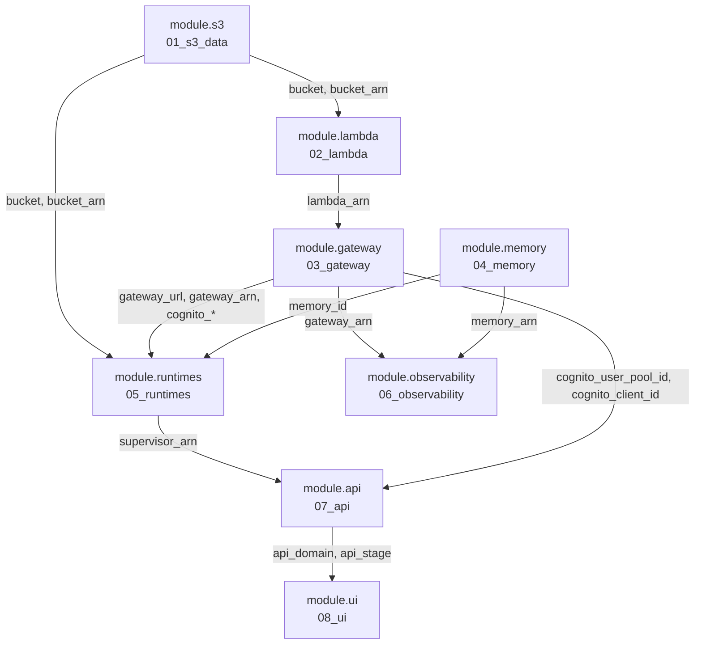

# 00_all_at_once — the composing root

The whole stack in one `apply`. **Zero resources and zero data sources of its
own** — it is eight `module` blocks, one `provider`, six variables and twelve
outputs.

```bash
uv run scripts/package.py && uv run scripts/seed_s3.py && make ui-build
terraform init && terraform apply -var-file=dev.tfvars
```

or, from the repo root:

```bash
make deploy          # artifacts, then this directory
```

---

## What this module is for

The eight numbered directories are the same eight modules, called here as
children. **Nothing is copied by hand:** `module.gateway.gateway_url` feeding
`module.runtimes.gateway_url` *is* the dependency, so Terraform works out the
order itself and applies them in it.

The numbered directories still work standalone — they declare no provider, so
Terraform builds a default one from `AWS_REGION` / `~/.aws/config`. Use them when
you want to stop after a layer and look at what you made; use this when you just
want the system.

To stop after one layer from here instead:

```bash
terraform apply -target=module.s3
```

---

## The graph



**Read the arguments, not the order.** The `module` blocks appear in numeric
order for readability, but Terraform ignores that entirely — the references are
the graph. `module.memory` has no inputs from anything, so it is built in
parallel with 01–03.

### What flows where

| Producer | Output | Consumer | As |
|---|---|---|---|
| 01 | `bucket`, `bucket_arn` | 02, 05 | same names |
| 02 | `lambda_arn` | 03 | `lambda_arn` |
| 03 | `gateway_url` | 05 | `gateway_url` |
| 03 | `gateway_arn` | 05, 06 | `InvokeGateway` scope / delivery source |
| 03 | `cognito_discovery_url`, `cognito_client_id` | 05 | the supervisor's JWT authorizer |
| 03 | `cognito_user_pool_id`, `cognito_client_id` | 07 | API authorizer + proxy env |
| 04 | `memory_id` | 05 | `MEMORY_ID` |
| 04 | `memory_arn` | 06 | delivery source |
| 05 | `supervisor_arn` | 07 | `AGENT_RUNTIME_ARN` |
| 07 | `api_domain`, `api_stage` | 08 | CloudFront origin + `origin_path` |

**Only two values are yours to invent: `password` and `bedrock_model_id`.**
Everything else is somebody's output. `scripts/check_terraform_chain.py` enforces
exactly that.

---

## The `provider` block — the only one in the stack

```hcl
provider "aws" { region = var.region }
```

**This is why the children declare none.** A child module with its own provider
block is legacy behaviour that Terraform accepts, warns about, and gets `destroy`
ordering wrong.

It is also why `var.region` matters *here* and is nearly vestigial everywhere
else: this is the one place it actually configures anything. In a child, setting
`region` is a silent no-op — the provider's region wins, and the children use
`data.aws_region.current.region` for that reason.

---

## Variables

| Variable | Type | Default | Notes |
|---|---|---|---|
| `password` | string | **required**, `sensitive` | Cognito password for the machine user. Min 8 chars |
| `bedrock_model_id` | string | **required** | Account- and region-specific; no safe default |
| `region` | string | `us-west-2` | The one that actually configures the provider |
| `env` | string | `dev` | Tags, and resource name suffixes |
| `price_class` | string | `PriceClass_100` | Passed to 08 |
| `enable_transaction_search` | bool | `true` | Passed to 06. **Changes the whole account** |

### Why `bedrock_model_id` has no default

Anthropic models on Bedrock need a one-off **use-case form approved per account**,
and until it is, every call fails with *"Model use case details have not been
submitted for this account"*. Amazon's own Nova models have no such gate, which
is why the examples use `us.amazon.nova-lite-v1:0`.

To see what this account has, when the CLI is unavailable:

```
data.aws_bedrock_inference_profiles.all.inference_profile_summaries
```

### Why only *these* six

Every child variable that is somebody's output is wired directly, so it does not
appear here. What is left is the two you must invent, `region`/`env`, and **two
deliberate pass-throughs**:

- **`price_class`** — a cost knob you might reasonably change per environment.
- **`enable_transaction_search`** — passed explicitly rather than left to the
  child's default because it is the one setting whose blast radius is **the
  account rather than the stack.** It belongs in the tfvars you actually edit.

> There is a second account-scoped setting, `manage_apigw_account_logging` in
> [`07_api`](../07_api/), which is **not** exposed here. It defaults `true`. If
> you are deploying into an account you do not own, apply
> [`07_api`](../07_api/) standalone with it set `false`, or add the pass-through.

---

## The eight module blocks

| Block | Source | Inputs beyond `region`/`env` |
|---|---|---|
| `module.s3` | [`../01_s3_data`](../01_s3_data/) | none |
| `module.lambda` | [`../02_lambda`](../02_lambda/) | `bucket`, `bucket_arn` |
| `module.gateway` | [`../03_gateway`](../03_gateway/) | `lambda_arn`, `password` |
| `module.memory` | [`../04_memory`](../04_memory/) | none |
| `module.runtimes` | [`../05_runtimes`](../05_runtimes/) | 8 — the whole surface |
| `module.observability` | [`../06_observability`](../06_observability/) | `gateway_arn`, `memory_arn`, `enable_transaction_search` |
| `module.api` | [`../07_api`](../07_api/) | `supervisor_arn`, `cognito_user_pool_id`, `cognito_client_id` |
| `module.ui` | [`../08_ui`](../08_ui/) | `api_domain`, `api_stage`, `price_class` |

**`module.memory` is 04 and not 07** even though it depends on nothing, because
the supervisor takes `MEMORY_ID` as an environment variable — so memory must
*exist* before the runtimes. That is deliberately different from the order you
*verify* things in: memory is exercised last.

**`module.ui` is last** because CloudFront's `/api/*` origin is the API above,
and that reference is the only thing ordering the two.

---

## Outputs

Twelve, in one place.

| Output | Use |
|---|---|
| `env_file` | **The useful one** — paste into `agent-core/.env` |
| `chat_url` | Open the UI |
| `api_url` | The supervisor as an API, for callers that are not the browser |
| `bearer_token_command` | Mint the token `clients/a2a_call.py` reads from `BEARER_TOKEN` |
| `invoke_command` | A ready-made `curl` against the supervisor |
| `supervisor_arn` | The only runtime reachable from outside |
| `runtime_arns` | Map of all five |
| `bucket`, `gateway_url`, `memory_id` | The three that also go in `.env` |
| `transaction_search` | `on` / `OFF`, so a plan diff tells you which you have |
| `distribution_id` | `aws cloudfront create-invalidation --distribution-id <this> --paths '/*'` |

```bash
terraform output -raw env_file >> ../../.env
```

prints the block that points local code at the deployed stack — bucket, gateway
URL, memory id and all four runtime ARNs.

---

## Before you apply

**Build the artifacts first.** `filemd5()`, `filebase64sha256()` and `fileset()`
are all evaluated at **plan** time, not apply. `make artifacts` builds the seven
zips, the seed JSON and the UI; `make plan` and `make deploy` chain it for you.

**Check the chain.** `terraform validate` checks one directory's syntax and
schema in isolation, and cannot tell you four things that matter:

```bash
make check      # scripts/check_terraform_chain.py
```

1. every required variable is some earlier module's output
2. this root passes all of them to every child
3. `example.tfvars` shows each module's complete variable surface
4. the environment variables `05_runtimes` sets are field names
   `_shared/config.py` actually reads

**The last one matters most:** a typo there does not fail, it falls back to
`127.0.0.1`, which inside a container reaches nothing. That script exists because
six green `validate` runs once hid five reasons the stack could not deploy.

**Name your tfvars anything except `example.tfvars`.** The root `.gitignore`
ignores `*.tfvars` but explicitly un-ignores that one, so a password in it would
be committed.

```bash
uv run scripts/gen_tfvars.py     # regenerate every dev.tfvars from the variable blocks
```

`example.tfvars` is the committed reference — required variables set, optional
ones shown commented with their defaults. `dev.tfvars` is gitignored and has
**every** variable uncommented, so you change one by editing a value rather than
remembering to uncomment a line. The generator keeps whatever you already set.

---

## Two settings that are not yours alone

`enable_transaction_search` (06) and `manage_apigw_account_logging` (07) both
change **the account and region**, not just this stack. Both default `true`
because the layer they belong to cannot work otherwise, and both have an opt-out
that disables the dependent resources with them — so `false` gives you a smaller
working stack rather than a failed apply.

Set both `false` in an account you do not own.

---

## Ordering hazards this root does not remove

Terraform's graph is built from references. Five places need an edge that no
reference creates, and all of them fail in ways that point somewhere else. They
live in the children, and applying from here does not change them:

| Where | The edge | Without it |
|---|---|---|
| [`03_gateway`](../03_gateway/) | `time_sleep` → gateway → target | `ValidationException: Gateway service is not authorized to perform AssumeRole` |
| [`06_observability`](../06_observability/) | resource policy → `time_sleep` → X-Ray switch → delivery | `AccessDeniedException` on `aws/spans` |
| [`07_api`](../07_api/) | role → attachment → `time_sleep` → account → stage | `BadRequestException: CloudWatch Logs role ARN must be set` |
| [`07_api`](../07_api/) | `triggers` on the deployment | A method change applies cleanly and the stage serves the previous version |
| [`07_api`](../07_api/) | `depends_on` the log group, on the Lambda | Lambda creates the group with no retention and Terraform then fights it |

The first three share a shape: **a role or policy created moments earlier, and
another AWS service asked to use it immediately.** IAM is eventually consistent,
and every one of them reports the failure as a permissions problem rather than a
timing one. All three use a variable named `iam_propagation_delay`, default
`30s` — one knob to reach for. **Raise it before concluding a policy is wrong.**

---

## Tearing it down

```bash
make destroy        # or: terraform destroy -var-file=dev.tfvars
```

Two things will not go quietly:

- **The data bucket** from [`01_s3_data`](../01_s3_data/) has no
  `force_destroy`, and by then it holds shortlists and deployment artifacts that
  Terraform does not manage. Empty it first.
- **`enable_transaction_search`** reverts the account to X-Ray-only, which
  silently stops traces for anything else in the account relying on it.
