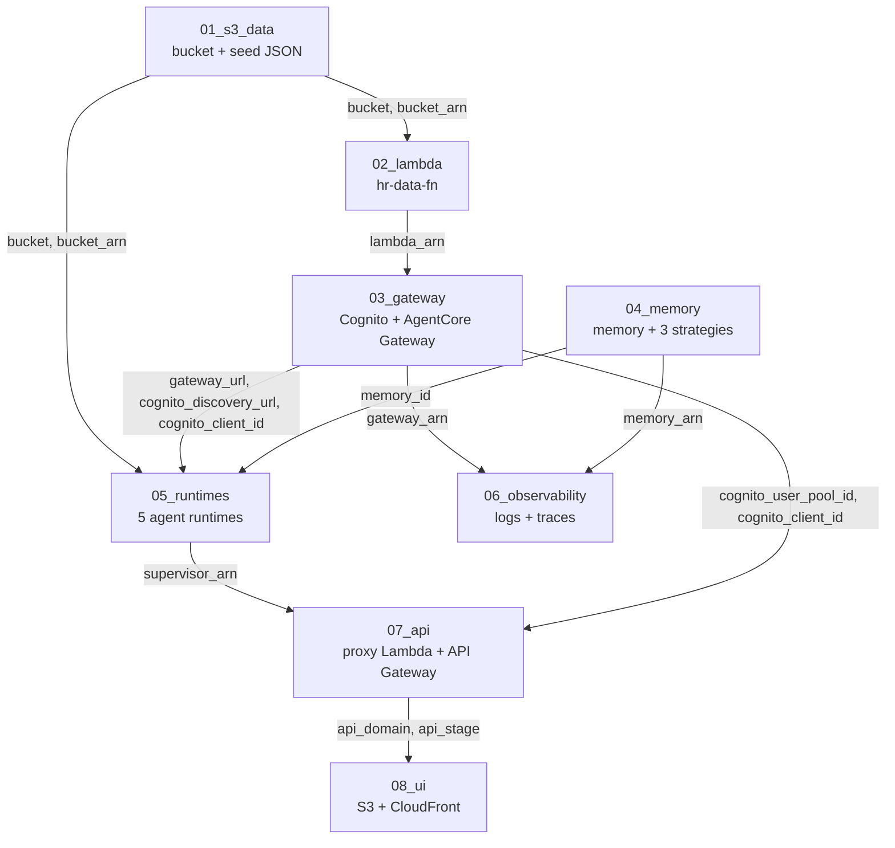

# The Terraform layer, module by module

Eight numbered modules and one root that composes them. **67 resource blocks, 25 data
sources, 62 variables, 40 outputs.**

This is the reference. [`../architecture.md`](../architecture.md) is the *why* — read that
first if you want the design. [`../README.md`](../README.md) is how to run it.

- [How to read a module](#how-to-read-a-module)
- [The dependency graph](#the-dependency-graph)
- [Conventions every module follows](#conventions-every-module-follows)
- [00_all_at_once](#00_all_at_once) · [01_s3_data](#01_s3_data) · [02_lambda](#02_lambda) · [03_gateway](#03_gateway) · [04_memory](#04_memory)
- [05_runtimes](#05_runtimes) · [06_observability](#06_observability) · [07_api](#07_api) · [08_ui](#08_ui)
- [Ordering hazards](#ordering-hazards)
- [Checking all of this](#checking-all-of-this)

---

## How to read a module

Every numbered directory is a **root module in its own right** and a **child module of
`00_all_at_once`** at the same time. Both work:

```bash
cd 03_gateway && terraform apply -var-file=dev.tfvars   # standalone, one layer
cd 00_all_at_once && terraform apply -var-file=dev.tfvars   # all eight, one graph
```

The numbering answers one question: **what does the next resource need?** It is not the
order you *verify* things in — that list is in
[`architecture.md`](../architecture.md#build-order), and it deliberately differs. Memory is
exercised last but must *exist* before the runtimes, because the supervisor takes
`MEMORY_ID` as an environment variable. So it is `04`, applied before `05`.

Each section below lists variables (required ones first), data sources, resources and
outputs. "×N" means the resource is multiplied by `for_each` or `count`.

**Every module also has its own README**, which walks the file block by block — what each
variable is for, what each data source is doing, why each resource exists, and what breaks
when it is missing. This page is the map; those are the territory.

| | | |
|---|---|---|
| [`00_all_at_once`](00_all_at_once/README.md) — the composing root | [`01_s3_data`](01_s3_data/README.md) — the system of record | [`02_lambda`](02_lambda/README.md) — the estate as MCP tools |
| [`03_gateway`](03_gateway/README.md) — Cognito + the Gateway | [`04_memory`](04_memory/README.md) — memory and its strategies | [`05_runtimes`](05_runtimes/README.md) — the five runtimes |
| [`06_observability`](06_observability/README.md) — logs and traces | [`07_api`](07_api/README.md) — the streaming API | [`08_ui`](08_ui/README.md) — CloudFront, two origins |

---

## The dependency graph



Nothing is copied by hand in `00_all_at_once`. **The references above *are* the graph** —
`module.gateway.gateway_url` feeding `module.runtimes.gateway_url` is what tells Terraform
that 03 comes before 05. Standalone, the same edges are `terraform output -raw` commands
you run yourself, which is why every required variable's description names the module it
comes from.

### What flows where

| Producer | Output | Consumer | As |
|---|---|---|---|
| 01 | `bucket`, `bucket_arn` | 02, 05 | `bucket`, `bucket_arn` |
| 02 | `lambda_arn` | 03 | `lambda_arn` |
| 03 | `gateway_url` | 05 | `gateway_url` |
| 03 | `cognito_discovery_url`, `cognito_client_id` | 05 | inbound JWT config |
| 03 | `gateway_arn` | 06 | `gateway_arn` |
| 03 | `cognito_user_pool_id`, `cognito_client_id` | 07 | authorizer + proxy env |
| 04 | `memory_id` | 05 | `memory_id` |
| 04 | `memory_arn` | 06 | `memory_arn` |
| 05 | `supervisor_arn` | 07 | `AGENT_RUNTIME_ARN` + the IAM scope |
| 07 | `api_domain`, `api_stage` | 08 | CloudFront origin + `origin_path` |

Only **two** values are yours to invent: `password` and `bedrock_model_id`. Everything else
is somebody's output. `check_terraform_chain.py` enforces exactly that.

---

## Conventions every module follows

**No `provider` blocks in children.** Only `00_all_at_once` declares one. A child module
with its own provider is legacy behaviour that Terraform accepts, warns about, and gets
`destroy` ordering wrong. Standalone, Terraform builds a default provider from
`AWS_REGION` / `~/.aws/config` — so set `AWS_REGION` to match when applying one directly.

**`var.region` is nearly vestigial.** Every module declares it, and interpolations use
`data.aws_region.current.region` instead. A discovery URL built from `var.region` can name
a different region than the resource actually deployed into, and the resulting 401 says
nothing about regions. *Setting `region` on a child is a silent no-op* — the provider's
region wins.

**Relative paths go through a `local`.** `path.module` cannot appear in a variable default
(defaults must be literals), so the variable holds the relative part and a local joins it:

```hcl
variable "dist_dir" { default = "../../dist" }
locals { dist = "${path.module}/${var.dist_dir}" }
```

`path.module` is the module's own directory in both modes, which is what makes standalone
and composed use behave identically.

**`local.common_tags`** — `Project = ai-agent-platform`, `Env`, `Track = agent-core` — is
on everything that takes tags.

**Artifacts must exist before `plan`, not before `apply`.** `filemd5()`,
`filebase64sha256()` and `fileset()` are evaluated at plan time. `make artifacts` builds
all of them; `make plan` and `make deploy` chain it.

---

## 00_all_at_once

The composing root. **0 resources, 0 data sources** — it is eight `module` blocks, one
provider, and the outputs worth having in one place.

| Variable | Type | Default | Notes |
|---|---|---|---|
| `password` | string | **required** | Cognito password, min 8 chars. `sensitive = true` |
| `bedrock_model_id` | string | **required** | Account- and region-specific; no safe default |
| `region` | string | `us-west-2` | The one that actually configures the provider |
| `env` | string | `dev` | Tags, and resource name suffixes |
| `price_class` | string | `PriceClass_100` | Passed to 08 |
| `enable_transaction_search` | bool | `true` | Passed to 06. **Changes the whole account** |

`enable_transaction_search` is passed through explicitly rather than left to the child's
default, because it is the one setting whose blast radius is the account rather than the
stack — it belongs in the tfvars you actually edit.

**Outputs (12):** `bucket`, `gateway_url`, `memory_id`, `runtime_arns`, `supervisor_arn`,
`bearer_token_command`, `invoke_command`, `env_file`, `transaction_search`, `chat_url`,
`api_url`, `distribution_id`.

`env_file` is the useful one — it prints the block to paste into `agent-core/.env` so local
code talks to the deployed stack.

To stop after a layer from here: `terraform apply -target=module.s3`.

---

## 01_s3_data

The system of record. 3 variables (none required), 2 data sources, **5 resources**, 2 outputs.

| Variable | Default | Notes |
|---|---|---|
| `seed_dir` | `"seed"` | Where `scripts/seed_s3.py` writes. Joined to `path.module` in a local |
| `region`, `env` | | |

**Data:** `aws_caller_identity.current`, `aws_region.current` — the account id is in the
bucket name, because bucket names are globally unique.

**Resources**

| Resource | Notes |
|---|---|
| `aws_s3_bucket.hr` | |
| `aws_s3_bucket_public_access_block.hr` | all four blocks on |
| `aws_s3_bucket_versioning.hr` | |
| `aws_s3_bucket_server_side_encryption_configuration.hr` | |
| `aws_s3_object.seed` **×3** | employees, requisitions, skills |

**Outputs:** `bucket`, `bucket_arn`.

> The seed lives at `01_s3_data/seed/` and `scripts/seed_s3.py` writes there. Two places
> pointing at one directory: move it and you must move both, or the apply uploads whatever
> was there last.

---

## 02_lambda

`hr-data-fn`: the estate as MCP tools, for the Gateway to call. 5 variables (2 required),
2 data sources, **5 resources**, 2 outputs.

| Variable | Default | From |
|---|---|---|
| `bucket` | **required** | `01.bucket` |
| `bucket_arn` | **required** | `01.bucket_arn` |
| `package` | `../../dist/hr_data_fn.zip` | `scripts/package.py` |
| `region`, `env` | | |

**Data:** `aws_iam_policy_document.assume`, `aws_iam_policy_document.s3`.

**Resources:** `aws_iam_role.fn`, `aws_iam_role_policy.s3`,
`aws_iam_role_policy_attachment.logs`, `aws_lambda_function.hr_data`,
`aws_lambda_permission.gateway`.

`aws_lambda_permission.gateway` is what lets `bedrock-agentcore.amazonaws.com` invoke it.
Without it the Gateway target creates and every tool call is a 403.

**Outputs:** `lambda_arn`, `lambda_name`.

---

## 03_gateway

Identity **and** the AgentCore Gateway. 9 variables (2 required), 4 data sources,
**8 resources**, 7 outputs — the widest output surface in the stack, because three later
modules need something from it.

| Variable | Default | Notes |
|---|---|---|
| `lambda_arn` | **required** | from `02` |
| `password` | **required** | `sensitive`. The machine user's password |
| `username` | `hr-agent` | |
| `gateway_name` | `hr-gateway` | Names the gateway *and* its role |
| `gateway_authorizer_type` | `AWS_IAM` | Or `CUSTOM_JWT`. **Immutable** — changing it replaces the gateway, its target, and the `gateway_url` |
| `iam_propagation_delay` | `30s` | See [Ordering hazards](#ordering-hazards) |
| `restrict_trust_to_gateway` | `false` | Confused-deputy conditions; `true` on a **second** apply |
| `region`, `env` | | |

**Data:** `aws_region.current`, `aws_caller_identity.current`,
`aws_iam_policy_document.assume`, `aws_iam_policy_document.invoke`.

**Resources**

| Resource | Notes |
|---|---|
| `aws_cognito_user_pool.hr` | |
| `aws_cognito_user_pool_client.hr` | no secret, `ALLOW_USER_PASSWORD_AUTH` |
| `aws_cognito_user.agent` | permanent password, `message_action = SUPPRESS` |
| `aws_iam_role.gateway` | |
| `aws_iam_role_policy.invoke` | `lambda:InvokeFunction` on the one Lambda |
| `time_sleep.iam_propagation` | **load-bearing** — see below |
| `aws_bedrockagentcore_gateway.hr` | `depends_on = [time_sleep.iam_propagation]` |
| `aws_bedrockagentcore_gateway_target.hrdata` | `depends_on = [time_sleep.iam_propagation]` |

**Outputs (7):** `gateway_url`, `gateway_id`, `gateway_arn`, `bearer_token_command`,
`cognito_discovery_url`, `cognito_client_id`, `cognito_user_pool_id`.

> `search_type = "SEMANTIC"` on the gateway can **only** be set at creation. Turning it on
> later means recreating the gateway and every target under it.

---

## 04_memory

Depends on nothing but its own role, which is why it can be this early. 2 variables
(neither required), 1 data source, **6 resources**, 2 outputs.

| Variable | Default | Notes |
|---|---|---|
| `region`, `env` | | The only two. Nothing here comes from an earlier step |

**Data:** `aws_iam_policy_document.assume`.

**Resources:** `aws_iam_role.memory`, `aws_iam_role_policy_attachment.inference`,
`aws_bedrockagentcore_memory.hiring_desk`, and three strategies:

| Resource | Strategy name | Namespace template |
|---|---|---|
| `aws_bedrockagentcore_memory_strategy.facts` | `candidate_facts` | `/requisitions/{sessionId}/facts` |
| `aws_bedrockagentcore_memory_strategy.preferences` | `recruiter_preferences` | `/recruiters/{actorId}/preferences` |
| `aws_bedrockagentcore_memory_strategy.summaries` | `requisition_summary` | `/summaries/{actorId}/{sessionId}` |

**Outputs:** `memory_id`, `memory_arn`.

> Strategy names must match `^[a-zA-Z][a-zA-Z0-9_]{0,47}$` — **no hyphens**.
> `candidate-facts` is rejected; `candidate_facts` is not.

---

## 05_runtimes

The five agent runtimes, in three dependency tiers. 11 variables (**8 required** — the most
in the stack), 4 data sources, **6 resource blocks / 5 runtimes**, 4 outputs.

| Variable | From |
|---|---|
| `bucket`, `bucket_arn` | `01` |
| `gateway_url`, `cognito_discovery_url`, `cognito_client_id`, `gateway_arn` | `03` |
| `memory_id` | `04` |
| `bedrock_model_id` | **you** |
| `dist_dir` (`../../dist`), `region`, `env` | |

**Data:** `aws_region.current`, `aws_caller_identity.current`,
`aws_iam_policy_document.assume`, `aws_iam_policy_document.runtime`. The account id is there
to build the runtime ARN patterns in `local.runtime_arn_pattern`.

**Resources**

| Resource | Multiplicity | Notes |
|---|---|---|
| `aws_s3_object.artifact` | **×5** | one zip per runtime, `for_each = local.protocols` |
| `aws_iam_role.runtime` | **×5** | one role each |
| `aws_iam_role_policy.runtime` | **×5** | |
| `aws_bedrockagentcore_agent_runtime.leaf` | **×3** | `hr_skills_mcp`, `recruiting_outreach`, `people_compliance` |
| `aws_bedrockagentcore_agent_runtime.screening` | ×1 | tier 2 — also gets `SKILLS_MCP_ARN` |
| `aws_bedrockagentcore_agent_runtime.supervisor` | ×1 | tier 3 — gets the peer ARNs and `MEMORY_ID` |

**The log groups are deliberately NOT created here.** They were, and it could never work:
the name is `/aws/bedrock-agentcore/runtimes/{agent_runtime_id}-DEFAULT`, so the group can
only be declared after the runtime exists — and creating the runtime is what starts the
container that creates the group. Terraform always arrives second, with
`ResourceAlreadyExistsException`. Compare `07_api`, which wins the identical race because
`/aws/lambda/{function-name}` is knowable before the function exists, so `depends_on` puts
terraform first.

What actually fixed *"the log group does not exist"* was `logs:CreateLogGroup` on the
execution role, below. `runtime_log_groups` is now computed from the ids rather than
managed, so it still tells you where to look. The cost is retention: a service-created
group never expires, and setting it is one `aws logs put-retention-policy` loop.

The role needs `logs:CreateLogGroup` regardless. With only `CreateLogStream` and
`PutLogEvents` a runtime can write into a group that already exists and cannot bring one
into being — a silent failure whose symptom is the absence of the thing you would read to
diagnose it.

**Tracing needs `xray:*`, and logging permissions do not imply it.** `AGENT_OBSERVABILITY_ENABLED`
puts an OTLP exporter in every container; without `PutTraceSegments`, `PutTelemetryRecords`,
`GetSamplingRules` and `GetSamplingTargets` it fails every batch with `403 Forbidden`. The
agent keeps answering — spans are the only casualty — so the dashboard stays empty and
nothing surfaces unless you read the container's log. `cloudwatch:PutMetricData` goes with
it, scoped by the `bedrock-agentcore` namespace because PutMetricData takes no resource ARN.

**Every runtime gets `s3:GetObject` on the data prefixes, not just the scoring engine.**
`install()` is at module scope in all five entrypoints, so with `DATA_SOURCE=s3` all five
read the records on import. Scoping it to `hr_skills_mcp` alone was true of the design and
false of the code: the other four raised `AccessDenied` before binding a port, and an
import-time crash reads as a start-up failure rather than as a permissions one. The
property worth keeping survives — `GetObject` only, so no runtime can write. `shortlists/`
belongs to hr-data-fn in `02_lambda` and no runtime touches it.

The three tiers exist because the supervisor needs its peers' ARNs as environment
variables. `local.protocols` maps each runtime to `MCP` / `A2A` / `HTTP`, and the protocol
determines the port the container must bind — 8000 `/mcp`, 9000 `/`, 8080 `/invocations`.

Two things in `local.base_env` are about **start-up**, not behaviour. A runtime has 30
seconds to unpack, import and answer its health check, or:

```
Runtime initialization time exceeded. Please make sure that initialization
completes in 30s.
```

`OTEL_PYTHON_DISABLED_INSTRUMENTATIONS` turns off the ~30 instrumentations
`aws-opentelemetry-distro` ships that this system never uses — `opentelemetry-instrument`
walks all of them before the server binds. Its partner lives in `scripts/package.py`, which
prunes vendored packages nothing imports (a PostgreSQL driver, an ORM, gRPC). Together they
took the supervisor artifact from 120 MB to 71.

**Only the supervisor has an authorizer.** The other four take **SigV4**, signed with their
execution role.

That is not a shortcut — it is the only thing that works. The natural design is to forward
the caller's bearer token down the chain, and AgentCore makes it impossible: it consumes
`Authorization` at its edge and never passes it to the container, so there is nothing to
reuse. A workload access token is not a substitute either — AWS documents it as usable only
against first-party AgentCore identity services. The remaining option would be a Cognito
machine password in five container environments.

So: **humans authenticate with Cognito, machines with IAM.** The supervisor keeps
`custom_jwt_authorizer` because the thing on the other side of its door is a person, and it
uses **`allowed_audience`, not `allowed_clients`** — `aud` on an ID token versus `client_id`
on an access token. This stack uses ID tokens, so `allowed_clients` would reject the very
token 07's authorizer just accepted.

**The Gateway takes SigV4 too**, via `authorizer_type = "AWS_IAM"`. Its only caller is
`talent_screening`, which builds that MCP client at container *start-up* — when no request
and so no token exists. CUSTOM_JWT there would mean either a machine password in the
container or reopening the connection per request; SigV4 removes the problem instead, since
each request is signed as it is sent and botocore refreshes the role's credentials itself.

Two consequences worth knowing. The caller needs **`bedrock-agentcore:InvokeGateway`** —
a different action from `InvokeAgentRuntime`, scoped here to the one gateway ARN. And
`authorizer_type` is **immutable**: changing it replaces the gateway and every target under
it, with a new `gateway_url`, which is why that URL is an output rather than anything
written down by hand.

### IAM is now the whole check

Moving the inner hops to SigV4 changed what an IAM grant *means* here. While they were
CUSTOM_JWT the token was the gate and the role was a second lock; now there is no second
lock. `bedrock-agentcore:InvokeAgentRuntime` on `"*"` — which is what this module used to
grant — let the outreach agent invoke the supervisor and the screener invoke anything in
the account, while the comment beside it read *"only the supervisor may delegate"*.

So the call graph is written down as `local.callees` and turned straight into policy:

```hcl
callees = {
    hiring_supervisor = ["talent_screening", "recruiting_outreach", "people_compliance"]
    talent_screening  = ["hr_skills_mcp"]
}
```

The three leaves appear on no left-hand side, so they get no grant at all — a leaf that can
invoke its own caller is a loop waiting for a prompt that suggests it.

Each edge grants **two** actions, and the second is the one that catches people:

| action | what it covers |
|---|---|
| `bedrock-agentcore:InvokeAgentRuntime` | sending the message |
| `bedrock-agentcore:GetAgentCard` | fetching `/.well-known/agent-card.json` first |

An A2A conversation is both calls, and discovery runs first — so a role with only the invoke
grant fails *before* the part it was granted, with `403 Forbidden` on the card. That reads
as "the remote agent is down". It is not. `aws iam simulate-principal-policy` settles it in
one command, showing `allowed` beside `implicitDeny`:

```bash
aws iam simulate-principal-policy \
  --policy-source-arn arn:aws:iam::<acct>:role/agentcore-hiring_supervisor-role \
  --action-names bedrock-agentcore:InvokeAgentRuntime bedrock-agentcore:GetAgentCard \
  --resource-arns <the callee's runtime arn>
```

Same shape as `InvokeGateway`: **one conversation, several actions, and the failure names
none of them.**

These are **name patterns**, `runtime/talent_screening-*`, not the runtime ARNs. That is
forced rather than lazy: referencing `agent_runtime_arn` would make the policy depend on the
runtimes, and the screener opens its MCP connections during container start — inside
`CreateAgentRuntime`, while it waits for the health check. Invert the order and the
container cannot reach `hr_skills_mcp`, never goes healthy, and the apply fails on a timeout
that mentions no IAM at all. The `-*` covers the generated id suffix, and IAM's `*` spans
`/`, so one pattern also covers `.../runtime-endpoint/DEFAULT`.

Memory is the one grant still on `"*"`. Scoping it needs `memory_arn`, which `04` outputs
and this module does not take — a follow-up, recorded here rather than left to be
rediscovered.

**Outputs:** `runtime_arns` (a map), `runtime_log_groups` (computed, not managed — see
above), `supervisor_arn`, `invoke_command`.

> **There are deliberately no endpoint resources.** `CreateAgentRuntime` creates the
> `DEFAULT` endpoint itself, so declaring one is a `ConflictException` on every apply.

---

## 06_observability

Logs and traces, plus the account-level switch that makes traces possible. 7 variables
(2 required), 3 data sources, **10 resources**, 3 outputs.

| Variable | Default | Notes |
|---|---|---|
| `gateway_arn` | **required** | from `03` |
| `memory_arn` | **required** | from `04` |
| `enable_transaction_search` | `true` | **account + region wide.** Bills, and `destroy` turns it off |
| `iam_propagation_delay` | `30s` | Same hazard as 03 |
| `retention_days` | `30` | On the two **vended** groups this module creates. Runtime groups are the service's and never expire |
| `region`, `env` | | |

**Data:** `aws_caller_identity.current`, `aws_region.current`,
`aws_iam_policy_document.xray_spans` (`count`-gated).

**Resources**

| Resource | Multiplicity | Notes |
|---|---|---|
| `aws_cloudwatch_log_group.vended` | ×2 | gateway, memory |
| `aws_cloudwatch_log_delivery_source.logs` | ×2 | |
| `aws_cloudwatch_log_delivery_destination.logs` | ×2 | `CWL` |
| `aws_cloudwatch_log_delivery.logs` | ×2 | joins the two halves |
| `aws_cloudwatch_log_resource_policy.xray_spans` | ×0–1 | lets X-Ray write `aws/spans` |
| `time_sleep.policy_propagation` | ×0–1 | |
| `aws_xray_trace_segment_destination.cwl` | ×0–1 | Transaction Search itself |
| `aws_cloudwatch_log_delivery_source.traces` | ×0–2 | `local.traced` |
| `aws_cloudwatch_log_delivery_destination.traces` | ×0–2 | `XRAY`, **no** config block |
| `aws_cloudwatch_log_delivery.traces` | ×0–2 | `depends_on` the switch |

`enable_transaction_search = false` gates the switch *and* all three trace resources
together, so you get logs without traces rather than a half-built stack.

**Outputs:** `log_groups`, `runtime_logs_note`, `transaction_search`.

> **Runtime creates its own log group. Gateway and Memory do not.** Until you wire the
> delivery above, the busiest component in the system is the only silent one.

---

## 07_api

The supervisor exposed over HTTP. No browser in this layer. 13 variables (3 required),
5 data sources, **20 resources** — the largest module — and 5 outputs.

| Variable | Default | Notes |
|---|---|---|
| `supervisor_arn` | **required** | from `05`. The **only** runtime the proxy may invoke |
| `cognito_user_pool_id` | **required** | from `03`. JWKS URL + the authorizer's ARN |
| `cognito_client_id` | **required** | from `03` |
| `stage_name` | `v1` | Becomes `origin_path` in 08 |
| `proxy_timeout_seconds` | `300` | Applied to the Lambda **and** the integration |
| `throttle_rate` / `throttle_burst` | `5` / `10` | Cost control, not capacity |
| `manage_apigw_account_logging` | `true` | **account + region wide.** See below |
| `iam_propagation_delay` | `30s` | For the role that setting points at |
| `proxy_zip` | `../../dist/chat_proxy.zip` | |
| `retention_days`, `region`, `env` | | |

**Data:** `aws_caller_identity.current`, `aws_region.current`,
`aws_iam_policy_document.proxy_assume`, `aws_iam_policy_document.proxy`,
`aws_iam_policy_document.apigw_assume` (`count`-gated).

**Resources**

| Group | Resources |
|---|---|
| the proxy | `aws_iam_role.proxy`, `aws_iam_role_policy.proxy`, `aws_cloudwatch_log_group.proxy`, `aws_lambda_function.proxy` |
| the API | `aws_api_gateway_rest_api.chat`, `aws_api_gateway_authorizer.cognito`, `aws_api_gateway_resource.api`, `aws_api_gateway_resource.route` **×2**, `aws_api_gateway_method.chat`, `aws_api_gateway_method.login`, `aws_api_gateway_integration.route` **×2**, `aws_lambda_permission.apigw` |
| account logging | `aws_iam_role.apigw_cloudwatch` ×0–1, `aws_iam_role_policy_attachment.apigw_cloudwatch` ×0–1, `time_sleep.apigw_account` ×0–1, `aws_api_gateway_account.this` ×0–1 |
| the stage | `aws_api_gateway_deployment.chat`, `aws_cloudwatch_log_group.api`, `aws_api_gateway_stage.chat`, `aws_api_gateway_method_settings.throttle` |

**API Gateway does not log with the stage's own permissions.** It assumes a role recorded
in *account settings*, one per region, shared by every REST API in it — and a stage that
logs cannot be created before that role exists:

```
BadRequestException: CloudWatch Logs role ARN must be set in account settings
to enable logging
```

`manage_apigw_account_logging` creates that role and sets it. It is the second
account-scoped thing in this stack after Transaction Search in 06, and the provider does
not document what `destroy` does to it — so set it `false` in an account you do not own.
That gates the account setting, `access_log_settings` on the stage **and**
`logging_level` in the method settings together, because asking for either kind of logging
without the role is exactly what fails.

Three settings here are load-bearing and none of them errors when wrong:

- `response_transfer_mode = "STREAM"` — `BUFFERED` delivers the whole SSE stream at the end.
- `uri` must be `2021-11-15/.../response-streaming-invocations`. Paired with the ordinary
  `2015-03-31/.../invocations` API Gateway returns a **500**, not a fallback.
- The IAM policy scopes to `[supervisor_arn, "${supervisor_arn}/*"]`. The second entry is
  the `DEFAULT` *endpoint* — a policy naming only the runtime ARN passes review and fails
  at runtime.

**Outputs:** `api_domain`, `api_stage` (both for 08), `api_url`, `proxy_log_group`,
`api_log_group`.

---

## 08_ui

The React build on CloudFront, with 07 as its `/api/*` origin. 7 variables (2 required),
5 data sources, **6 resources**, 3 outputs.

| Variable | Default | Notes |
|---|---|---|
| `api_domain` | **required** | from `07`. Bare host — no scheme, no path |
| `api_stage` | **required** | from `07`. Becomes `origin_path` |
| `origin_read_timeout` | `60` | Max without a quota increase; the default 30 cuts the stream |
| `price_class` | `PriceClass_100` | |
| `ui_dist_dir` | `../../ui/dist` | |
| `region`, `env` | | |

**Data:** `aws_caller_identity.current`, `aws_iam_policy_document.bucket`,
`aws_cloudfront_cache_policy.optimized`, `aws_cloudfront_cache_policy.disabled`,
`aws_cloudfront_origin_request_policy.all_viewer_except_host`.

Those last three are AWS-managed policies looked up by name rather than by hardcoded id —
`Managed-CachingOptimized`, `Managed-CachingDisabled`, `Managed-AllViewerExceptHostHeader`.

**Resources:** `aws_s3_bucket.site`, `aws_s3_bucket_public_access_block.site`,
`aws_s3_object.site` **×N** (one per built file), `aws_cloudfront_origin_access_control.s3`,
`aws_s3_bucket_policy.site`, `aws_cloudfront_distribution.site`.

Two behaviours on one distribution — `/*` → S3, `/api/*` → the API — which is what removes
CORS entirely: there is no second origin for the browser to be told about.

**Outputs:** `chat_url`, `distribution_id`, `ui_bucket`.

> Only S3 gets an OAC. CloudFront OAC has no `apigateway` origin type, so `execute-api` is
> publicly resolvable and the Cognito authorizer is the gate.

---

## Ordering hazards

Terraform's graph is built from references. Five places in this stack need an edge that no
reference creates, and all of them fail in ways that point somewhere else.

| Where | The edge | What you see without it |
|---|---|---|
| `03_gateway` | `time_sleep.iam_propagation` → gateway → target | `ValidationException: Gateway service is not authorized to perform AssumeRole`. The policy is correct; it has not propagated. **"and retry" is the real instruction.** |
| `06_observability` | resource policy → `time_sleep` → X-Ray switch → traces delivery | `AccessDeniedException: XRay does not have permission to call PutLogEvents on the aws/spans Log Group`. There is no role to fix — the grant is on the log group |
| `07_api` | role → attachment → `time_sleep` → `aws_api_gateway_account` → stage | `BadRequestException: CloudWatch Logs role ARN must be set in account settings`. The fix is a resource nothing in your API refers to |
| `07_api` | `triggers` on `aws_api_gateway_deployment` | A method change applies cleanly and the stage serves the **previous** version |
| `07_api` | `depends_on = [aws_cloudwatch_log_group.proxy]` on the Lambda | Lambda creates the group itself, with no retention, and terraform then fights it. This works **only** because `/aws/lambda/{function-name}` is knowable before the function exists — `05_runtimes` loses the same race by construction, and so declares no log group at all |

All three `time_sleep`s share a variable name — `iam_propagation_delay`, default `30s` —
so there is one knob to reach for. Raise it before concluding a policy is wrong.

Notice the shape the three of them have in common: **a role or policy created moments
earlier, and another AWS service asked to use it immediately.** IAM is eventually
consistent, and every one of these reports the failure as a permissions problem rather
than a timing one.

### Two settings that are not yours alone

`enable_transaction_search` (06) and `manage_apigw_account_logging` (07) both change the
**account and region**, not just this stack. Both default `true` because the layer they
belong to cannot work otherwise, and both have an opt-out that disables the dependent
resources with them — so `false` gives you a smaller working stack rather than a failed
apply. Set both `false` in an account you do not own.

---

## Checking all of this

```bash
make check      # scripts/check_terraform_chain.py
```

Four things `terraform validate` **cannot** tell you, because it checks one directory's
syntax and schema in isolation:

1. every required variable is some earlier module's output
2. `00_all_at_once` passes all of them to every child
3. `example.tfvars` shows the module's complete variable surface
4. the environment variables `05_runtimes` sets are field names `_shared/config.py` reads

The last one matters most: a typo there does not fail, it falls back to `127.0.0.1`, which
inside a container reaches nothing.

That script exists because six green `validate` runs once hid five reasons the stack could
not deploy.

```bash
uv run scripts/gen_tfvars.py    # regenerate every dev.tfvars from the variable blocks
```

`example.tfvars` is the committed reference — required variables set, optional ones shown
commented with their defaults. `dev.tfvars` is gitignored and has **every** variable
uncommented, so you change one by editing a value rather than remembering to uncomment a
line. The generator keeps whatever you already set.

> Name your own tfvars anything except `example.tfvars`. The root `.gitignore` ignores
> `*.tfvars` but explicitly un-ignores that one, so a password in it would be committed.
