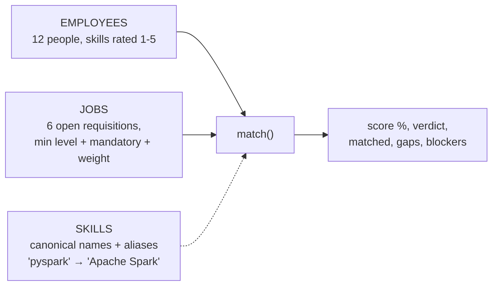
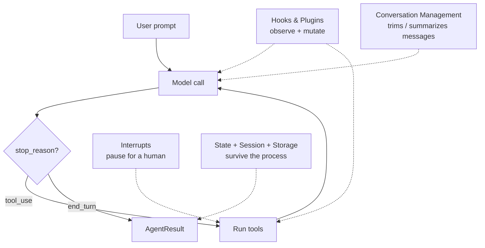
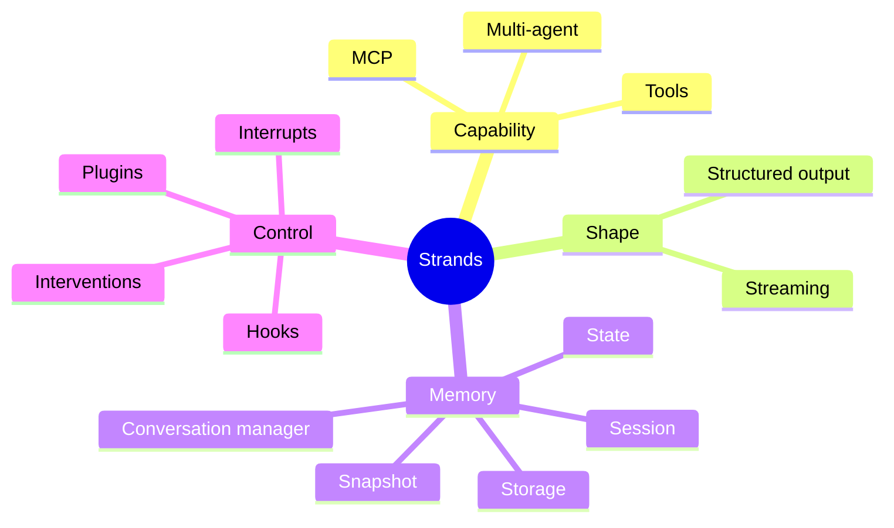

# Strands Agents — A Hands-On Course

A model-driven agent framework from AWS. You describe **tools** and a **prompt**;
the model decides what to call and when. No graph to hand-wire for the common case.

```python
from strands import Agent

agent = Agent(tools=[find_candidates])
agent("Who on the bench could fill our Senior Data Engineer role?")
```

That is a complete agent. Everything else in this course is about what happens
when that one line meets production.

---

## One domain, sixteen lessons

Every example runs on the same small world — **employees have rated skills, jobs
require skills, and something has to decide who fits**:



The data and the scoring live in [app/_shared/hr_data.py](app/_shared/hr_data.py) —
in memory, deterministic, no database. Point those functions at a real HRMS and
every lesson keeps working unchanged.

**`match()` is arithmetic, never a model call.** The model's job is to find the
right people to score, call the tool, and explain the result — not to invent a
percentage. A score nobody can reproduce by hand is a score nobody will defend in
a hiring review.

---

## The one diagram to memorize

Every Strands feature plugs into exactly one spot in this loop.



Keep it in your head as: **Model ⇄ Tools, wrapped in Memory, watched by Hooks.**

---

## The data

Twelve employees, six open requisitions, a skill catalog with aliases. All in
[app/_shared/hr_data.py](app/_shared/hr_data.py).

<details>
<summary><b>Employees</b> (skills shown are the first four of each)</summary>

| id | name | role | location | status | skills |
|---|---|---|---|---|---|
| `E1001` | Anjali Deshpande | Director, Data & Analytics | Bengaluru | allocated | Data Modeling L5, Stakeholder Management L5, Snowflake L4, SQL L5 |
| `E1002` | Priya Raman | Senior Data Engineer | Bengaluru | bench | Python L4, Apache Spark L5, Apache Airflow L4, SQL L5 |
| `E1003` | Rahul Menon | Data Engineer | Hyderabad | bench | Python L4, Apache Spark L3, SQL L4, dbt L3 |
| `E1004` | Meera Krishnan | Principal Engineer, Streaming | Chennai | allocated | Apache Kafka L5, Apache Spark L4, Scala L4, Java L4 |
| `E1005` | Vikram Iyer | Streaming Engineer | Chennai | bench | Apache Kafka L4, Apache Spark L4, Java L3, AWS L3 |
| `E1006` | Sneha Kapoor | Analytics Engineer | Pune | bench | SQL L4, dbt L4, Snowflake L3, Data Modeling L3 |
| `E1007` | Arjun Nair | ML Engineer | Bengaluru | allocated | Python L5, Machine Learning L4, PyTorch L4, MLOps L3 |
| `E1008` | Fatima Sheikh | Cloud Platform Engineer | Hyderabad | bench | AWS L5, Terraform L4, Kubernetes L4, Docker L4 |
| `E1009` | Karthik Subramanian | Backend Engineer | Chennai | bench | Java L4, SQL L4, REST API L4, Apache Kafka L3 |
| `E1010` | Divya Pillai | Data Analyst | Kochi | bench | SQL L4, Data Modeling L2, Python L2 |
| `E1011` | Rohan Gupta | SRE | Pune | allocated | Kubernetes L5, Terraform L4, AWS L4, CI/CD L5 |
| `E1012` | Aisha Khan | Full-stack Engineer | Bengaluru | bench | TypeScript L4, React L4, REST API L3, Python L3 |

</details>

<details>
<summary><b>Open requisitions</b> (`*` = mandatory)</summary>

| id | title | location | experience | required skills |
|---|---|---|---|---|
| `J2001` | Senior Data Engineer | Bengaluru | 6+ yrs | Python L4*, Apache Spark L4*, SQL L4*, Apache Airflow L3 |
| `J2002` | Streaming Platform Engineer | Chennai | 7+ yrs | Apache Kafka L4*, Apache Spark L4*, Scala L3, Java L3 |
| `J2003` | Analytics Engineer | Pune | 3+ yrs | SQL L4*, dbt L3*, Snowflake L3, Data Modeling L3 |
| `J2004` | ML Engineer | Bengaluru | 5+ yrs | Python L4*, Machine Learning L4*, PyTorch L3, MLOps L3 |
| `J2005` | Cloud Platform Engineer | Hyderabad | 5+ yrs | AWS L4*, Terraform L3*, Kubernetes L3*, Docker L3 |
| `J2006` | Backend Engineer, Payments | Chennai | 4+ yrs | Java L4*, SQL L3*, REST API L3, Apache Kafka L3 |

</details>

<details>
<summary><b>Who the matcher picks</b> — the deterministic answer every lesson is graded against</summary>

| requisition | top 3 available candidates |
|---|---|
| `J2001` | Priya Raman 100% · Rahul Menon 61% · Vikram Iyer 50% |
| `J2002` | Vikram Iyer 86% · Priya Raman 43% · Karthik Subramanian 36% |
| `J2003` | Sneha Kapoor 100% · Rahul Menon 86% · Divya Pillai 52% |
| `J2004` | Priya Raman 43% · Vikram Iyer 36% · Fatima Sheikh 36% |
| `J2005` | Fatima Sheikh 100% · Priya Raman 19% · Vikram Iyer 19% |
| `J2006` | Karthik Subramanian 95% · Vikram Iyer 36% · Priya Raman 29% |

Read these before you debug a lesson. If an agent tells you Priya Raman is a poor
fit for J2001, the agent is wrong — not the data.

</details>

---

## Setup

```bash
cd code/strands-ai

# 1. Dependencies
uv sync

# 2. A local model — no API keys, nothing leaves your machine
ollama pull llama3.2
ollama serve

# 3. Run any lesson
uv run app/01_quickstart/main.py
```

Settings live in [.env](.env) and are read by [app/_shared/config.py](app/_shared/config.py).
Everything the examples persist lands under `.run/` — `rm -rf .run` resets the course.

---

## Learning path

```mermaid
flowchart LR
    subgraph A["Build it"]
        A1["01 First agent"] --> A2["02 MCP tools"] --> A3["03 Adding tools"] --> A4["04 Using tools"]
    end
    subgraph B["Shape the output"]
        B1["05 Structured output"] --> B2["06 Streaming"] --> B3["07 Multi-agent"]
    end
    subgraph C["Understand the engine"]
        C1["08 Agent loop"] --> C2["09 State"] --> C3["10 Storage"] --> C4["11 Sessions"] --> C5["12 Snapshots"]
    end
    subgraph D["Control it"]
        D1["13 Hooks"] --> D2["14 Conversation mgmt"] --> D3["15 Interrupts"] --> D4["16 Plugins"]
    end
    A4 --> B1
    B3 --> C1
    C5 --> D1
```



> **New here? Start with the [Quick Start Tutorial](app/01_quickstart/TUTORIAL.md)** —
> one resourcing assistant built up over 10 runnable steps, covering tools,
> streaming, typed output, sessions and guardrails before you touch the lessons below.

| # | Lesson | The question it answers |
|---|--------|-------------------------|
| [01](app/01_quickstart/) | **First example** *(+ [full tutorial](app/01_quickstart/TUTORIAL.md))* | What is the minimum that runs? |
| [02](app/02_mcp/) | **MCP tools** | How do I borrow the HR team's tools without importing their code? |
| [03](app/03_adding_tools/) | **Adding tools** | How does a Python function become a tool? |
| [04](app/04_using_tools/) | **Using tools** | Who decides when a tool runs — and can I overrule it? |
| [05](app/05_structured_output/) | **Structured responses** | How do I get a typed object instead of prose? |
| [06](app/06_streaming/) | **Streaming responses** | How do I show progress instead of a spinner? |
| [07](app/07_multi_agents/) | **Multi agents** | Screening, outreach and fairness review in one agent — how do I split it? |
| [08](app/08_agent_loop/) | **Agent loop** | What actually happens between prompt and answer? |
| [09](app/09_state/) | **State** | Where do I put facts the model must not hallucinate? |
| [10](app/10_storage/) | **Storage** | Where do bytes go — disk, S3, memory? |
| [11](app/11_session_management/) | **Session management** | How does a conversation survive a restart? |
| [12](app/12_snapshots/) | **Snapshots** | How do I rewind an agent to a past moment? |
| [13](app/13_hooks/) | **Hooks** | How do I inject logging / auth / retries without forking? |
| [14](app/14_conversation_management/) | **Conversation management** | The context window is full. Now what? |
| [15](app/15_interrupts/) | **Interrupts** | How do I stop a bot rejecting a candidate on its own? |
| [16](app/16_plugins/) | **Plugins** | How do I ship hooks + tools as one reusable unit? |

> Lesson 02 (MCP) sits before 03 because it already existed in this repo. If you
> are reading top-to-bottom for the first time, 03 → 04 → back to 02 also works.

---

## The four buckets

Everything in Strands is one of these. When you hit a new feature, ask which bucket.



## Version

Written against **`strands-agents` 1.51.0** and **`strands-agents-tools` 0.8.6**
(see [pyproject.toml](pyproject.toml)). The SDK moves fast — if an import fails,
check the module's `__init__.py` in your venv before assuming the doc is wrong.
