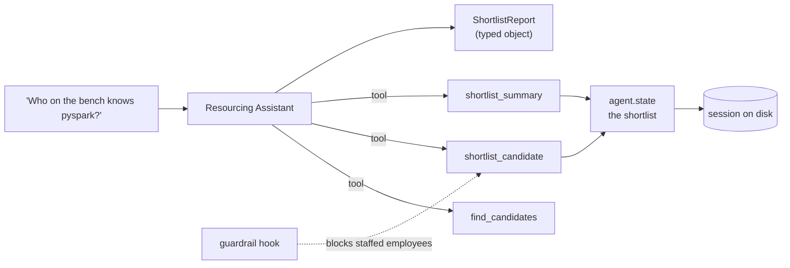
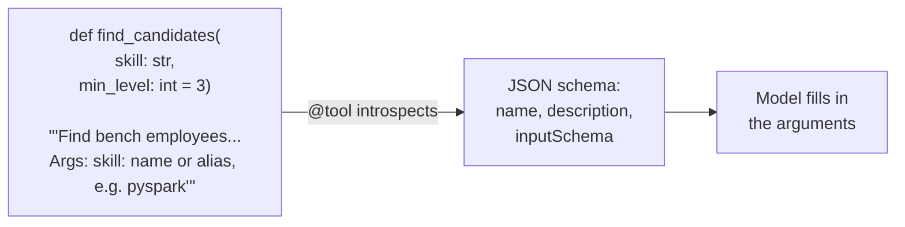
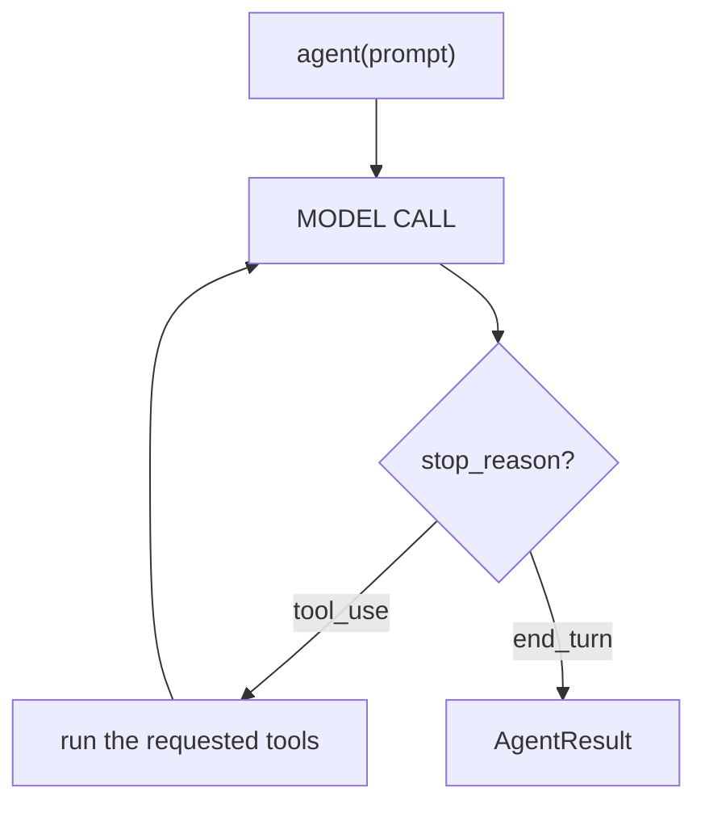
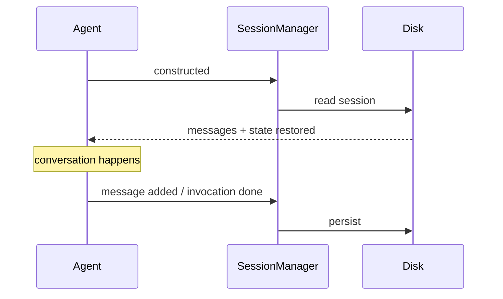
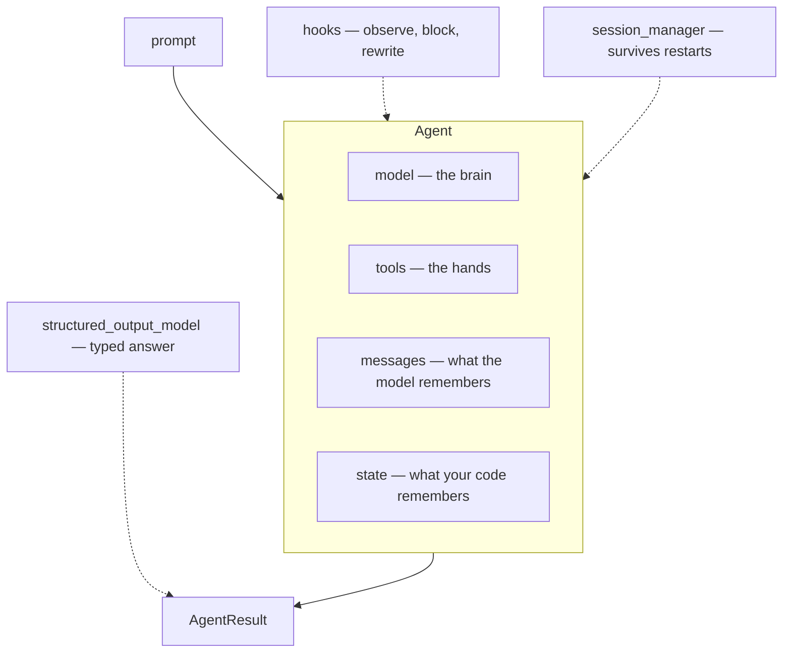

# Strands Quick Start — Build a Real Agent in 11 Steps

A hands-on tutorial. You start with three lines of Python and finish with a
**resourcing assistant**: requisition J2001 is open, twelve people are in the
directory, and the agent has to work out who to interview. It gets tools, memory,
a guardrail, typed output, survives a restart, and finally borrows tools it never
wrote from an MCP server. Every step is runnable and every output below is real.

**Companion code:** [tutorial.py](tutorial.py) · [hr_mcp_server.py](hr_mcp_server.py) (step 11)

```bash
uv run app/00_tutorial/tutorial.py          # all eleven steps
uv run app/00_tutorial/tutorial.py 3        # just step 3
uv run app/00_tutorial/tutorial.py 3 4 5    # a range
```

> This is a *new* tutorial alongside the existing [README.md](../01_quickstart/README.md) (concepts)
> and [main.py](../01_quickstart/main.py) (the two-tool demo). Nothing here replaces those.
>
> The employee, job and skill data lives in
> [app/_shared/hr_data.py](../_shared/hr_data.py) — in memory, deterministic, and
> shared by every lesson in the course.

---

## What you will build



Two rules the assistant lives by, and both are enforced in code rather than hoped
for in a prompt:

- **A candidate missing a mandatory skill cannot be shortlisted** — checked inside
  the tool, because it is a property of the requisition.
- **Someone already staffed on a project cannot be approached** — checked in a
  hook, because it is company policy that applies to every tool that touches people.

Eleven steps, each adding exactly one idea:

| Step | Adds | Strands concept |
|---|---|---|
| 1 | An agent that talks | `Agent(model=...)` |
| 2 | Reading the result properly | `AgentResult`, `stop_reason` |
| 3 | One tool | `@tool` |
| 4 | More tools, chained | model-driven routing |
| 5 | Visibility into the loop | hooks + `metrics` |
| 6 | Progress for humans | `stream_async` |
| 7 | Machine-readable output | `structured_output_model` |
| 8 | Memory across restarts | `session_manager` |
| 9 | A rule the model cannot talk past | `cancel_tool` |
| 10 | All of it in one agent | — |
| 11 | Tools, data and prompts from another process | `MCPClient` |

---

## Prerequisites

```bash
cd code/strands-ai
uv sync                    # installs strands-agents + tools, and fastmcp for step 11

ollama pull qwen2.5:7b     # see "Choosing a model" — this matters a lot
ollama serve
```

No API keys. Nothing leaves your machine.

---

## ⚠️ Choosing a model — read this before you blame the code

Strands hands the model a list of tools and lets it decide. **Everything in this
tutorial depends on how well your model calls tools**, and small models are bad at
it in a specific, recognisable way: they print the tool call as *text* instead of
actually calling it.

Same step 4, same code, two models:

```
# llama3.2 (3B) — describes the call instead of making it, and invents an id
{"name": "shortlist_candidate", "parameters": {"employee_id": "<the strongest one>"}}

# qwen2.5:7b — clean
tool call 1: find_candidates({'skill': 'Apache Spark', 'min_level': 4})
tool call 2: shortlist_candidate({'employee_id': 'E1002'})
answer: Shortlisted Priya Raman at 100%.
```

Notice the second failure in the small-model output: `"<the strongest one>"` is
not an employee id. That is why `shortlist_candidate` validates its input before
writing anything to state — a weak model will hand you placeholder text, and
state that outlives the turn must refuse it.

Override per-run without editing anything — environment variables win over `.env`:

```bash
OLLAMA_MODEL=qwen2.5:7b uv run app/00_tutorial/tutorial.py
```

**If your agent starts describing tool calls instead of making them, that is a model
problem, not a prompt problem.** Reach for a bigger model before you rewrite anything.

---

## Step 1 — The smallest thing that works

```python
from strands import Agent

agent = Agent(model=make_model())
result = agent("In one sentence: what is an AI agent?")
print(result)
```

That is a complete agent. Two things to notice:

- **`model=` is not optional in practice.** Omit it and Strands defaults to
  `BedrockModel()`, which needs AWS credentials. `make_model()` points at local Ollama.
- **`print(result)` works** even though `result` is not a string — see step 2.

---

## Step 2 — You did not get a string back

```python
result = agent("Say 'hello' and nothing else.")

result.stop_reason                     # 'end_turn'
result.message["role"]                 # 'assistant'
result.metrics.accumulated_usage       # {'inputTokens': 37, 'outputTokens': 3, ...}
result.metrics.cycle_count             # 1
```

```
type          : AgentResult
str(result)   : Hello.
stop_reason   : end_turn
tokens        : {'inputTokens': 37, 'outputTokens': 3, 'totalTokens': 40}
cycles        : 1
```

**Learn `stop_reason` now.** It is the field you will grep for in every incident:

| Value | Meaning |
|---|---|
| `end_turn` | finished normally |
| `max_tokens` | the model's own output cap — answer is truncated |
| `limit_turns` / `limit_total_tokens` | *your* budget cap fired |
| `interrupt` | waiting for a human |
| `cancelled` | `agent.cancel()` was called |

Branch on `stop_reason`, never on the text of the answer.

---

## Step 3 — Give it a hand: one tool

```python
@tool
def find_candidates(skill: str, min_level: int = 3) -> str:
    """Find bench employees who have a skill at or above a proficiency level.

    Args:
        skill: Skill name or alias, e.g. "pyspark" or "Apache Spark"
        min_level: Minimum proficiency, 1 (aware) to 5 (expert). Default 3.
    """
    people = employees_with_skill(skill, min_level=min_level, available_only=True)
    ...

agent = Agent(model=make_model(), tools=[find_candidates], system_prompt=...)
agent("Who on the bench knows pyspark at level 4 or better?")
```

```
tools the model can see: ['find_candidates']
Priya Raman in Bengaluru knows PySpark at level 5, and Vikram Iyer in Chennai knows it at level 4.
```

Three things just happened that are worth slowing down for.

### The docstring is prompt, not documentation



| Your Python | What the model sees |
|---|---|
| function name | tool name |
| docstring summary | tool description |
| type hints | argument types |
| `Args:` lines | argument descriptions |

Nobody wrote "pyspark means Apache Spark" in the prompt — `skill: Skill name or
alias, e.g. "pyspark"` told the model it may pass whatever word the user used, and
the *data layer* resolves the alias. **Vague docstring = misused tool.**

Note also `min_level: int = 3`. A default makes the parameter optional in the
schema, so "who knows Spark?" and "who knows Spark at 4+?" are both answerable
without the model guessing at a required argument.

### `context=True` gives the tool the agent

`shortlist_candidate` uses it. `tool_context.agent.state` is a private key-value
store the model never sees — the shortlist lives there. The model is good at
*extracting* "shortlist Priya" from a sentence and bad at *remembering* the list
for twelve turns. Let each side do what it is good at.

### Never name a tool you did not load

The system prompt in this step mentions only `find_candidates`. If a prompt
references a tool the agent lacks, **the model will invent one** — and a
hallucinated `get_employee_salary` looks exactly like a real call in your logs.

---

## Step 4 — Three tools, and the model chains them

```python
agent = Agent(
    model=make_model(),
    tools=[find_candidates, shortlist_candidate, shortlist_summary],
    system_prompt=SYSTEM_PROMPT,
)

print(agent("Find a Spark 4+ person on the bench and shortlist them."))
```

```
Priya Raman has been shortlisted with a score of 100%. There is 1 candidate on the shortlist.
state: [{'employee_id': 'E1002', 'name': 'Priya Raman', 'score': 100}]
```

There is no router, no `if intent ==`, no graph. The model read three tool
descriptions and picked two, in order: search, then act on a result of the search.
That is what **model-driven** means, and it is the whole value proposition — you
add capability by adding functions.

Note the system prompt does real work here:

```python
SYSTEM_PROMPT = (
    f"You are a resourcing assistant filling requisition {JOB_ID} (Senior Data Engineer, Bengaluru). "
    "Use find_candidates to search, shortlist_candidate to add someone, and shortlist_summary "
    "to report. Never invent a skill level or a match score. Keep replies to one sentence."
)
```

**"Never invent a skill level or a match score"** is the important line — the
hiring equivalent of "never do arithmetic yourself". A model asked to estimate a
match percentage will produce a confident, plausible, unreproducible number.
`match()` in [hr_data.py](../_shared/hr_data.py) produces one you can defend in a
review. Push determinism into tools wherever you can.

---

## Step 5 — Watch the loop

```python
def trace(event: BeforeToolCallEvent) -> None:
    print(f"  {event.tool_use['name']}({event.tool_use['input']})")

agent = Agent(..., hooks=[trace])
result = agent("Shortlist E1002, then E1003, then tell me who is on the list.")
```

```
  tool call 1: shortlist_candidate({'employee_id': 'E1002'})
  tool call 2: shortlist_candidate({'employee_id': 'E1003'})
  tool call 3: shortlist_summary({})
  tool call 4: shortlist_summary({})
answer      : Priya Raman is currently on the shortlist for requisition J2001 with a perfect match.
model calls : 3
stop_reason : end_turn
```

This is the engine, and it is simpler than you expect:



**One cycle = one model call + the tools it asked for.** Repeat until the model
stops asking. Budget for roughly `n_tools + 1` model calls.

Watch what happens to E1003. Rahul Menon is a real employee on the bench, but his
Spark is level 3 against a mandatory level-4 bar, so the tool refuses:

```
Rahul Menon cannot be shortlisted for J2001: missing mandatory Apache Spark.
```

That string goes back to the model as the tool result, and the model explains it
to the user. **A refusal is information, not an error** — which is exactly why
tools should return helpful text rather than raising.

---

## Step 6 — Stream it, so a human sees progress

A blocking call means a spinner. Streaming means the user watches it work.

```python
async for event in agent.stream_async("Shortlist E1002, then summarise the shortlist."):
    if "data" in event:
        print(event["data"], end="", flush=True)
    elif "current_tool_use" in event and event["current_tool_use"].get("name"):
        print(f"\n<calling {event['current_tool_use']['name']}>")
    elif "result" in event:
        print(f"\n<done: {event['result'].stop_reason}>")
```

```
<calling shortlist_candidate>
<calling shortlist_summary>
Priya Raman is on the shortlist for J2001 at 100%.
<done: end_turn>
```

Events are plain dicts — branch on the key:

| Key | Meaning |
|---|---|
| `data` | a chunk of assistant text |
| `current_tool_use` | a tool call being assembled (fires repeatedly) |
| `tool_stream_event` | progress yielded by a streaming tool |
| `message` | a message committed to history |
| `result` | the final `AgentResult` — always last |

**Pass `callback_handler=None`** whenever you iterate `stream_async`. The default
handler prints to stdout, so leaving it on gives you every line twice.

---

## Step 7 — A typed object instead of prose

```python
class ShortlistReport(BaseModel):
    """A machine-readable summary of the shortlist for one requisition."""
    job_id: str = Field(description="The requisition id, e.g. J2001")
    candidate_count: int = Field(description="How many candidates are on the shortlist")
    top_candidate: str = Field(description="Name of the highest-scoring candidate")
    top_score: int = Field(ge=0, le=100, description="That candidate's score, copied from the tool")

report = agent("Summarise the shortlist.", structured_output_model=ShortlistReport).structured_output
```

```
type: ShortlistReport
{
  "job_id": "J2001",
  "candidate_count": 1,
  "top_candidate": "Priya Raman",
  "top_score": 100
}
usable immediately: Priya Raman -> interview slot 1
```

No regex, no `json.loads`, no stripping ` ```json ` fences. Strands converts your
Pydantic class into a tool the model must call, then validates the arguments.

**Field descriptions are where business rules go.** `"copied from the tool"` on
`top_score` does more work than a paragraph of system prompt — without it, a model
will happily round 100 to "about 95" on the way into a typed field. And
`ge=0, le=100` means a nonsense score cannot reach your database at all.

Two limits worth knowing up front: nested schemas (`list[SubModel]`) are much
harder for small models, and a model that refuses to call the output tool raises
`StructuredOutputException` — catch it rather than letting it 500.

---

## Step 8 — Survive a restart

Everything so far lives in RAM. One `session_manager=` fixes that.

```python
first = Agent(agent_id="resourcing", session_manager=FileSessionManager(session_id="tutorial-demo"), ...)
first("Shortlist E1002.")

# a brand new object — simulating a redeploy
second = Agent(agent_id="resourcing", session_manager=FileSessionManager(session_id="tutorial-demo"), ...)
```

A requisition stays open for weeks. This is what turns "where were we on J2001?"
into a question the assistant can answer on Thursday — and in production the
`session_id` is usually the requisition id, not a string called `tutorial-demo`.

```
run A — messages at boot: 0
run A — messages after : 4
run B — messages at boot: 4   ← restored from disk
run B — state restored  : [{'employee_id': 'E1002', 'name': 'Priya Raman', 'score': 100}]
run B — Priya Raman is currently on the shortlist for the Senior Data Engineer position in Bengaluru.
```



- **`session_id`** identifies the conversation. **`agent_id`** identifies the agent
  within it. Both are storage keys — change one and you silently orphan the history.
- **Restore happens at construction**, not on first invocation. Read `agent.messages`
  right after `Agent(...)` to see what came back.
- Both `messages` **and** `state` come back. Tools, prompts, and hooks do not — they
  are code, so re-register them.

---

## Step 9 — A guardrail the model cannot talk its way past

"Please don't approach people who are already staffed" in a system prompt is a
suggestion. A hook is a rule.

```python
def protect_allocated_staff(event: BeforeToolCallEvent) -> None:
    if event.tool_use["name"] != "shortlist_candidate":
        return
    employee = get_employee(event.tool_use["input"].get("employee_id", ""))
    if employee and employee["availability"] == "allocated":
        event.cancel_tool = (
            f"{employee['name']} is allocated to a project. Approaching staffed employees "
            "needs their manager's sign-off, so they were not shortlisted."
        )

agent = Agent(..., hooks=[protect_allocated_staff])
```

Why here and not inside the tool? Because it is **company policy, not requisition
logic**. The mandatory-skill check belongs to J2001 and lives in the tool; the
"don't poach staffed people" rule applies to every tool that touches a person, and
one hook covers all of them — including the ones a teammate adds next month.

```
bench    : Priya Raman has been shortlisted at 100% for requisition J2001. Currently, 1 candidate is on the shortlist.
  [guardrail] blocked Arjun Nair — staffed on a project
allocated: Arjun Nair cannot be shortlisted at this time as he is allocated to a project
           and requires his manager's sign-off. Currently, 1 candidate is on the shortlist.
state (E1007 is absent): [{'employee_id': 'E1002', 'name': 'Priya Raman', 'score': 100}]
```

`cancel_tool` does two things at once: the tool **never executes**, and your message
is handed to the model as the tool result — so the model explains the refusal to the
user in its own words. That is the whole authorization pattern in four lines.

Word that message as an instruction, not a status. `"...so they were not
shortlisted"` tells the model what to say; a bare `"denied"` leaves it to invent
an explanation, and it will.

The hook is a plain function; Strands reads the **type hint** to know when to call it.

---

## Step 10 — Everything at once

```python
agent = Agent(
    model=make_model(),
    system_prompt=SYSTEM_PROMPT,
    tools=[find_candidates, shortlist_candidate, shortlist_summary],
    hooks=[protect_allocated_staff],
    agent_id="resourcing-final",
    session_manager=FileSessionManager(session_id="tutorial-final"),
    callback_handler=None,
)
```

Four turns, and three different things stop the agent from doing something wrong:

| Turn | What happens | Enforced by |
|---|---|---|
| "Who knows pyspark 4+?" | returns E1002 and E1005 | the data layer's alias resolution |
| "Shortlist E1002." | 100% match, added | — |
| "Shortlist E1007 too." | refused — Arjun is staffed | the **hook** |
| "Shortlist E1005." | refused — no Python or SQL at the required level | the **tool** |

```
> Who on the bench knows pyspark at level 4 or better?
  Priya Raman has been shortlisted. There is currently 1 candidate on the shortlist.
> Shortlist E1002.
  Priya Raman is already on the shortlist. There is currently 1 candidate on the list.
> Shortlist E1007 too.
  Arjun Nair cannot be shortlisted at this time as he is staffed on a project and requires manager sign-off.
> Shortlist E1005.
  Vikram Iyer cannot be shortlisted for J2001 as he is missing the mandatory skills in Python and SQL.

final report: {"job_id":"J2001","candidate_count":1,"top_candidate":"Priya Raman","top_score":100}
```

Every guard held, and the typed report agrees with the state on disk. Three honest
observations about that output:

- **Turn 1 did more than it was asked.** "Who knows pyspark 4+?" is a question, and
  the agent answered it by shortlisting somebody. Model-driven routing means the
  model decides *how many* steps a request is worth, and "helpful" often means
  "took an action you did not ask for". If that matters, split the agent (lesson 07)
  or gate the write behind an interrupt (lesson 15).
- **Turn 2 was a repeat.** An earlier version of this tutorial shortlisted Priya
  twice, because `shortlist_candidate` happily appended a duplicate. A model
  re-reads its own history and re-acts on it — **any tool that writes must be
  idempotent**, or your state will drift from reality without a single error.
- **The typed report is a shape guarantee, not a truth guarantee.** `top_score: 100`
  is correct here only because the tool computed it. Ask the model to estimate a
  score and Pydantic will validate a hallucination just as happily.

All three are the kind of thing you only learn by running it, which is why the
tutorial prints them rather than hiding them.

---

## Step 11 — Someone else's tools, over MCP

Steps 1-10 owned every tool. Real teams do not: HR owns employee data, and you do
not want their query logic pasted into your agent. **MCP (Model Context Protocol)**
puts the tools in a server and makes your agent one of its clients.

[hr_mcp_server.py](hr_mcp_server.py) is built with **fastmcp** and imports nothing
from Strands. It publishes three different kinds of thing, and only the first is
famous:

| | What it is | Who decides to use it | Costs a model call? |
|---|---|---|---|
| **Tools** | actions with arguments | the model | yes |
| **Resources** | data at a URI | your code | no |
| **Prompts** | the question itself | your code (HR wrote it) | only when you send it |

```python
from fastmcp import FastMCP
from fastmcp.prompts import Message

mcp = FastMCP("hr-directory", instructions="Employee skills, open requisitions, ...")

@mcp.tool(description="Score one employee against one requisition and explain the gaps.")
def score_match(employee_id: str, job_id: str) -> dict:
    return match(get_employee(employee_id), get_job(job_id))

@mcp.resource("hr://employees/{employee_id}", mime_type="application/json")
def employee_profile(employee_id: str) -> dict:          # {} in the URI = a template
    return get_employee(employee_id)

@mcp.prompt(description="Screen one candidate against one requisition.")
def screen_candidate(employee_id: str, job_id: str) -> str:
    result = match(get_employee(employee_id), get_job(job_id))
    return f"Write a screening note...\n{json.dumps(result)}\n..."   # score already in it

mcp.run(transport="stdio", show_banner=False)
```

### Two packages called FastMCP

Both are in this venv and both work — the client cannot tell which one you used:

```python
from mcp.server.fastmcp import FastMCP    # bundled with the `mcp` SDK
from fastmcp import FastMCP               # the standalone project — what this server uses
```

The decorators are identical. Three things move when you swap the import, and the
server file marks each with a `fastmcp:` comment:

| | bundled `mcp.server.fastmcp` | standalone `fastmcp` |
|---|---|---|
| Prompt messages | `base.UserMessage(...)` / `base.AssistantMessage(...)` | one `Message(content, role="assistant")` |
| Log level | `FastMCP(name, log_level="WARNING")` | `configure_logging(level="WARNING")` (package-level) |
| Startup banner | none | prints one — `run(..., show_banner=False)` on stdio |

Both matter more than they look on stdio: **anything the server writes to stderr
lands in your client's console**, so a banner and INFO request logging will bury
the output you actually came for.

The client side is six lines:

```python
hr = MCPClient(lambda: stdio_client(
    StdioServerParameters(command=sys.executable, args=["app/00_tutorial/hr_mcp_server.py"])))

with hr:                                    # the block is load-bearing
    tools = hr.list_tools_sync()
    agent = Agent(model=make_model(), tools=[*tools, shortlist_candidate])
```

```
tools     : ['find_by_skill', 'score_match', 'rank_for_job', 'rank_jobs_for_person']
resources : ['hr://skills', 'hr://employees', 'hr://jobs', 'hr://bench']
templates : ['hr://employees/{employee_id}', 'hr://jobs/{job_id}']
prompts   : ['screen_candidate', 'shortlist_brief', 'skill_gap_plan']

hr://employees/E1002 — Priya Raman, Senior Data Engineer, 6 rated skills
score_match(E1010, J2003) -> 52% blocked, blocked on ['dbt']

the agent's toolbox: ['find_by_skill', 'score_match', 'rank_for_job', 'rank_jobs_for_person', 'shortlist_candidate']
> The top 2 available candidates for J2001 are Priya Raman and Rahul Menon. However,
  since Rahul Menon is blocked ... Priya Raman is the only suitable candidate.

screen_candidate renders: ['user']
shortlist_brief renders  : ['user', 'assistant']   ← a prompt can pre-seed the assistant's turn too
> Divya Pillai's score is 52 ... The most damaging gap is dbt, a mandatory skill she
  lacks entirely. Therefore, we recommend declining Divya Pillai for J2003.
```

Six things worth noticing:

1. **Those four tool names were never typed in `tutorial.py`.** They came off the
   wire on connect and landed in the agent's registry as if you had written them.
2. **Remote and local tools mix freely.** `tools=[*tools, shortlist_candidate]` —
   the model cannot tell which live in another process.
3. **A resource is not a tool.** `hr.read_resource_sync("hr://bench")` is your code
   fetching data by URI. No model call, no tokens, no chance of the model deciding
   not to. Reach for a resource whenever *you* already know what you need.
4. **A `{placeholder}` in a URI is a template** — one shape, many documents, listed
   separately by `list_resource_templates_sync()`.
5. **A prompt is HR's wording, not yours.** `screen_candidate` renders with the score
   already computed and embedded, so the model is writing prose about a number it
   cannot get wrong. The team that owns the data owns the definition of a good
   screening note; a prompt is how they ship it.
6. **`call_tool_sync` skips the model entirely.** Useful in tests — a tool call with
   no model in the loop is a deterministic assertion.

**The failure mode to know:** if the subprocess fails to start, the agent does not
crash — it simply has fewer tools and improvises. Log `agent.tool_names` on boot,
and when the client will not start, run the server by hand to see the real error:

```bash
uv run app/00_tutorial/hr_mcp_server.py     # should sit waiting on stdin
```

[02 · MCP](../02_mcp/) goes further: transports (stdio vs HTTP), lifecycle, and
what to do about two servers that both expose a tool called `search`.

---

## The complete mental model



Four words to keep: **Model, Tools, Memory, Control.**

---

## Troubleshooting

| Symptom | Cause | Fix |
|---|---|---|
| Model *prints* a tool call instead of making one | model too weak at tool use | use a bigger model (`OLLAMA_MODEL=qwen2.5:7b`) |
| `NoCredentialsError` / Bedrock errors | no `model=` passed | pass `make_model()` |
| Every line printed twice | `callback_handler` on *and* iterating `stream_async` | `callback_handler=None` |
| Model invents a tool | prompt names a tool that is not loaded | keep prompt and `tools=` in sync |
| Tool gets `"<the best one>"` as an id | small model passing placeholder text | validate ids in the tool, return the valid ones |
| Tool never fires | vague docstring or missing type hints | rewrite the docstring for the model |
| `StructuredOutputException` | schema too complex for the model | flatten it, or use a bigger model |
| Agent forgets across restarts | no `session_manager` | add one; check `agent_id` is stable |
| Agent forgets *within* a long chat | sliding window (default 40 msgs) dropped it | see lesson 14 |
| `ConcurrencyException` | two invocations on one agent at once | one agent per conversation |
| Scores are wrong | model estimated instead of calling `match()` | force a tool: "never invent a match score" |
| MCP tools missing from `agent.tool_names` | the server subprocess died on startup | run it by hand: `uv run app/00_tutorial/hr_mcp_server.py` |
| `MCPClientInitializationError` on a tool call | you left the `with` block | keep the session open for as long as the agent runs |

---

## Cheat sheet

```python
from strands import Agent, tool, ToolContext

# create
agent = Agent(model=..., tools=[...], system_prompt="...", callback_handler=None)

# invoke
result = agent("prompt")                                  # blocking
result = await agent.invoke_async("prompt")               # async
async for event in agent.stream_async("prompt"): ...      # streamed
result = agent("prompt", structured_output_model=MyModel) # typed
result = agent("prompt", limits={"turns": 5})             # budgeted

# read
str(result); result.stop_reason; result.structured_output; result.metrics

# tools
agent.tool_names                       # what the model can see
agent.tool.find_candidates(skill="pyspark", min_level=4)   # call it yourself

# memory
agent.state.set("k", v); agent.state.get("k")   # private to your code
agent.messages                                   # what the model sees

# control
agent.add_hook(fn)                     # event type from the type hint
agent.cancel()                         # stop mid-run
agent.cleanup()                        # release MCP clients etc.

# someone else's tools (MCP)
with MCPClient(lambda: stdio_client(StdioServerParameters(...))) as hr:
    hr.list_tools_sync(); hr.list_resources_sync(); hr.list_prompts_sync()
    hr.read_resource_sync("hr://bench").contents[0].text          # data, no model
    hr.get_prompt_sync("screen_candidate", {...}).messages         # HR's wording
    hr.call_tool_sync(tool_use_id="1", name="score_match", arguments={...})
    Agent(model=..., tools=[*hr.list_tools_sync(), my_local_tool])
```

---

## Where next

You now have the spine. Each of these goes one level deeper:

| Want to… | Go to |
|---|---|
| Borrow someone else's tools | [02 · MCP](../02_mcp/) |
| Write better tools | [03](../03_adding_tools/) · [04](../04_using_tools/) |
| Split one overloaded agent | [07 · Multi agents](../07_multi_agents/) |
| Understand cost and cycles | [08 · Agent loop](../08_agent_loop/) |
| Persist properly (S3, snapshots) | [10](../10_storage/) · [11](../11_session_management/) · [12](../12_snapshots/) |
| Add auth, retries, tracing | [13 · Hooks](../13_hooks/) |
| Stop blowing the context window | [14 · Conversation management](../14_conversation_management/) |
| Ask a human for approval | [15 · Interrupts](../15_interrupts/) |
| Package it for your team | [16 · Plugins](../16_plugins/) |

---

## Remember

> **An Agent is a model, a prompt, and a list of tools — Strands owns the loop.**
> **Docstrings are prompt. `stop_reason` is truth. Hooks are policy.**
