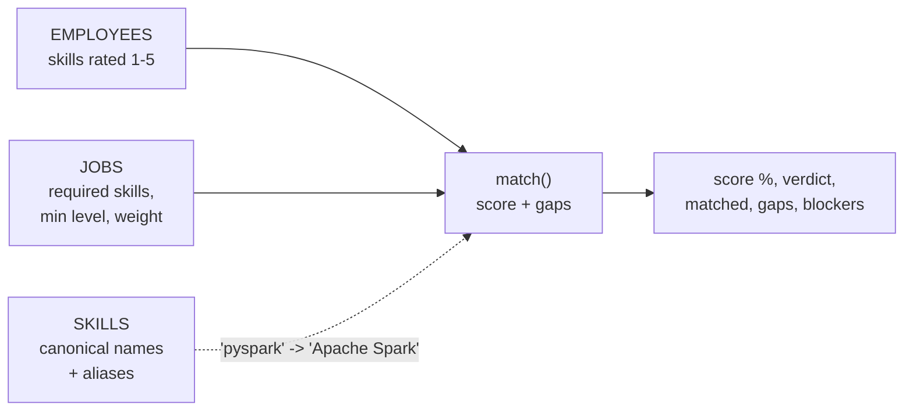
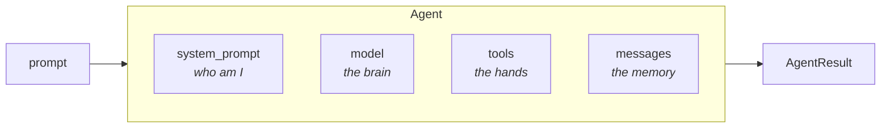
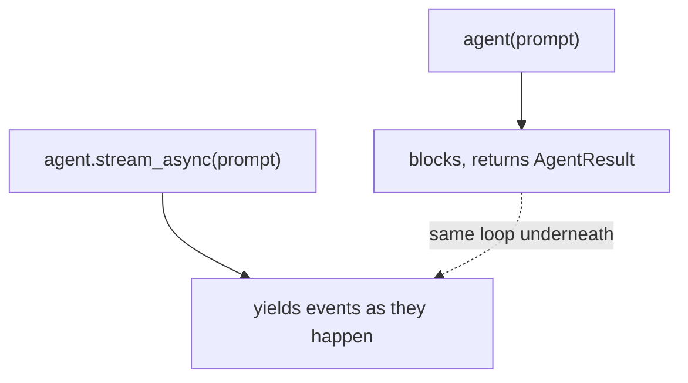

# 01 · Strands Agents — First Example

> **Problem** — Wiring an LLM into an app used to mean writing the loop yourself:
> call the model, parse a tool request, dispatch it, append the result, call again,
> check for termination. That loop is the same every time, and every team rewrites
> it slightly wrong.
>
> **Strands solves it** by owning the loop. You bring a model and some functions.

---

## The whole idea in 5 lines

```python
from strands import Agent, tool

@tool
def employee_skill_level(employee_name: str, skill: str) -> int:
    """Return an employee's proficiency in one skill, from 0 to 5."""
    return skill_level(find_employee_by_name(employee_name), skill)

agent = Agent(tools=[employee_skill_level])
agent("What level is Priya at in pyspark?")
```

No routing, no `if intent == ...`. The **model** reads your tool's name, docstring
and type hints and decides to call it. That is what "model-driven" means.

### The domain for the whole course

Every lesson from here on runs on one small world, defined in
[app/_shared/hr_data.py](../_shared/hr_data.py):



`match()` is plain arithmetic, never a model call. A score you cannot reproduce
by hand is a score nobody will defend in a hiring review — the model's job is to
*explain* the number, not to invent it.

---

## Anatomy of an Agent



| Argument | What it is | Default |
|---|---|---|
| `model` | Provider object, or a Bedrock model-id string | `BedrockModel()` |
| `tools` | Functions, modules, MCP clients, other agents | none |
| `system_prompt` | Persona + rules | none |
| `name` / `description` | Identity — matters once agents call each other (lesson 07) | `"Strands Agents"` |
| `callback_handler` | Where streamed events go | prints to stdout |

---

## What comes back

`agent(...)` returns an **`AgentResult`**, not a string.

```python
result = agent("What level is Priya at in pyspark?")

str(result)             # the text — this is why print(result) works
result.stop_reason      # "end_turn" | "tool_use" | "max_tokens" | "interrupt" | ...
result.message          # the final assistant message (raw content blocks)
result.metrics          # tokens, latency, per-cycle traces
result.structured_output  # populated only in lesson 05
```

`stop_reason` is the field you will grep for in every incident. Learn it early.

---

## The code in this folder

[main.py](main.py) is a slightly richer first example — two HR tools plus
`calculator` from `strands_tools`, streaming events instead of blocking:

```python
agent = Agent(
    name="SkillMatchAgent",
    description="Answers questions about employee skills and job requirements.",
    tools=[employee_skill_level, job_bar, calculator],
    model=make_model(),
    callback_handler=callback_handler,
)

async for event in agent.stream_async(message):
    if "data" in event:
        log.info(event["data"])          # text as it is generated
    elif "current_tool_use" in event:
        log.info(event["current_tool_use"]["name"])   # which tool fired
```

Two ways to consume the same run:



Use `agent(...)` for scripts and batch jobs. Use `stream_async` for anything a
human is watching (lesson 06).

---

## Run it

```bash
uv run app/01_quickstart/main.py
# Ask about a skill or a job (enter for: 'Does Priya clear the Apache Spark bar for job J2001? By how many levels?'):
```

The default question needs two facts and one subtraction: Priya's Spark level
(5), the J2001 bar (4), and the gap. Watch which of those the model looks up and
which it tries to do in its head — `calculator` is there so it does not have to.

You will notice **every line is logged twice**. That is deliberate here: this file
both passes a `callback_handler` *and* iterates `stream_async`, so the same event
reaches two consumers. Pick one. Every later lesson passes
`callback_handler=None` and iterates the stream.

---

## Gotchas

- **No `model=`** means Bedrock, which means AWS credentials. Every lesson here
  passes `make_model()` to stay on local Ollama.
- **The docstring is the API contract.** The model only sees name + docstring +
  type hints. A vague docstring is a tool the model will misuse.
- **Small local models are picky.** `temperature=0.2` is not cosmetic — it is the
  difference between reliable tool calls and creative JSON.
- **Never let the model do the matching.** It can call `match()`, quote it and
  explain it. The moment it estimates a percentage itself, you have a number no
  auditor can reproduce.

---

## Remember

> **An Agent is a model, a prompt, and a list of tools. Strands owns the loop.**
