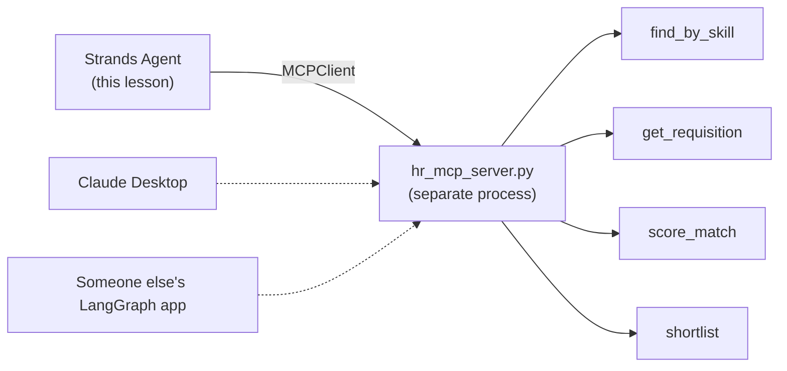

# 02 · Tools from an MCP Server

> **Problem** — The HR team owns employee data. You do not want a copy of their
> query logic pasted into your agent, and they do not want to re-implement it for
> every framework a consuming team happens to like.
>
> **MCP (Model Context Protocol) solves it**: tools live in a server, agents are
> clients. Write the tool once, use it from any MCP-aware agent.

---

## Mental model



The server owns the data and the scoring rule. Three different clients get the
same four tools and — more importantly — the *same score* for the same candidate.

The agent asks the server *"what can you do?"* on connect, and the answers land in
the agent's tool registry as if you had written them yourself. Prove it to yourself
in one line:

```python
with hr_server:
    tools = hr_server.list_tools_sync()
    print([t.tool_name for t in tools])
    # ['find_by_skill', 'get_requisition', 'score_match', 'shortlist']
```

Those two names were never written in your codebase. They came off the wire.

---

## The code

[main.py](main.py):

Two files. [hr_mcp_server.py](hr_mcp_server.py) knows nothing about Strands:

```python
from mcp.server.fastmcp import FastMCP

mcp = FastMCP("hr-skills")

@mcp.tool(description="Score one employee against one job and explain the gaps.")
def score_match(employee_id: str, job_id: str) -> dict:
    return match(get_employee(employee_id), get_job(job_id))

mcp.run(transport="stdio")
```

[main.py](main.py) is the client:

```python
from mcp import StdioServerParameters, stdio_client
from strands import Agent
from strands.tools.mcp import MCPClient

hr_server = MCPClient(lambda: stdio_client(
    StdioServerParameters(command=sys.executable, args=["app/02_mcp/hr_mcp_server.py"])
))

with hr_server:
    agent = Agent(tools=hr_server.list_tools_sync(), model=make_model())
    agent("Who are the top 3 available candidates for J2001, and what are their gaps?")
```

Three things worth noticing:

1. **You can pass either.** `tools=[hr_server]` hands the agent the *client* —
   `MCPClient` is a `ToolProvider` and the agent calls `load_tools()` itself.
   Listing tools explicitly, as here, lets you print and filter them first.
2. **The lambda is deliberate.** `MCPClient` needs to be able to *re-open* the
   transport, so it takes a factory, not a live connection.
3. **`stdio_client`** launches the server as a subprocess and talks over stdin/stdout.
   `sys.executable` is this venv's python, so the server sees the same dependencies
   you do. The other common transport is `streamablehttp_client` for a remote server.
4. **The `with` block is load-bearing.** MCP tools are only callable while the
   session is open; leaving the block kills the subprocess. Calling a tool after
   that fails at runtime, not at construction.

---

## Transports at a glance

| Transport | Use when | Constructor |
|---|---|---|
| **stdio** | Server runs locally as a subprocess | `stdio_client(StdioServerParameters(command=..., args=[...]))` |
| **Streamable HTTP** | Server is a remote service | `streamablehttp_client("https://host/mcp")` |
| **SSE** | Legacy remote servers | `sse_client("https://host/sse")` |

```python
from mcp.client.streamable_http import streamablehttp_client

remote = MCPClient(lambda: streamablehttp_client("https://example.com/mcp"))
agent = Agent(tools=[remote])
```

---

## Lifecycle

MCP clients hold a subprocess or a socket. The agent manages that for you, but
be explicit when you can:

```python
agent = Agent(tools=[mcp_client])
try:
    agent("...")
finally:
    agent.cleanup()      # shuts down every ToolProvider the agent loaded
```

Mixing sources is normal and expected:

```python
agent = Agent(tools=[mcp_client, my_local_tool, calculator])
```

---

## Run it

```bash
uv run app/02_mcp/main.py
```

Three questions, answered entirely from tools that live in another process:
the requisition's mandatory skills, a ranked shortlist, and one pairing (E1010
against J2003) where the candidate is blocked by exactly one mandatory skill.

### When the client will not start

```
ValueError: Failed to load tool <MCPClient ...>: Failed to start MCP client:
  the client initialization failed: unhandled errors in a TaskGroup
```

That message tells you nothing, because the stdio transport swallows whatever the
*subprocess* said. **Always run the server command by hand to see the real error:**

```bash
uv run app/02_mcp/hr_mcp_server.py
```

It should sit there waiting on stdin. If it traceback's instead, that traceback is
your real error — an import failure, a missing env var, or a syntax error in the
server. Common causes for third-party servers: the package cannot be fetched
(behind TLS interception, set `UV_NATIVE_TLS=1`), or the command is not on `PATH`.

---

## Gotchas

- **A dead server is a silent capability loss.** If the subprocess fails to start,
  the agent simply has fewer tools and will improvise. Log `agent.tool_names` on boot.
- **Tool names collide.** Two servers exposing `search` will fight. Namespace your
  own servers.
- **Trust boundary.** An MCP server's tool descriptions are text the model obeys.
  Only connect servers you trust.
- **The server is where policy belongs.** `score_match` returning the same number
  to every client is the point. If each agent re-implemented matching, "why did
  she score 82 here and 61 there?" becomes an unanswerable question.

---

## Remember

> **`MCPClient` is a tool *provider*: pass the client, get the server's whole toolbox.**
