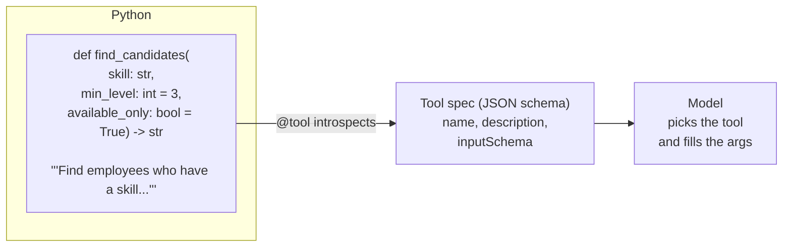
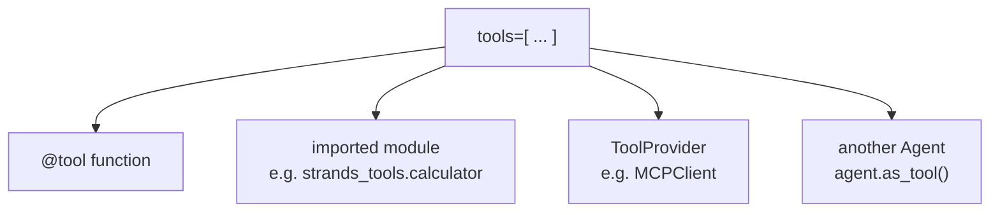

# 03 · Adding Tools

> **Problem** — A language model can only produce text. It cannot read your
> HRMS, score a candidate against a requisition, or know that Priya is on the
> bench. Tools are the only way out of that box — and the framework must
> translate a Python function into something a model can *understand well enough
> to call correctly*.
>
> **Strands solves it** with `@tool`: your function's signature and docstring
> become a JSON schema the model reads. You never write the schema by hand.

---

## What the model actually sees



| Python thing | Becomes |
|---|---|
| function name | tool `name` |
| docstring summary | tool `description` |
| type hints | `inputSchema` property types |
| `Args:` section | per-argument descriptions |
| default values | optional parameters |

**This is the whole reason to write good docstrings.** They are not documentation
here, they are prompt.

---

## The four ways to add a tool



### 1. A decorated function

```python
@tool
def find_candidates(skill: str, min_level: int = 3, available_only: bool = True) -> str:
    """Find employees who have a skill at or above a proficiency level.

    Args:
        skill: Skill name or alias, e.g. "pyspark" or "Apache Spark"
        min_level: Minimum proficiency, 1 (aware) to 5 (expert). Default 3.
        available_only: Only people on the bench, not staffed on a project.
    """
    ...
```

Note `min_level: int = 3` — a default value makes the parameter optional in the
schema, so "who knows Spark?" and "who knows Spark at level 4+?" both work.

### 2. A pre-built module

```python
from strands_tools import calculator, current_time, file_read, http_request

agent = Agent(tools=[calculator, current_time])
```

`strands-agents-tools` ships ~40 of these — shell, editor, python_repl, retrieve,
memory, browser, use_aws, and more.

### 3. Override the generated spec

When the function name is an internal detail:

```python
@tool(
    name="score_candidate",
    description="Score one employee against one open job. Returns the match percentage, "
    "the skills that met the bar, and the gaps that did not.",
)
def _run_match_engine(employee_id: str, job_id: str) -> dict:
    ...
```

The model sees `score_candidate`; your codebase keeps `_run_match_engine`.

### 4. Tools that need the agent — `ToolContext`

```python
@tool(context=True)
def shortlist_candidate(employee_id: str, reason: str, tool_context: ToolContext) -> str:
    """Add a candidate to the shortlist for the requisition being worked on."""
    employee = get_employee(employee_id)          # validate before you write
    if employee is None:
        return f"No employee {employee_id!r}. Pass an id like 'E1002'."

    agent = tool_context.agent
    shortlist = agent.state.get("shortlist") or []
    shortlist.append({"employee_id": employee_id, "reason": reason})
    agent.state.set("shortlist", shortlist)
    return f"Shortlisted {employee['name']} ({len(shortlist)} on the list)."
```

`tool_context` carries three things — and the `tool_context` parameter is invisible
to the model:

| Field | What it gives you |
|---|---|
| `tool_context.agent` | the calling agent — its `state`, `messages`, `model` |
| `tool_context.tool_use` | this call's `toolUseId` and raw input |
| `tool_context.invocation_state` | kwargs passed into `agent(...)` for this run |

It is also the handle you use to pause for a human — see lesson 15.

---

## Return values

Return anything JSON-serializable and Strands wraps it. Return a `ToolResult` dict
when you need to signal failure explicitly:

```python
@tool
def get_profile(employee_id: str) -> dict:
    """Fetch an employee's skill profile."""
    employee = get_employee(employee_id)
    if employee is None:
        return {"status": "error",
                "content": [{"text": f"Unknown employee {employee_id!r}. Known ids: E1001, E1002, ..."}]}
    return {"status": "success", "content": [{"text": describe(employee)}]}
```

An `"error"` result goes back to the model as text — the model can read it and
retry with better arguments. That is a feature: **let the model recover.**

---

## Run it

```bash
uv run app/03_adding_tools/main.py
```

Expected shape of the output:

```
Registered tools: ['find_candidates', 'score_candidate', 'shortlist_candidate', 'calculator']
E1002 Priya Raman — level 5, Bengaluru, bench
E1005 Vikram Iyer — level 4, Chennai, bench
Shortlisted Priya Raman (1 on the list).
Agent state after the run: {'shortlist': [{'employee_id': 'E1002', ...}]}
```

`find_candidates("pyspark", 4)` returns Apache Spark people — alias resolution
lives in the data layer, not the prompt. The model is free to use whatever word
the hiring manager used.

---

## Gotchas

- **Untyped parameters become `any`.** The model will pass junk. Always annotate.
- **Docstring drift is a bug.** Change the behaviour, change the docstring.
- **Too many tools hurts.** Small models degrade past ~10–15 tools. Split into
  multiple agents (lesson 07) rather than growing one toolbox forever.
- **Sync tools are fine.** Strands runs a plain `def` tool via `asyncio.to_thread`,
  so it will not block the loop. Use `async def` when you already have async I/O.
- **Validate ids inside the tool.** A small local model will cheerfully pass
  `"<the best candidate>"` as an `employee_id`. State that outlives the turn must
  reject that, and the rejection text is what lets the model correct itself.
- **Two hops are reliable, three are not** on `llama3.2`. If a task needs
  find → score → shortlist, either say so step by step or move up a model size.

---

## Remember

> **Signature + docstring = the tool's API contract with the model.**
