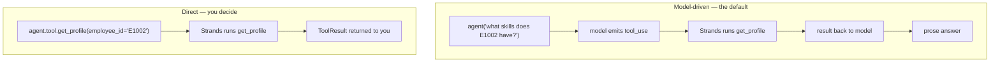
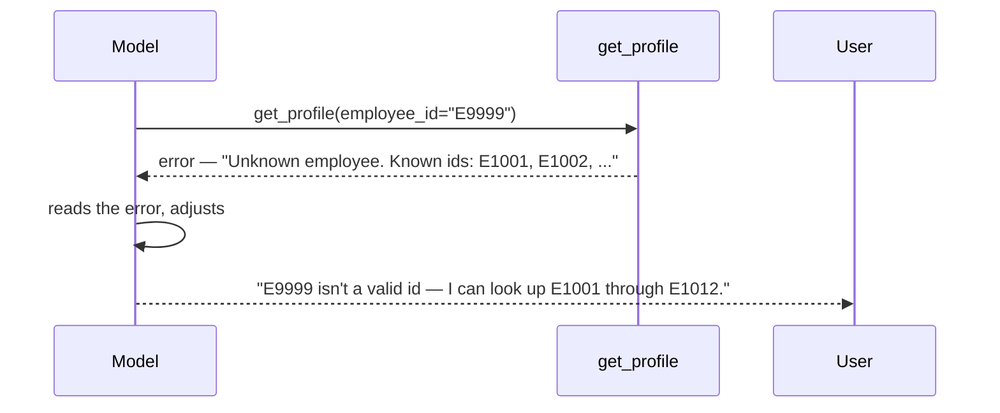

# 04 · Using Tools

> **Problem** — "The model decides" is wonderful until it isn't. Sometimes you
> *know* which tool must run. Sometimes a tool must never run without approval.
> Sometimes three tool calls should run in parallel, and sometimes they must not.
> And sometimes the agent gets stuck calling the same tool forever.
>
> **Strands solves it** by making every one of those a knob, without giving up
> the model-driven default.

---

## Two paths to the same tool



```python
result = agent.tool.get_profile(employee_id="E1002")
# {'toolUseId': '...', 'status': 'success',
#  'content': [{'text': 'Priya Raman (Senior Data Engineer): Python L4, Apache Spark L5, ...'}]}
```

The direct call is still **recorded in `agent.messages`**, so the next model turn
sees it. That is usually what you want — it is how you seed an agent with a fact.
Turn it off when the call is plumbing:

```python
agent.tool.get_profile(employee_id="E1008", record_direct_tool_call=False)
```

Use direct calls for: pre-fetching the requisition before the conversation starts,
deterministic workflow steps, testing a tool in isolation. In a screening app the
first call is almost always direct — you already know which req you opened.

---

## Let the model recover from errors

Return an error result instead of raising, and the failure becomes information:

```python
return {"status": "error",
        "content": [{"text": f"Unknown employee {employee_id!r}. Known ids: E1001, E1002, ..."}]}
```



Note what the error text contains: the *valid options*. "Employee not found" makes
recovery a guess; listing the ids makes it a lookup.

A raised exception is caught and returned to the model too, but a *deliberate*
message tells the model how to fix itself. Write error text for the model, not for a log.

---

## Execution order

Multiple tool calls in one model turn run **concurrently by default**.

| Executor | Behaviour | Use when |
|---|---|---|
| `ConcurrentToolExecutor` (default) | all tool calls in a turn run in parallel | independent reads |
| `SequentialToolExecutor` | one at a time, in the order the model emitted them | writes, rate limits, ordering matters |

Reading two profiles is a parallel job. Shortlisting two people against a cap of
three is not — run those sequentially or both calls will see the same count.

```python
from strands.tools.executors import SequentialToolExecutor

agent = Agent(tools=[...], tool_executor=SequentialToolExecutor())
```

---

## Budget caps — the runaway safety valve

```python
result = agent("Get E1005's profile, then score them against J2002.", limits={"turns": 1})
result.stop_reason   # "limit_turns"
```

This matters more than it looks in a screening agent: "find me someone for this
role" over a 4,000-person directory is exactly the prompt that turns into eighty
profile lookups if nothing stops it.

| Limit | Caps | `stop_reason` |
|---|---|---|
| `turns` | loop iterations (model call + its tools) | `limit_turns` |
| `output_tokens` | cumulative generated tokens | `limit_output_tokens` |
| `total_tokens` | cumulative input + output | `limit_total_tokens` |

Limits **terminate gracefully** — no exception, and `agent.messages` stays valid,
so you can inspect and re-invoke. Token caps are soft: one oversized response can
overshoot by a turn, since checks happen at turn boundaries.

---

## Tools that report progress

Make the tool an async generator. Every `yield` streams out; the **last** yield is
the result the model sees.

```python
@tool
async def screen_shortlist(job_id: str) -> str:
    """Screen every bench employee against a job, reporting progress as it goes."""
    for index, employee in enumerate(bench, start=1):
        result = match(employee, job)
        yield f"screened {index}/{len(bench)}: {result['name']} {result['score']}%"
    yield f"Screened {len(bench)} candidates. Best: {best['name']} at {best['score']}%."
```

```python
async for event in agent.stream_async("Screen the bench for J2001."):
    if "tool_stream_event" in event:
        print(event["tool_stream_event"]["data"])
        # screened 1/8: Priya Raman 100%
        # screened 2/8: Rahul Menon 61% ...
```

The model only ever sees the last line. The intermediate yields exist for the
human watching a progress bar — which is the difference between a 20-second
screen that feels broken and one that feels like work being done.

---

## Stopping a tool before it runs

Full treatment in lesson 13, but the hook that matters lives here conceptually:

```python
def block_adverse_actions(event: BeforeToolCallEvent) -> None:
    if event.tool_use["name"].startswith("reject_"):
        event.cancel_tool = "Rejections require a human recruiter."

agent = Agent(tools=[...], hooks=[block_adverse_actions])
```

`cancel_tool` short-circuits execution and hands your message back to the model as
the tool result. Set `event.selected_tool` instead to *swap* in a different implementation.

---

## Run it

```bash
uv run app/04_using_tools/main.py
```

---

## Gotchas

- **Direct calls skip the model entirely** — no reasoning, no retries, no hooks
  around model selection. That is the point, but do not expect the agent to
  "know" you called it beyond the recorded message.
- **Concurrency is per-turn**, not global. Two tool calls the model emits in
  *different* turns are always sequential.
- **`limits` is per invocation**, not cumulative across calls on the same agent.
- **A tool that reads people should be capped.** Lesson 16 turns that cap into a
  reusable plugin; `limits` is the crude version you can add today.

---

## Remember

> **Model-driven by default; `agent.tool.x()` when you already know; `limits` so it can't run forever.**
