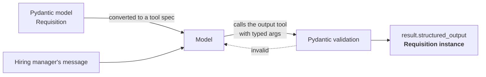
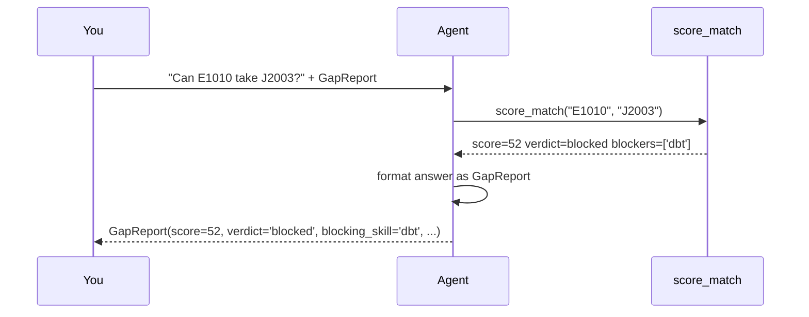

# 05 · Structured Responses

> **Problem** — Prose is unusable downstream. A hiring manager's `"I need someone
> senior who can own our pyspark pipelines"` cannot go into a requisition table.
> So teams write
> a second prompt asking for JSON, then a regex to find the JSON, then a try/except
> because the model wrapped it in ```` ```json ````, then a validator because it
> invented a field. That whole pipeline is a bug farm.
>
> **Strands solves it** with `structured_output_model=`: hand it a Pydantic class,
> get back a validated instance of that class. Parsing is not your problem.

---

## How it works



Strands turns your schema into a **tool the model must call**. That is why it works
on any tool-capable model, and why validation failures can be retried automatically.

---

## The schema is the prompt

```python
class SkillRequirement(BaseModel):
    """One skill a role needs."""

    skill: str = Field(description="Canonical skill name, e.g. 'Apache Spark' not 'pyspark'")
    min_level: int = Field(ge=1, le=5, description="1 aware, 3 working independently, 5 expert")
    mandatory: bool = Field(description="True only if a candidate without it cannot do the job")


class Requisition(BaseModel):
    """An open role, extracted from a hiring manager's message."""

    title: str = Field(description="Job title, under 6 words")
    department: str
    location: str = Field(description="City, or 'Remote' if none is stated")
    min_experience_years: int = Field(ge=0, le=25)
    seniority: Literal["junior", "mid", "senior", "lead"]
    required_skills: list[SkillRequirement] = Field(description="3 to 6 skills, mandatory ones first")
```

Every `description=` is read by the model. **Field descriptions are where you put
the business rules** — `"True only if a candidate without it cannot do the job"`
does more work than a paragraph in the system prompt, because it is attached to
the exact field where the mistake would be made.

`Literal[...]` is your friend: it makes an invalid seniority structurally
impossible. `ge=1, le=5` does the same for a proficiency level, so "level 7 in
Spark" can never reach your database.

---

## Three ways to use it

### Per invocation — same agent, different shapes

```python
result = agent(message, structured_output_model=Requisition)
req: Requisition = result.structured_output
```

### Agent-level default — every call returns this shape

```python
agent = Agent(model=..., structured_output_model=Requisition)
req = agent(message).structured_output
```

### With tools — the loop runs first, then the shape is forced

```python
agent = Agent(tools=[score_match], system_prompt="Assess the candidate. Call score_match once.")
report = agent("Can E1010 take the Analytics Engineer role J2003?",
               structured_output_model=GapReport).structured_output
```



The `score` and `verdict` fields are described as *"the value returned by the
tool, unchanged"*. That phrasing is load-bearing: without it a model will happily
round 52 to "about 50" on the way into a typed field.

This composition — **tools gather facts, schema shapes the answer** — is the single
most useful pattern in the whole SDK.

---

## Nesting works

`Requisition.required_skills` is a `list[SkillRequirement]` — a model inside a
model. Lists, nested models, `Optional`, enums — anything Pydantic can express.

Nesting costs you accuracy on a weak model, but it is not the cliff edge — see
"Run it" below for where the real one is.

---

## Run it

```bash
uv run app/05_structured_output/main.py
```

**Expect failures on llama3.2** — including demo 1, the flat one. All three demos
catch `StructuredOutputException` and print what went wrong, so the script always
runs to the end. Those messages are the lesson.

Now run the identical code against a bigger local model:

```bash
ollama pull qwen2.5:7b
OLLAMA_MODEL=qwen2.5:7b uv run app/05_structured_output/main.py
```

All three pass, nested schema included. Not one line of Python changed.

That is the point of this lesson. Structured output is a **tool call** underneath —
Strands hands the model a tool whose input schema is your Pydantic class. So the
question is never "is my schema too complex", it is "can this model call a tool
reliably". A 3B model often cannot, which is why demo 1 fails on a schema with no
nesting in it at all. Nesting raises the bar; it does not set it.

Strands raises rather than handing you a half-filled requisition, and it does not
give up cheaply: when the model answers with prose instead of calling the tool, the
event loop re-prompts in *forced* mode and tries again. The exception means it
failed twice.

If you are stuck on a small model: split the call. One extracts the flat requisition
fields, a second extracts the skills list. Two reliable calls beat one that fails
most of the time.

> **On Ollama specifically**, forced mode is weaker than it looks. Forcing works by
> sending `tool_choice`, and the Strands Ollama provider ignores it — that is the
> `UserWarning: A ToolChoice was provided to this provider but is not supported`
> you will see. The retry is just a re-prompt, so a model that will not call the
> tool voluntarily often will not call it under duress either. On Bedrock or
> Anthropic, `tool_choice` is honoured and the forced retry actually forces.

---

## Gotchas

- **`agent.structured_output(Model, prompt)` is deprecated.** It bypasses the tool
  loop. Use `structured_output_model=` on the agent or the invocation instead.
- **It is a tool call, so it needs a tool-calling model.** Before you blame your
  schema, check the model can call tools reliably. `llama3.2` (3B) fails demo 1's
  flat schema; `qwen2.5:7b` passes all three unchanged.
- **Nesting is expensive.** `list[SubModel]` roughly doubles the difficulty. On a
  small model, prefer two flat calls over one nested schema.
- **Wrap it — every call, not just the scary ones.** `StructuredOutputException`
  means the model would not call the output tool even when forced. Catch it and
  degrade, do not let it 500. All three demos here are wrapped, because the flat
  one fails too.
- **Tools + schema can drift.** In demo 3 a small model sometimes re-derives the
  score instead of copying the tool's. Say "unchanged" in the field description;
  a bigger model helps more. In production, assert it: if
  `report.score != tool_score`, reject the response rather than store it.
- **`str(result)` returns the JSON** when structured output is present, not the prose.
- **Optional fields invite omission.** If a field matters, make it required and
  describe it.
- **Descriptions cost tokens** — but they buy accuracy. Spend them on the ambiguous fields.
- **A typed field is not a true field.** `verdict: Literal["strong", ...]` guarantees
  the string is one of four values, not that it is the *right* one. Validation is
  a shape check, never a correctness check.

---

## Remember

> **Give it a Pydantic class, get an instance back. Field descriptions are prompt.**
