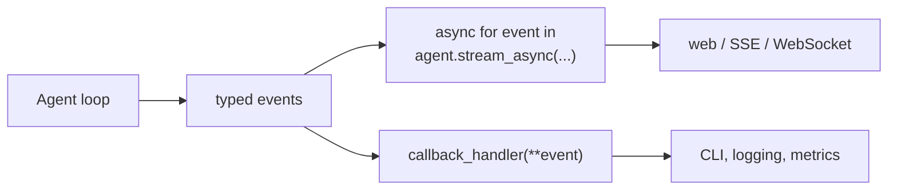
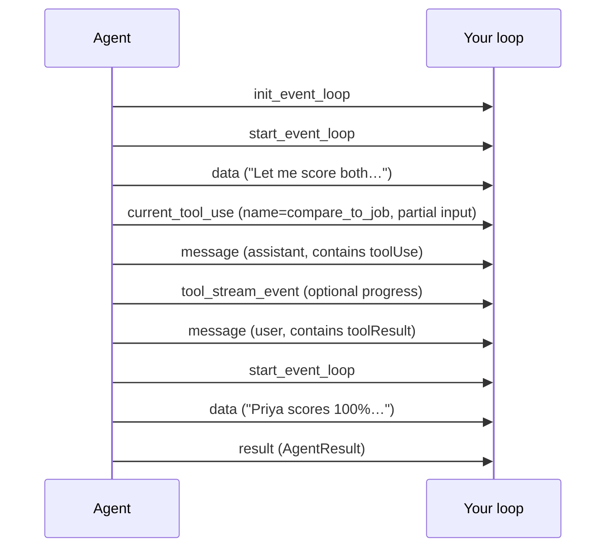

# 06 · Streaming Responses

> **Problem** — Screening a bench against a requisition takes 20 seconds. A
> blocking `agent(prompt)` gives the recruiter a spinner for all 20, then a wall
> of text. Worse, you cannot tell a hung screen from a slow one, and you cannot
> cancel it.
>
> **Strands solves it** with `stream_async`: an async iterator of typed events
> covering the *whole* loop — not just text, but tool selection, tool progress,
> message commits and the final result.

---

## Two APIs, one stream



`callback_handler` is the synchronous hook — the same events, pushed to a function.
`stream_async` is the pull-based iterator. Both see identical data; pick by shape,
not by capability.

```python
agent = Agent(..., callback_handler=None)   # None = silence the default printer
```

> The **default** `callback_handler` prints to stdout. In any real app you set it
> to `None` and consume `stream_async` instead — otherwise your output is doubled.

---

## The event taxonomy

Events are plain dicts. Detect by key.

| Key | Meaning | Typical use |
|---|---|---|
| `init_event_loop` | invocation is starting | start a timer |
| `start_event_loop` | a new cycle begins (model call ahead) | "thinking…" |
| `data` | a chunk of assistant text | print / stream to UI |
| `delta` | the raw provider delta behind `data` | rarely needed |
| `current_tool_use` | tool call being assembled (name + partial input) | "scoring `compare_to_job`…" |
| `tool_stream_event` | progress yielded by a streaming tool | "screened 4/8 candidates" |
| `reasoningText` | extended-thinking text | show/hide a reasoning pane |
| `message` | a full message committed to history | audit log |
| `result` | the final `AgentResult` | close the stream |
| `force_stop` | loop aborted by tool or exception | error UI |

```python
async for event in agent.stream_async(prompt):
    if "data" in event:
        print(event["data"], end="", flush=True)
    elif "current_tool_use" in event and event["current_tool_use"].get("name"):
        print(f"<calling {event['current_tool_use']['name']}>")
    elif "result" in event:
        print(event["result"].stop_reason)
```

---

## Order of events in a tool-using turn



Note `current_tool_use` fires **repeatedly** as the model streams the tool's JSON
arguments. Deduplicate on `toolUseId` if you only want one notification per call —
that is exactly what the `seen_tools` set in [main.py](main.py) does.

---

## Behind an HTTP endpoint

```python
async def sse_chunks(prompt: str):
    async for event in agent.stream_async(prompt):
        if "data" in event:
            yield f"data: {event['data']}\n\n"
        elif "current_tool_use" in event and event["current_tool_use"].get("name"):
            yield f"event: tool\ndata: {event['current_tool_use']['name']}\n\n"
        elif "result" in event:
            yield "event: done\ndata: {}\n\n"
```

Drop that generator into FastAPI's `StreamingResponse(media_type="text/event-stream")`
and you have the screening panel: text streams into the explanation pane, `event: tool`
lines drive the progress row above it.

---

## Cancelling

```python
task = asyncio.create_task(consume(agent.stream_async(prompt)))
...
agent.cancel()      # cooperative stop at the next safe point
```

---

## Run it

```bash
uv run app/06_streaming/main.py
```

Demo 2 prints one labelled line per event — read that output once and the taxonomy
above will stick.

Demo 5 prints a ranked shortlist with **no model involved at all**. It is there as
a counterweight: `rank_candidates()` is deterministic Python, and streaming it
token by token from a model would be slower, costlier and wrong more often. Stream
the model's *explanation* of a shortlist; compute the shortlist itself.

---

## Gotchas

- **Forgetting `callback_handler=None`** while also iterating `stream_async` prints
  everything twice.
- **`data` is not JSON-safe by itself.** Escape before embedding in SSE if the model
  can emit newlines mid-token.
- **One invocation at a time.** A second concurrent call on the same agent raises
  `ConcurrencyException` by default — that guard is protecting `agent.messages`.
- **`result` arrives last, always.** Use it to close the stream, never assume the
  text you saw is complete before it.
- **Streaming is presentation, not intelligence.** If a number is on screen, it
  should have come from a tool. Watching it get typed out one token at a time makes
  a hallucinated score look every bit as authoritative as a real one.

---

## Remember

> **`stream_async` yields dicts; branch on the key. `data` = text, `result` = done.**
