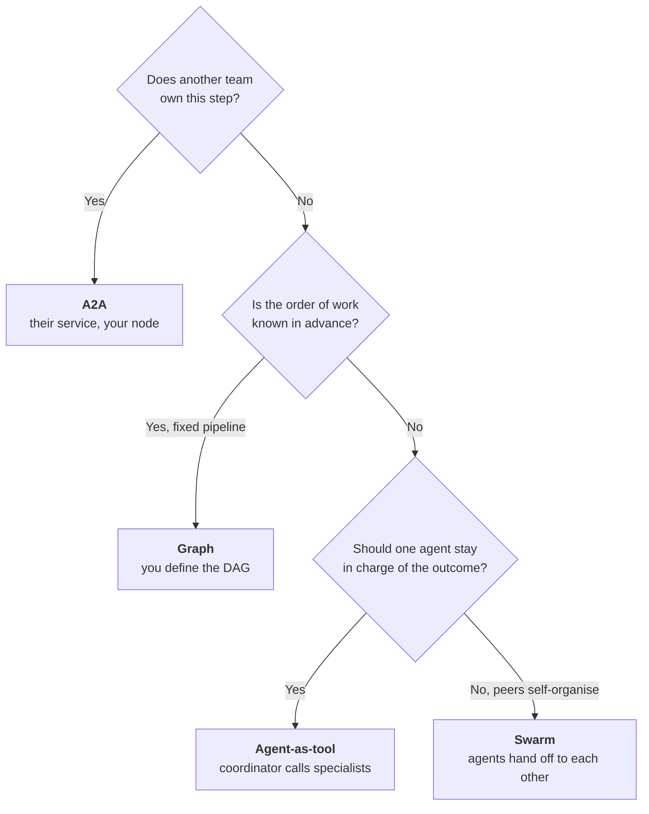
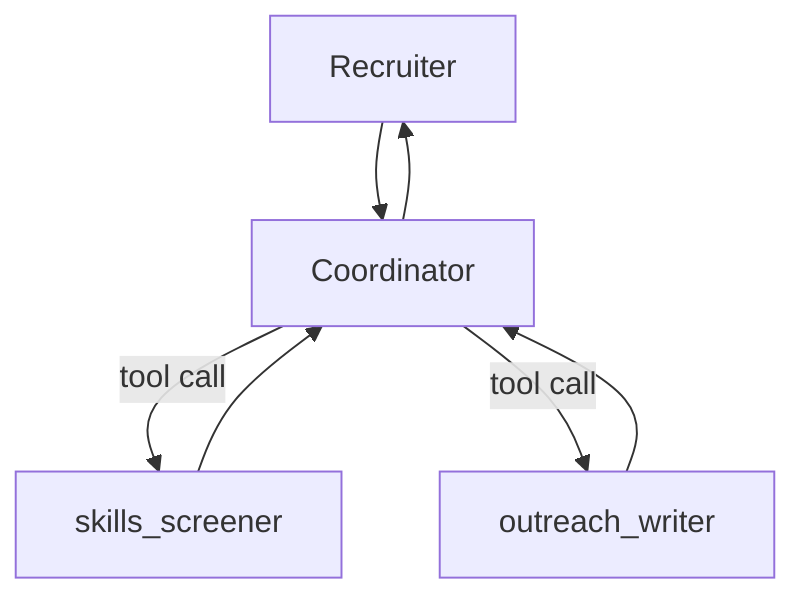
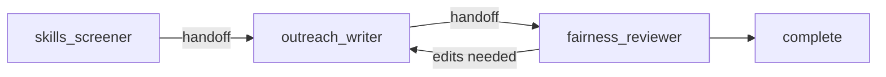
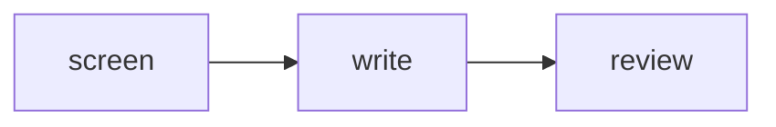
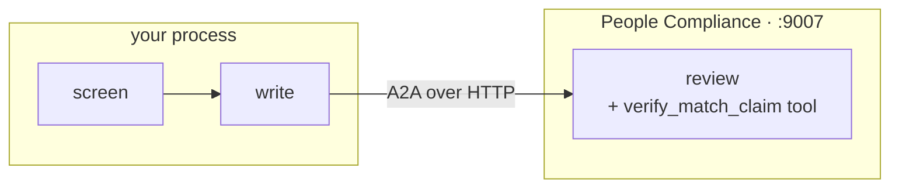
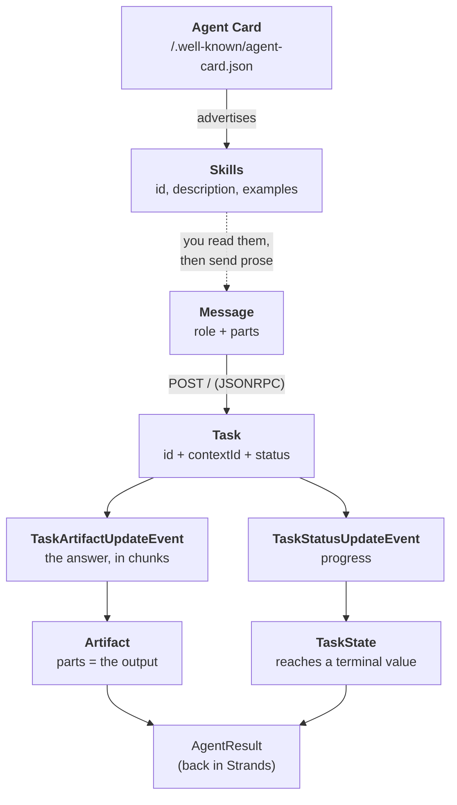

# 07 · Multi Agents

> **Problem** — One agent that screens candidates, writes outreach notes *and*
> polices them for bias does all three badly. It picks wrong tools, forgets the
> fairness rules under a long prompt, and is unreviewable — nobody can say what it
> will do to the next candidate.
>
> **Strands solves it** with three composition patterns — plus A2A when the step
> belongs to another team entirely. The hard part is not the API, it is
> **choosing which one**.

---

## Choose the pattern first



| Pattern | Who routes | Determinism | Best for |
|---|---|---|---|
| **Agent-as-tool** | the coordinator's model | medium | assistants with specialist backends |
| **Swarm** | whichever agent is speaking | low | open-ended investigation, unknown path |
| **Graph** | you, in code | high | pipelines, approvals, compliance |
| **Graph + A2A node** | you, in code | high | a step another *team* owns and deploys |

The first three are composition questions — how do I split this work? A2A answers a
different one: **who owns the agent?** All three patterns above run in your process,
from your `main.py`. An A2A node is a service somebody else deploys, versions and
changes without telling you.

---

## Names and descriptions are load-bearing

In every pattern, one agent reads another's identity to decide what it is for:

```python
screener = Agent(
    name="skills_screener",
    description="Ranks candidates for a requisition and names their exact skill gaps.",
    system_prompt="You screen candidates. Call the tools, then report ids, scores and gaps.",
    tools=[screen_for_job, candidate_gaps],
)
```

The three specialists in [main.py](main.py):

| Agent | Owns | Must not |
|---|---|---|
| `skills_screener` | scores and gaps, from tools only | speculate about ability |
| `outreach_writer` | a 3-sentence invitation | promise pay or promotion |
| `fairness_reviewer` | APPROVED, or the exact edits | write the note itself |

`description` becomes the tool description / handoff hint. A vague description is
the #1 cause of multi-agent systems that route badly.

---

## Pattern 1 — Agent as tool



```python
coordinator = Agent(
    system_prompt="Use skills_screener to find who fits, then outreach_writer to draft the note.",
    tools=[screener.as_tool(), recruiter.as_tool()],
)
coordinator("Requisition J2001 is open. Find the best available candidate and produce an outreach note.")
```

`as_tool()` options:

- `preserve_context=False` (default) — the sub-agent resets to its construction
  state before each call. Every invocation is clean and reproducible.
- `preserve_context=True` — the sub-agent remembers across calls.
- `name=` / `description=` — override the defaults.

You can also just pass the agent: `tools=[analyst]` auto-wraps it with defaults.

---

## Pattern 2 — Swarm

Peers with a shared task. Strands injects handoff tools; whoever holds the baton
decides who gets it next.



```python
swarm = Swarm(
    nodes=[screener, recruiter, reviewer],
    entry_point=screener,
    max_handoffs=6,
    max_iterations=6,
    node_timeout=120.0,
    repetitive_handoff_detection_window=4,     # break A→B→A→B ping-pong
    repetitive_handoff_min_unique_agents=3,
)
result = swarm("Requisition J2001 is open. Find the best available candidate and produce an outreach note.")

result.status                                             # Status.COMPLETED
[n.node_id for n in result.node_history]                  # the actual path taken
```

**The guardrails are the point.** `max_handoffs`, `max_iterations`,
`execution_timeout`, `node_timeout`, and the repetitive-handoff detector. A swarm
without limits is an infinite loop with a bill.

Note what a swarm cannot promise here: that the fairness reviewer ran. If the
screener decides the note is fine and calls it done, nothing stopped it. For a
process with a mandatory step, that is disqualifying — which is why the same task
appears again below as a Graph.

> **Observed on llama3.2, running exactly this code:**
>
> ```
> status: Status.COMPLETED
> path:   skills_screener
> skills_screener: {"name": "outreach_note", "parameters": {"candidate_id": "E1002", ...}}
> ```
>
> The swarm reports success after a single node. The screener *printed* a handoff
> as text instead of calling the handoff tool, so `outreach_writer` and
> `fairness_reviewer` never ran — and nothing in the result says so. The same task
> through the Graph below completes `screen → write → review` every time.
>
> **`status: COMPLETED` means the orchestrator stopped, not that the work happened.**
> Check `node_history` against what you expected. Swarms need a model that is
> genuinely good at tool calling — verify yours before designing around one.

---

## Pattern 3 — Graph

You write the edges. The model never routes.



```python
builder = GraphBuilder()
builder.add_node(screener, "screen")
builder.add_node(recruiter, "write")
builder.add_node(reviewer, "review")
builder.add_edge("screen", "write")
builder.add_edge("write", "review")
builder.set_entry_point("screen")

graph = builder.build()
result = graph("Requisition J2001 is open. Find the best available candidate...")

result.execution_order        # [screen, write, review]
result.results["review"]      # that node's output
```

**This is the right pattern for hiring.** The fairness review is not a suggestion
the model may skip when it feels confident; it is an edge in a DAG that runs every
single time, and `execution_order` is the evidence that it did.

**Conditional edges** make it a real workflow engine:

```python
def only_if_blocked(state) -> bool:
    return "blocked" in str(state.results.get("screen", "")).lower()

builder.add_edge("screen", "suggest_training", condition=only_if_blocked)
```

A candidate blocked on one mandatory skill is a development plan, not a rejection —
a conditional edge is how that branch becomes part of the process rather than
something a recruiter has to remember.

Nodes can be agents *or* other multi-agent systems — a Swarm can be a node in a Graph.

---

## Pattern 4 — Graph with an A2A node

The rules about what a recruiter may say to a candidate belong to **People
Compliance**. They change them without asking you, and every hiring pipeline in the
company must get the same answer. A local `fairness_reviewer` is a policy fork
waiting to drift — so the review step moves out of your process entirely.



**The server** — [a2a_server.py](a2a_server.py). An ordinary Strands agent; `A2AServer`
publishes it. You never write an AgentExecutor.

```python
from strands.multiagent.a2a import A2AServer

server = A2AServer(
    agent_factory=build_reviewer,        # one agent per conversation — multi-tenant safe
    host="127.0.0.1", port=9007,
    skills=[REVIEW_SKILL],               # what other agents match against to find you
    enable_a2a_compliant_streaming=True,  # the default in the next major version
)
server.serve()
```

`name` and `description` on the agent are not cosmetic — they are copied onto the
Agent Card at `/.well-known/agent-card.json`, which is how a caller discovers what
this service is for.

**The client** — `A2AAgent` implements the same `AgentBase` protocol a local `Agent`
does, so it drops into the graph as an ordinary node:

```python
from strands.agent import A2AAgent

compliance = A2AAgent(endpoint="http://127.0.0.1:9007", name="compliance_reviewer",
                      description="People Compliance's review service.")

builder.add_node(screener, "screen")
builder.add_node(recruiter, "write")
builder.add_node(compliance, "review")     # <- another process
builder.add_edge("write", "review")
```

**That last line is the whole argument for this pattern.** Compare it with
`ask_compliance_agent` written as a `@tool`: then the remote call is something a
model *chooses* to make, and a model that forgets skips your compliance review. As a
node, the edge fires because the graph says so. No model is consulted.

```
=== 4. Graph with an A2A node (remote, another team's service) ===
discovered: People Compliance Reviewer — skills: outreach_compliance_review
status: Status.COMPLETED | nodes completed: 3
order: screen -> write -> review
compliance says: REJECTED: Remove "ideal fit" and any promises about the role.
```

### The vocabulary, and how it connects

A2A has its own nouns, and they form one chain from discovery to answer:



| Term | What it is |
|---|---|
| **Agent Card** | The discovery document: `name`, `description`, `url`, `version`, `capabilities`, `skills`, `preferredTransport`, `securitySchemes`. `A2AServer` builds it from your agent plus `skills=`. |
| **Skill** | A *declared* capability — `id`, `description`, `tags`, `examples`. Advertising, not an API: you cannot call `outreach_compliance_review(note)`. Nothing routes to a skill. |
| **Client / Server** | Roles, not identities. `main.py` is a client to Compliance; Compliance is a server to it. An agent can be both at once. |
| **Message** | One turn: `role` (user/agent), `messageId`, `parts`, optionally `taskId`/`contextId`. |
| **Part** | The content unit — `TextPart`, `FilePart`, `DataPart`. Messages carry parts; so do artifacts. |
| **Task** | The unit of work the server creates on accepting a message: `id`, `contextId`, `status`, `history`, `artifacts`. This is what makes A2A more than RPC — work is addressable and can outlive the request. |
| **contextId** | Groups many tasks into one ongoing conversation. **This is what `agent_factory(context_id)` keys on** — hence multi-tenant safe. |
| **Artifact** | The task's *output*. Status updates are progress; the artifact is the answer. |

**TaskState** — nine values, which Strands collapses into a `stop_reason` you already
know from lesson 2:

| TaskState | `stop_reason` | Means |
|---|---|---|
| `completed` `failed` `canceled` `rejected` | `end_turn` | terminal — no more events |
| `input-required` `auth-required` | `interrupt` | paused, waiting on you (lesson 15, over the wire) |
| `submitted` `working` `unknown` | — | in flight |

Where each term lives in this lesson's code:

| Term | Code |
|---|---|
| Agent Card | `compliance_card()` — `GET /.well-known/agent-card.json` |
| Skill | `REVIEW_SKILL = AgentSkill(id="outreach_compliance_review", …)` |
| Server | `A2AServer(agent_factory=build_reviewer, port=9007, skills=[…])` |
| contextId | the `context_id` argument to `build_reviewer` |
| Client | `A2AAgent(endpoint=COMPLIANCE_URL)` |
| Message + Part | the outreach note the `write` node produced |
| Task, TaskState | `result.status`, and `stop_reason` on the node's result |
| Artifact chunks | `a2a_text()` joining the content blocks |
| Transport | `preferredTransport: "JSONRPC"` → the `POST /` in the server log |

### A2A vs MCP

Both are protocols you speak to something outside your process, and they answer
different questions ([02 · MCP](../02_mcp/) is the other one):

| | MCP | A2A |
|---|---|---|
| Connects | an agent to **capabilities** | an agent to **another agent** |
| You send | `score_match(employee_id, job_id)` — typed, by name | a message; the other side decides what to do |
| Discovery | `list_tools` / `list_resources` / `list_prompts` | one Agent Card |
| Other side has | functions | judgement — its own model, prompt and tools |
| Failure mode | the tool returns an error | the agent disagrees with you |

The compliance reviewer runs **both**: it is an A2A server to your graph, and inside
it `verify_match_claim` is an ordinary tool. That stack is the normal shape — A2A at
the team boundary, MCP inside it.

**The connection that explains the pattern:** Card → Skills → Message → Task →
Artifact is a chain built for agents that have *opinions*. An MCP tool schema assumes
the caller knows what it wants and the callee just computes. A2A assumes the callee
may answer `REJECTED: remove the promise of a promotion` — something you did not ask
for and cannot override. That is why it is the right protocol for compliance and the
wrong one for a lookup.

### Two things that will bite you

**1. A remote answer arrives in pieces.** A spec-compliant A2A server streams, and
every chunk becomes its own content block — 25 of them for two sentences, so
`str(result)` prints one word per line. Join them:

```python
"".join(block.get("text", "") for block in node_result.result.message["content"])
```

**2. The remote agent's own tools are still model-driven.** The reviewer has
`verify_match_claim`, which reads the real score out of the HR record so a note
claiming "100% fit" can be checked rather than believed. On llama3.2 and qwen2.5:7b
it usually judges from the text alone and never calls it — the same small-model
weakness the Swarm section documents above. Crossing a process boundary does not
make a model better at tool calling; it only guarantees the *node* ran.

### Run it

```bash
# terminal 1 — leave it running
uv run app/07_multi_agents/a2a_server.py
curl http://127.0.0.1:9007/.well-known/agent-card.json

# terminal 2
uv run app/07_multi_agents/main.py
```

Without the server, pattern 4 prints how to start it and skips — it reads the card
first, so a missing service fails with a sentence instead of a stack trace.

---

## Results

`MultiAgentResult` is the common shape:

| Field | Meaning |
|---|---|
| `status` | `COMPLETED` / `FAILED` / `PENDING` |
| `results` | `{node_id: NodeResult}` |
| `accumulated_usage` | tokens across every node |
| `execution_count`, `execution_time` | how much work happened |
| `interrupts` | pending human-in-the-loop pauses (lesson 15) |

`GraphResult` adds `execution_order`, `completed_nodes`, `failed_nodes`.
`SwarmResult` adds `node_history`.

---

## Run it

```bash
uv run app/07_multi_agents/a2a_server.py     # terminal 1, for pattern 4
uv run app/07_multi_agents/main.py           # terminal 2
```

Four patterns, one task: fill J2001. Compare the paths they take — and note that
only the Graph guarantees the fairness reviewer saw the note. Patterns 1 and 2 are
commented out in `main()`; uncomment what you want to watch.

---

## Gotchas

- **Cost multiplies.** Three agents on one task is at least 3× the tokens. Start
  with one agent; split when it measurably fails.
- **Swarms need limits.** Always set `max_handoffs` and `max_iterations`.
- **Small models swarm badly.** llama3.2 may hand off erratically. Graphs are far
  more reliable on local models.
- **`preserve_context=True` leaks state between calls** — that is sometimes the
  goal, and sometimes a very confusing bug. In screening it is usually a bug:
  candidate B should not be judged against what the screener said about candidate A.
- **A mandatory review step is not a prompt instruction.** If a step must happen,
  it is an edge in a Graph or a hook (lesson 13), never a sentence in a system prompt.
- **A remote node is a new failure mode.** A local agent cannot be down. Read the
  Agent Card before you build the graph, and decide what a 500 from Compliance
  means for your pipeline — usually "stop", never "skip the review".
- **A2A is a boundary, not a speed-up.** Every node still costs a full model run,
  now with HTTP in front of it. Reach for it when *ownership* differs, not latency.

---

## Remember

> **Known order → Graph. Coordinator in charge → agent-as-tool. Let them figure it out → Swarm.**
> **Someone else's agent → A2A node in your Graph.**
