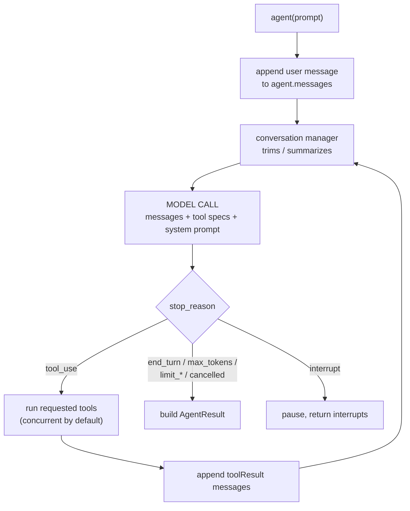
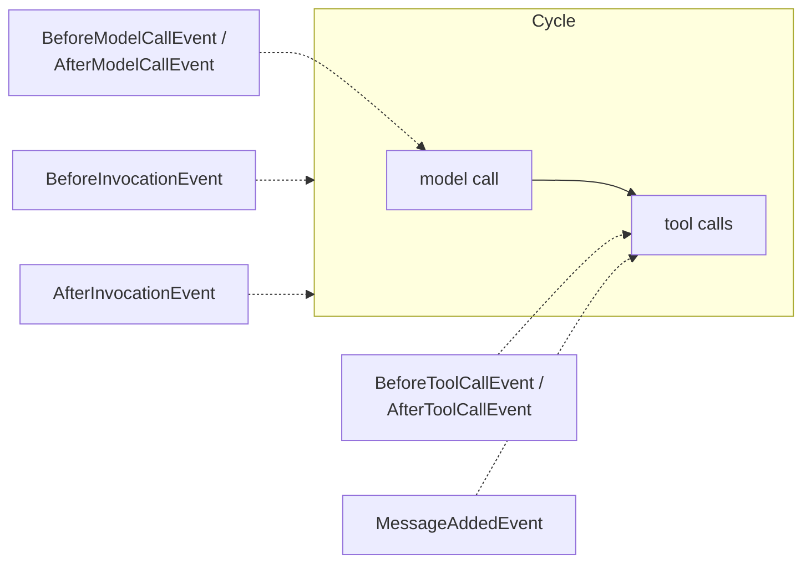

# 08 · The Agent Loop

> **Problem** — Agents fail in the middle, not at the edges. "It called the wrong
> tool", "it looped forever", "it stopped early", "it cost $40". You cannot debug
> any of that without a mental model of what runs between `agent(prompt)` and the
> answer.
>
> This lesson has no new API. It has **the model of the machine** — everything from
> here on plugs into a specific point in it.

---

## The loop



**One cycle = one model call + the tools it asked for.** Cycles repeat until the
model stops asking for tools. That is the entire algorithm.

---

## Where every feature attaches



| Lesson | Attaches at |
|---|---|
| 14 Conversation management | before every model call — decides what messages survive |
| 13 Hooks | before/after model, before/after tools, on message added |
| 15 Interrupts | inside a tool or a before-tool hook — pauses the whole loop |
| 11 Sessions | after invocation / after message — persists what happened |
| 04 Limits | checked at the top of each cycle |

---

## Watching it happen

```python
class LoopTracer(HookProvider):
    def register_hooks(self, registry, **_):
        registry.add_callback(BeforeModelCallEvent, self.on_model_start)
        registry.add_callback(AfterModelCallEvent, self.on_model_end)
        registry.add_callback(BeforeToolCallEvent, self.on_tool_start)

agent = Agent(tools=[get_requisition, screen_bench], hooks=[LoopTracer()])
agent("Who should we interview for J2002?")
```

Output for a two-hop question:

```
── invocation start ──
  cycle 1: → model
  cycle 1: ← model (stop_reason=tool_use)
  cycle 1:   ⚙ get_requisition({'job_id': 'J2002'})
  cycle 1:   ✓ get_requisition -> success
  cycle 2: → model
  cycle 2: ← model (stop_reason=tool_use)
  cycle 2:   ⚙ screen_bench({'job_id': 'J2002'})
  cycle 2:   ✓ screen_bench -> success
  cycle 3: → model
  cycle 3: ← model (stop_reason=end_turn)
```

**Three cycles for a two-tool answer.** The last cycle produces no tool call — it
is the model writing the answer. Budget for `n_tools + 1` model calls.

> On llama3.2 you will often see only **two** cycles: the model decides
> `screen_bench` alone answers the question and skips reading the requisition. That
> is the loop working correctly — it stops as soon as it believes it can answer.
> It is also the failure mode to watch for in a screening agent: the shortlist is
> right, the *reasoning about why* was never grounded in the actual requirements.
> `cycle_count` is a metric worth watching per prompt, not per feature.

---

## `stop_reason` — the only branch you need

| Value | Meaning | What to do |
|---|---|---|
| `end_turn` | normal completion | use the answer |
| `tool_use` | model wants tools (transient; you rarely see it in a result) | — |
| `max_tokens` | model hit its own output cap | answer is truncated — retry or raise the cap |
| `limit_turns` / `limit_total_tokens` / `limit_output_tokens` | **your** budget cap fired | inspect and decide; `agent.messages` is still valid |
| `interrupt` | waiting for a human (lesson 15) | collect responses, re-invoke |
| `cancelled` | `agent.cancel()` was called | clean up |
| `guardrail_intervened` / `content_filtered` | policy stopped it | surface a safe message |
| `stop_sequence` | hit a configured stop string | usually fine |
| `checkpoint` | paused for durable execution | resume from the checkpoint |

```python
if result.stop_reason != "end_turn":
    log.warning("agent stopped early: %s", result.stop_reason)
```

Branch on `stop_reason`. Never branch on the text of the answer.

---

## Metrics — where the money went

```python
m = result.metrics
m.cycle_count                       # how many model calls
m.accumulated_usage                 # {'inputTokens':…, 'outputTokens':…, 'totalTokens':…}
m.accumulated_metrics['latencyMs']
m.tool_metrics['screen_bench'].call_count   # .error_count, .total_time
m.get_summary()                     # everything, as a dict
result.context_size                 # input tokens on the last call
result.projected_context_size       # roughly what the next call will cost
```

`projected_context_size` is the number to watch — it is your early warning that
conversation management (lesson 14) is about to matter.

---

## Run it

```bash
uv run app/08_agent_loop/main.py
```

---

## Gotchas

- **Cost is per cycle, and context grows every cycle.** Five tool calls means five
  model calls, each with a longer message list. Cost is superlinear.
- **Tools inside one cycle run concurrently**, so their order is not guaranteed.
  Across cycles it is strictly sequential.
- **A limit that fires is not an error.** No exception is raised. If you do not
  check `stop_reason`, a truncated run looks exactly like a successful one.
- **`agent.messages` is the loop's real state.** Anything you want the model to
  remember must end up there, or in `state` (lesson 09).
- **Screening prompts are cycle-hungry.** "Find someone for J2001" over a large
  directory can become one cycle per candidate. Return a *ranked list* from one
  tool call instead of letting the model iterate people one at a time.

---

## Remember

> **One cycle = one model call + its tools. Repeat until `stop_reason != "tool_use"`.**
