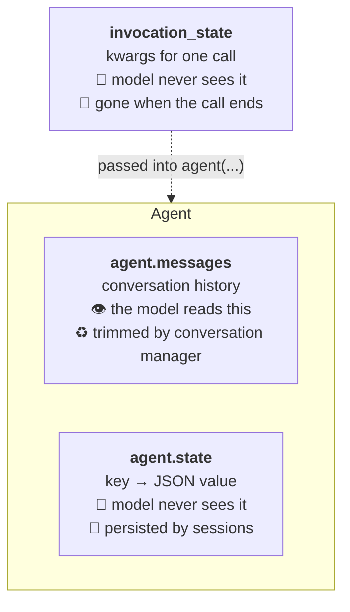
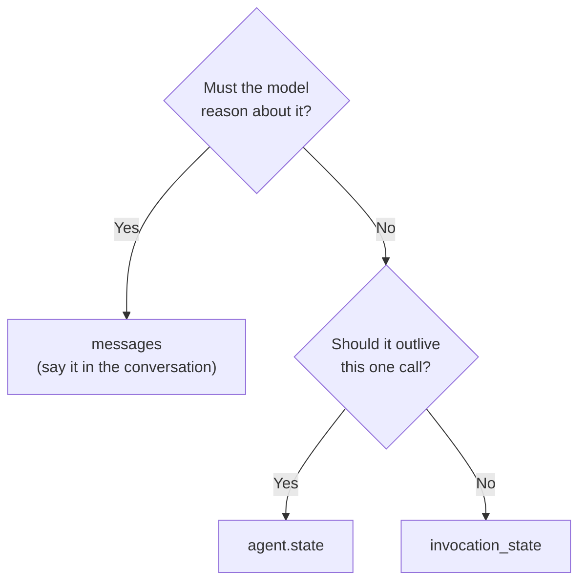

# 09 · State

> **Problem** — Some facts must be exactly right: which requisition is open, who
> is already shortlisted, which recruiter is asking. Put them in the prompt and the
> model may paraphrase, forget, or hallucinate them — and once a conversation is
> trimmed (lesson 14) they are gone. Put them in a global and you cannot screen two
> requisitions at once.
>
> **Strands solves it** with three separate stores, each with a different lifetime
> and a different audience.

---

## The three stores



| | `messages` | `state` | `invocation_state` |
|---|---|---|---|
| Model sees it | **yes** | no | no |
| Lifetime | until trimmed | agent lifetime | one invocation |
| Survives restart | with a session | with a session | never |
| Access from a tool | `tool_context.agent.messages` | `tool_context.agent.state` | `tool_context.invocation_state` |
| Good for | dialogue | open req, shortlist, counters | tenant id, recruiter id, request id |

---

## `agent.state` — private, durable, JSON

```python
agent = Agent(state={"business_unit": "Data & Analytics", "max_shortlist": 3})

agent.state.set("job_id", "J2001")
agent.state.get("job_id")                # one key
agent.state.get()                        # the whole dict (a copy)
agent.state.delete("max_shortlist")
```

It **validates on write**:

```python
agent.state.set("bad", {"E1002", "E1003"})   # ValueError — a set is not JSON serializable
```

That is deliberate. State is designed to be persisted (lesson 11) and snapshotted
(lesson 12), so anything that cannot round-trip through JSON is rejected at the
point of the bug, not at save time.

### Writing state from a tool

```python
@tool(context=True)
def open_requisition(job_id: str, tool_context: ToolContext) -> str:
    """Set the requisition this conversation is working on."""
    job = get_job(job_id)
    if job is None:
        return f"No such requisition {job_id}."
    tool_context.agent.state.set("job_id", job["job_id"])
    return f"Now working {job['job_id']} — {job['title']} in {job['location']}."
```

This is the canonical pattern: **the model extracts, the tool stores.** The model
is good at pulling "we're filling J2001" out of a sentence and bad at remembering
it for twelve turns. Play to both strengths.

And note the ordering rule this enables — `shortlist()` refuses to run at all
until `job_id` is in state:

```python
job_id = agent.state.get("job_id")
if not job_id:
    return "No requisition is open. Call open_requisition first."
```

A workflow rule enforced in code, not hoped for in a system prompt.

---

## `invocation_state` — request scope

```python
agent("Find the best candidate for J2001 and shortlist them.",
      invocation_state={"tenant_id": "acme-prod", "recruiter_id": "R-8812"})
```

```python
@tool(context=True)
def shortlist(employee_id: str, tool_context: ToolContext) -> str:
    recruiter = tool_context.invocation_state.get("recruiter_id", "unknown")
    ...
```

**This is how you do multi-tenancy and auth safely.** The model cannot see the
recruiter id, so it cannot leak it, confuse it, or be talked into changing it —
which matters when that id is what the audit trail attributes the shortlist to.
Hooks receive the same dict via `event.invocation_state`.

---

## `agent.messages` — what the model actually reads

```python
agent.messages          # list[Message], raw content blocks
len(agent.messages)
agent.messages = []     # hard reset of the conversation
```

Every `toolUse` and `toolResult` lives here too, which is why it grows fast and
why lesson 14 exists.

---

## Choosing, in one question



---

## Run it

```bash
uv run app/09_state/main.py
```

---

## Gotchas

- **State is invisible to the model — by design.** If the model needs a value, a
  tool must return it. Setting state does not "tell" the model anything.
- **`state.get()` returns a deep copy.** `agent.state.get("shortlist").append(x)`
  does nothing. Read, mutate, `set()` back — as `shortlist()` does here.
- **Validate before you store.** A small model will pass `"<the best candidate>"`
  as an employee id. State outlives the turn; it must not accept that.
- **State does not persist by itself.** Without a session manager (lesson 11) it
  dies with the process.
- **Keep state small.** It is serialized on every save under some session
  strategies. It is a key-value store, not a database.

---

## Remember

> **Model reads `messages`. Your code reads `state`. One request reads `invocation_state`.**
