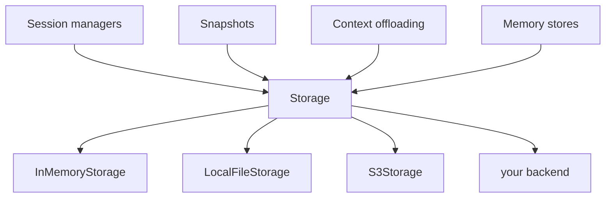
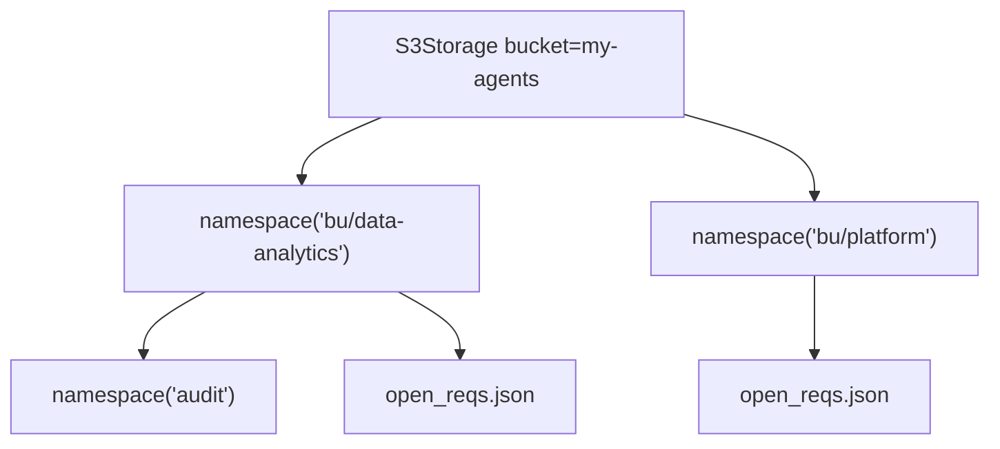

# 10 · Storage

> **Problem** — Sessions need to persist. So do snapshots, offloaded context, and
> long-term memory. If each subsystem invents its own persistence, you end up
> configuring S3 four times, and swapping to a different backend means rewriting
> four things.
>
> **Strands solves it** with one deliberately tiny interface — bytes under string
> keys — that every persistence feature consumes.

---

## The whole interface

```python
class Storage(Protocol):
    async def write(self, key: str, data: bytes) -> None: ...
    async def read(self, key: str) -> bytes | None: ...
    async def delete(self, key: str) -> None: ...
    async def list(self, query: str) -> list[str]: ...
```

Four methods. No transactions, no schemas, no query language. **That is the design:**
anything can implement it in twenty lines.



---

## The shipped backends

| Backend | Constructor | Use for |
|---|---|---|
| `InMemoryStorage` | `InMemoryStorage()` | tests, ephemeral runs |
| `LocalFileStorage` | `LocalFileStorage("./.strands/")` | local dev, single-box deploys |
| `S3Storage` | `S3Storage(bucket="b", prefix="agents/", region_name="ap-south-1")` | production, multi-instance |

```python
from strands.storage import InMemoryStorage, LocalFileStorage, S3Storage

storage = LocalFileStorage("./.run/storage")
await storage.write("shortlists/J2001.json", json.dumps(rank_candidates("J2001")).encode())
await storage.read("shortlists/J2001.json")   # b'[{"employee_id": "E1002", "score": 100, ...}]'
await storage.read("shortlists/J9999.json")   # None  ← not an exception
await storage.list("shortlists/")             # ['shortlists/J2001.json', ...] sorted
```

Swapping dev → prod is one line:

```python
storage = LocalFileStorage("./.run/storage") if settings.env == "local" else S3Storage(bucket="my-agents")
```

---

## Namespacing — the feature you will actually use

```python
root = S3Storage(bucket="my-agents")
data_bu = root.namespace("bu/data-analytics")
platform_bu = root.namespace("bu/platform")

await data_bu.write("open_reqs.json", b'["J2001","J2003"]')
await platform_bu.write("open_reqs.json", b'["J2005"]')   # different object entirely

await data_bu.list("")   # ['open_reqs.json'] — keys come back relative to the namespace
```



Namespaces nest, and a namespaced view *is* a `Storage` — so you can hand a
per-business-unit view straight to a session manager, and one hiring team being
unable to list another team's candidates becomes structural rather than a
convention someone has to remember.

---

## Key rules

- `/` is a logical separator. Runs are collapsed, leading/trailing stripped.
- `..` segments are **rejected** — no path traversal.
- Empty keys are rejected. Empty *prefixes* are fine and match everything.
- `list()` returns full keys, sorted ascending.

Those first two rules matter more than they look once a key contains user input:
`shortlists/{job_id}.json` with an unvalidated `job_id` is a path-traversal bug in
most storage layers, and a rejected key here.

---

## Writing your own

Implement the four methods. `Storage` is a `runtime_checkable` Protocol, so no
base class or registration is needed:

```python
class PiiRedactingStorage:
    """Strips candidate email addresses before anything is persisted."""

    def __init__(self, inner: Storage) -> None:
        self._inner = inner

    async def write(self, key: str, data: bytes) -> None:
        payload = json.loads(data)          # falls through to raw bytes if not JSON
        await self._inner.write(key, json.dumps(scrub(payload)).encode())

    async def read(self, key: str) -> bytes | None:
        return await self._inner.read(key)

    async def delete(self, key: str) -> None:
        await self._inner.delete(key)

    async def list(self, query: str = "") -> list[str]:
        return await self._inner.list(query)

isinstance(PiiRedactingStorage(InMemoryStorage()), Storage)   # True
```

A shortlist needs employee ids and scores. It does not need inboxes — and the
place to enforce that is the write path, not a code review. The wrapper pattern is
also how you add encryption, audit logging, compression, or a cache without
touching any agent code.

---

## Run it

```bash
uv run app/10_storage/main.py
ls -R .run/storage
```

---

## Gotchas

- **Bytes only.** Encode/decode is yours: `json.dumps(x).encode()`.
- **`read()` returns `None` for a missing key.** It does not raise. Handle the `None`.
- **Everything is async.** From sync code, wrap in `asyncio.run(...)`.
- **No atomicity across keys.** Two writes are two writes; there is no transaction.
- **`list()` on a huge prefix is expensive on S3.** Namespace narrowly.

---

## Remember

> **Four async methods over bytes. `namespace()` is how you isolate tenants for free.**
