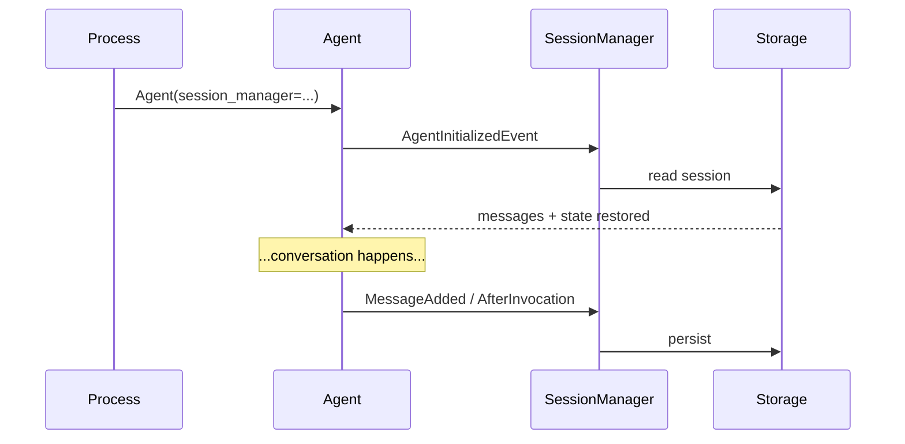
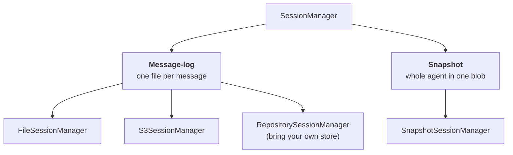

# 11 · Session Management

> **Problem** — `agent.messages` and `agent.state` live in RAM. Restart the process,
> deploy a new version, or route the user to a different pod, and the conversation
> is gone. Users do not accept an assistant with amnesia.
>
> **Strands solves it** with `session_manager=`: one constructor argument that
> makes an agent restore itself on init and persist itself as it runs.

---

## One line, two behaviours

```python
agent = Agent(
    agent_id="resourcing-desk",
    session_manager=FileSessionManager(session_id="req-J2001"),
    tools=[...],
)
```



`session_id` identifies the **conversation**. `agent_id` identifies the **agent
within it** — so a multi-agent app can keep several agents' histories in one session.
Both become storage keys, so keep them stable.

---

## Two families



| | Message-log | Snapshot |
|---|---|---|
| Writes | one small file per message | one blob per save |
| Multi-agent orchestrators | **yes** (Graph, Swarm) | no — single agents only |
| Time-travel restore | no | **yes** (lesson 12) |
| Backend | its own layout | any `Storage` (lesson 10) |
| Recommended for | orchestrators, existing apps | new single agents |

---

## Message-log managers

```python
from strands.session import FileSessionManager, S3SessionManager

FileSessionManager(session_id="req-J2001", storage_dir="./.run/sessions")
S3SessionManager(session_id="req-J2001", bucket="my-agents", prefix="prod/", region_name="ap-south-1")
```

On-disk layout:

```
.run/sessions/
└── session_req-J2001/
    ├── session.json
    └── agents/
        └── agent_resourcing-desk/
            ├── agent.json          ← state + conversation manager state
            └── messages/
                ├── message_0.json
                └── message_1.json
```

Readable, greppable, and one message per file means a crash mid-write loses one
message, not the conversation.

---

## Snapshot manager

```python
from strands.session import SnapshotSessionManager
from strands.storage import LocalFileStorage

SnapshotSessionManager(
    session_id="req-J2001",
    storage=LocalFileStorage("./.run/storage"),   # or S3Storage(...)
    save_latest_on="invocation",
    snapshot_trigger=lambda agent_data, **_: len(agent_data.messages) > 4,
)
```

`save_latest_on` is the durability/IO dial:

| Value | Saves after | Trade-off |
|---|---|---|
| `"message"` | every message added | most durable, most writes |
| `"invocation"` | every completed invocation *(default)* | the balanced choice |
| `"trigger"` | only when `snapshot_trigger` fires or you call `save_snapshot` | cheapest, least durable |

`snapshot_trigger` additionally appends an **immutable** snapshot to history — that
is what makes rewind possible. See lesson 12.

Key layout:

```
session/<session_id>/scopes/agent/<agent_id>/snapshots/
├── snapshot_latest.json            ← overwritten
└── immutable_history/
    └── snapshot_<uuid7>.json       ← append-only, time-ordered
```

---

## What gets persisted

| Persisted | Not persisted |
|---|---|
| `agent.messages` | `invocation_state` |
| `agent.state` | tools / model config |
| conversation-manager state | hooks, plugins |
| interrupt state (lesson 15) | anything not JSON-serializable |

**Tools and prompts are code, not data.** Change them between runs and the restored
conversation runs against the new code — which is usually what you want, and
occasionally a nasty surprise if a tool referenced in old messages no longer exists.

---

## Run it

```bash
uv run app/11_session_management/main.py     # first run: seeds the conversation
uv run app/11_session_management/main.py     # second run: it remembers
rm -rf .run                                   # reset
```

---

## Gotchas

- **`agent_id` changes silently orphan history.** It is part of the key. Pin it.
- **Session ids cannot contain path separators.** They are keys, and traversal is rejected.
- **Restore happens at construction**, not at first invocation. Read
  `agent.messages` right after `Agent(...)` to see what came back.
- **`SnapshotSessionManager` rejects Graph/Swarm** with `NotImplementedError`. Use
  a message-log manager for orchestrators.
- **Sessions grow forever.** Pair with a conversation manager (lesson 14) or the
  restored history will eventually exceed the context window.

---

## Remember

> **`session_manager=` restores on init and saves as it goes. Message-log = orchestrators; Snapshot = time travel.**
