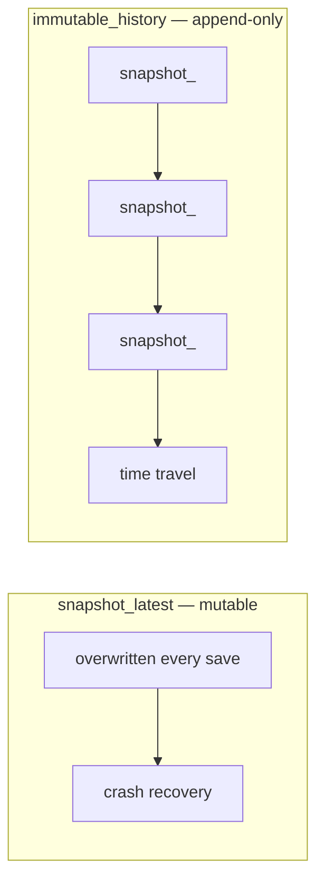
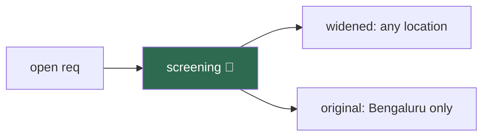

# 12 · Snapshots

> **Problem** — The agent was fine at turn 4 and went off the rails at turn 7.
> You want to go back to turn 4 — not restart. Or: you want to try two answers from
> the same starting point. Or: a user says "undo that". A session that only stores
> *the latest* state cannot do any of it.
>
> **Strands solves it** with `Snapshot`: a point-in-time, JSON-serializable capture
> of an agent that you can store anywhere and load back.

---

## Snapshot vs session



Sessions (lesson 11) answer *"where were we?"*. Snapshots answer *"where were we
**at that moment**?"*.

---

## In-memory: branch and rewind

```python
agent("We're screening for J2001, Senior Data Engineer in Bengaluru.")
checkpoint = agent.take_snapshot(preset="session", app_data={"label": "before-widening-search"})

agent("Actually, open it to any location and drop the floor to 3 years.")  # explore a branch
agent.load_snapshot(checkpoint)                                  # undo it entirely
```



`load_snapshot` restores **only the fields present** in the snapshot; everything
else is left alone.

---

## What a snapshot contains

| Field | In `preset="session"` | What it is |
|---|---|---|
| `messages` | ✅ | conversation history |
| `state` | ✅ | `agent.state` |
| `conversation_manager_state` | ✅ | trimming/summary bookkeeping |
| `interrupt_state` | ✅ | pending human-in-the-loop pauses |
| `model_state` | ✅ | provider-side state |
| `system_prompt` | ❌ | opt in with `include=` |

```python
agent.take_snapshot(preset="session")                        # the standard capture
agent.take_snapshot(include=["state", "system_prompt"])      # exactly these
agent.take_snapshot(preset="session", exclude=["messages"])  # state without the transcript
```

Order of resolution: **preset → include → exclude**. Passing only `exclude` raises,
because the resolved set would be empty.

`app_data` is yours — arbitrary JSON stored verbatim (labels, user id, git sha,
a reason string). Strands never touches it.

---

## Serialize it anywhere

```python
blob = json.dumps(agent.take_snapshot(preset="session").to_dict())
# ... store in Postgres / Redis / a queue / an S3 object ...
other_agent.load_snapshot(Snapshot.from_dict(json.loads(blob)))
```

Because it is plain JSON, a snapshot moves between processes, machines, and
languages. `schema_version` is checked on load, so an incompatible snapshot fails
loudly rather than half-restoring.

---

## Time travel through session history

```python
manager = SnapshotSessionManager(session_id="req-J2001-screening", storage=LocalFileStorage("./.run/storage"))
agent = Agent(agent_id="shortlist-builder", session_manager=manager)

await agent.invoke_async("Record: Priya Raman (E1002) — 100% match, invite to interview.")
cp1 = await manager.save_snapshot(agent, is_latest=False)     # explicit checkpoint
await agent.invoke_async("Record: Rahul Menon (E1003) — Spark one level short, hold.")

await manager.list_snapshot_ids(agent)                        # ['0192…', …] oldest first
await manager.restore_snapshot(agent, snapshot_id=cp1)        # ⏪ back to after the first decision
await manager.restore_snapshot(agent)                         # no id = latest
```

Or let it checkpoint automatically:

```python
SnapshotSessionManager(
    session_id="req-J2001-screening",
    storage=...,
    snapshot_trigger=lambda agent_data, **_: len(agent_data.messages) > 4,
)
```

Snapshot ids are UUIDv7 — **time-ordered**, so lexical sort is chronological sort.
That is why `list_snapshot_ids` can paginate with a simple `start_after` cursor.

---

## When you actually reach for this

| Scenario | Use |
|---|---|
| "Undo my last message" | `take_snapshot` before each turn, `load_snapshot` on undo |
| "Un-reject that candidate" | checkpoint per screening decision, restore the one before |
| Handing a screening to a hiring manager | serialize, ship the blob, load into their agent |
| A/B two answers from one context | one snapshot, two agents |
| Debugging a bad run | restore the checkpoint before it, replay |
| Long approval workflows | checkpoint before the risky step |
| Migrating an agent between hosts | serialize, ship, load |

---

## Run it

```bash
uv run app/12_snapshots/main.py
```

---

## Gotchas

- **Snapshots capture data, not code.** Restoring into an agent with different
  tools or a different prompt is allowed and can be confusing. Version your snapshots.
- **`SnapshotSessionManager` is single-agent only.** Graph and Swarm raise.
- **History grows unbounded.** Every immutable snapshot is a stored blob. Prune,
  or trigger sparingly.
- **`save_snapshot(is_latest=True)` returns `None`** — `snapshot_latest` has no id.
- **`load_snapshot` is a hard overwrite** of the fields it carries. There is no merge.

---

## Remember

> **`take_snapshot()` → JSON → `load_snapshot()`. Immutable history makes it time travel.**
