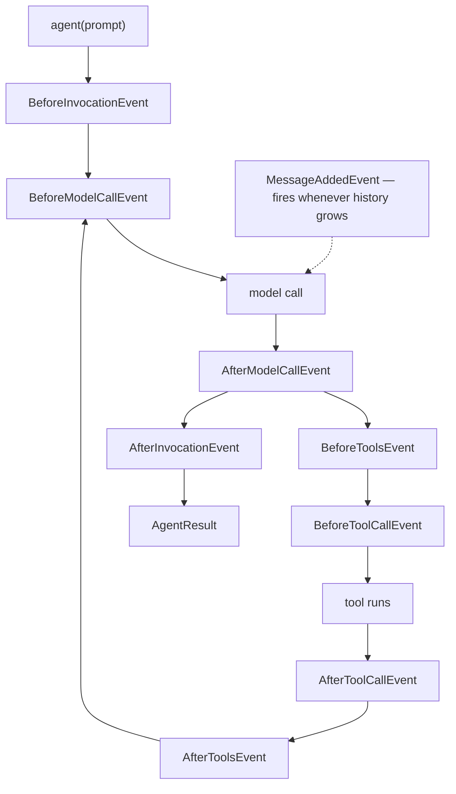

# 13 · Hooks

> **Problem** — Hiring is audited. Every profile read must be logged, no candidate
> may be rejected by a bot, and compensation data must never reach the model. None
> of that belongs inside `read_profile`, and all of it applies to *every* tool. The
> alternative is wrapping each tool by hand and forgetting one — which, in a
> regulated process, is the one that ends up in the complaint.
>
> **Strands solves it** with typed lifecycle events. Write a function, type-hint the
> event, and it runs at exactly that point in the loop — for everything.

---

## Where hooks fire



---

## Three ways to write one

### A plain function — the event type is inferred from the hint

```python
def audit_tool_calls(event: BeforeToolCallEvent) -> None:
    print(f"[audit] {event.tool_use['name']} {event.tool_use['input']}")

agent = Agent(tools=[...], hooks=[audit_tool_calls])
```

### A provider — bundles related callbacks and holds state

```python
class Telemetry(HookProvider):
    def register_hooks(self, registry: HookRegistry, **_) -> None:
        registry.add_callback(BeforeInvocationEvent, self._start)
        registry.add_callback(BeforeToolCallEvent, self._count_tool)
        registry.add_callback(AfterInvocationEvent, self._finish, order=HookOrder.SDK_LAST)
```

### After construction

```python
agent.add_hook(my_callback, MessageAddedEvent)
agent.add_hook(my_callback)                        # inferred from type hint
agent.add_hook(my_callback, [BeforeModelCallEvent, AfterModelCallEvent])
```

Union hints work too: `def h(event: BeforeToolCallEvent | AfterToolCallEvent)`
registers for both.

---

## The event catalog

| Event | Fires | Mutable fields — what you can change |
|---|---|---|
| `AgentInitializedEvent` | agent constructed | *(sync callbacks only)* |
| `BeforeInvocationEvent` | start of a request | `cancel`, `messages` |
| `BeforeModelCallEvent` | before each model call | `cancel` |
| `AfterModelCallEvent` | after each model call | `retry` |
| `BeforeToolsEvent` | before a batch of tools | `cancel` |
| `BeforeToolCallEvent` | before **each** tool | `cancel_tool`, `selected_tool`, `tool_use` |
| `AfterToolCallEvent` | after **each** tool | `result`, `retry`, `cancel_message` |
| `AfterToolsEvent` | after the batch | `end_turn` |
| `MessageAddedEvent` | any message appended | *(read-only in practice)* |
| `AfterInvocationEvent` | end of request | `resume` |

Multi-agent equivalents: `MultiAgentInitializedEvent`, `BeforeMultiAgentInvocationEvent`,
`BeforeNodeCallEvent` (has `cancel_node`), `AfterNodeCallEvent`, `AfterMultiAgentInvocationEvent`.

Every event carries `event.agent` (or `event.source` for multi-agent) and
`event.invocation_state`.

---

## The three things hooks are actually for

### 1. Observe

```python
def audit_tool_calls(event: BeforeToolCallEvent) -> None:
    print(f"[audit] {event.tool_use['name']} {event.tool_use['input']}")
```

Whose profile was opened, by which agent, with what arguments. In a hiring system
this log is not a debugging nicety — it is the answer to "on what basis was this
candidate assessed?" months later.

### 2. Block

```python
def block_adverse_actions(event: BeforeToolCallEvent) -> None:
    if event.tool_use["name"].startswith("reject_"):
        event.cancel_tool = (
            "Rejections require a human recruiter. Recommend the decision and explain why, "
            "but state clearly that it has not been actioned."
        )
```

The tool never runs; your string is handed to the model as the tool result, so the
model can explain the refusal to the user. **This is the authorization pattern.**

The line it draws is the important one: the agent may *recommend* a rejection all
day. It may not *execute* one. Note that the cancellation text tells the model what
to say next — a bare "denied" leaves it to invent an explanation.

### 3. Rewrite

```python
def redact_compensation(event: AfterToolCallEvent) -> None:
    for block in event.result.get("content", []):
        if "text" in block:
            block["text"] = block["text"].replace("band B4", "band [REDACTED]")
```

`read_profile` returns the band because the HRMS returns the band. Stripping it
here means the tool stays simple, every consumer of that tool is covered, and the
salary band is gone *before* it enters `agent.messages` — where it would otherwise
persist into the session, the snapshot and the summary.

Also here: `event.selected_tool = other_tool` swaps the implementation (mocking in
tests, routing to a sandbox), and `event.retry = True` on `AfterToolCallEvent`
re-runs a failed tool.

---

## Ordering

```python
registry.add_callback(AfterInvocationEvent, self._finish, order=HookOrder.SDK_LAST)
```

Lower runs first; equal orders keep registration order.

| Constant | Value | Meaning |
|---|---|---|
| `SDK_FIRST` | -100 | before everything |
| `INTERVENTION_OUTPUT` | -90 | output guardrails |
| `DEFAULT` | 0 | your hooks |
| `INTERVENTION_INPUT` | 90 | input guardrails |
| `SDK_LAST` | 100 | after everything |

**`After*` events run in reverse order.** So a Before/After pair registered together
nests correctly, like a context manager — the first to open is the last to close.

---

## Run it

```bash
uv run app/13_hooks/main.py
```

---

## Gotchas

- **`AgentInitializedEvent` must be sync.** Registering an async callback for it raises.
- **Hooks run on every single call.** A slow hook multiplies across every tool of
  every cycle. Keep them cheap; queue the expensive work.
- **Mutations are real.** Editing `event.result` changes what the model sees. That
  is the power and the footgun.
- **An exception in a hook fails the invocation.** Wrap risky hook bodies in try/except.
- **Hooks are not persisted.** They are code — re-register them after restoring a session.
  For an audit or redaction hook this is a security bug waiting to happen: a
  restored session with the redaction hook missing will happily replay the
  unredacted tool. Build the agent through one factory function, always.
- **Redact on the way in, not on the way out.** Once sensitive text is in
  `agent.messages` it is in the session file, the snapshot and any summary made
  from it. `AfterToolCallEvent` is the last cheap place to stop it.

---

## Remember

> **Type-hint the event, get called at that point. `cancel_tool` blocks, `result` rewrites, `order` sequences.**
