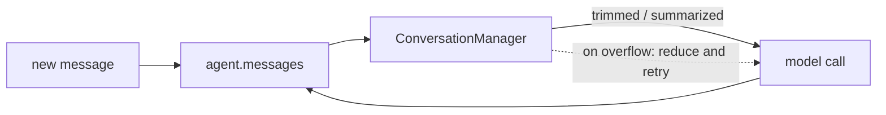
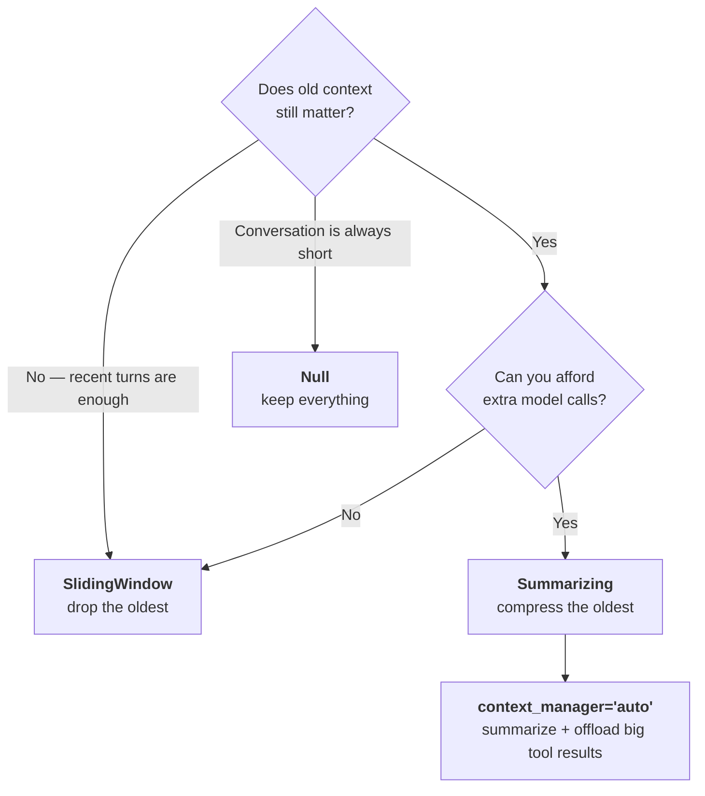
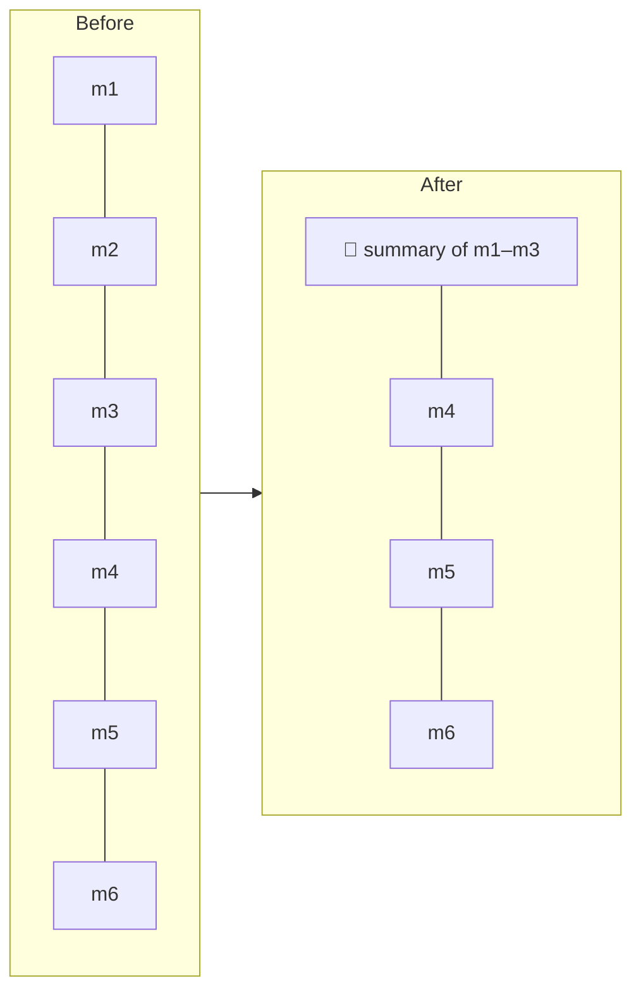

# 14 · Conversation Management

> **Problem** — `agent.messages` only grows. Every turn, every tool call, every
> tool *result* is appended. Three things happen: cost rises on every cycle
> (you resend the whole history each time), latency rises with it, and eventually
> the model rejects the request outright — a context window overflow, usually in
> production, usually on your most engaged user.
>
> **Strands solves it** with a `ConversationManager`: a strategy, applied before
> each model call, that decides what stays.

---

## Where it sits



It runs in two modes:

- **Reactive** — the model rejected the request for being too long. The manager
  *must* shrink history enough to succeed, then Strands retries.
- **Proactive** — a token threshold was crossed. Best-effort compression *before*
  the failure. This is the one you want in production.

---

## The four strategies



| Manager | Old context | Extra cost | Use for |
|---|---|---|---|
| `SlidingWindowConversationManager` *(default)* | **dropped** | none | chat, support bots |
| `SummarizingConversationManager` | **compressed** | one model call per compression | research, long sessions |
| `NullConversationManager` | kept | none | short flows, tests, full-fidelity audit |
| `context_manager="auto"` | compressed + offloaded | model call + storage | long-running agents with big tool results |

---

## Sliding window

```python
SlidingWindowConversationManager(
    window_size=40,              # messages to keep (default 40)
    should_truncate_results=True,# shrink oversized tool results instead of failing
    pin_first=2,                 # never drop the first N messages
    per_turn=False,              # True = apply before every model call, not just at the end
    proactive_compression=True,  # compress at 70% of the window
)
```

**`pin_first` is the underrated one.** The opening messages usually carry the task
definition and the user's identity — exactly what you cannot afford to lose.
Compare demos 1 and 2 in [main.py](main.py): same window, one remembers your name.

**`per_turn=True`** matters for agents that loop on tools (browsing, screenshots)
where a single invocation can add dozens of messages.

---

## Summarizing

```python
SummarizingConversationManager(
    summary_ratio=0.3,              # compress the oldest 30% (valid 0.1–0.8)
    preserve_recent_messages=10,    # never touch the last 10
    summarization_agent=None,       # a cheaper/faster agent can do the summarizing
    pin_first=2,
    proactive_compression={"compression_threshold": 0.7},
)
```



Use a small, cheap model as the `summarization_agent` — summarizing is not the job
that needs your best model.

---

## `context_manager="auto"` — the one-liner

```python
agent = Agent(model=..., context_manager="auto")
```

Composes benchmark-validated defaults: a `SummarizingConversationManager` with
proactive compression, plus a **ContextOffloader** that moves oversized tool results
out of the message list into storage, leaving a short preview the model can act on.

There is also `context_manager="agentic"`, where the model manages its own context
through injected tools and the conversation manager is only a safety net.

> ⚠️ The offloader in `"auto"` uses **in-memory** storage, which does not survive a
> restart. With a `session_manager`, pass an explicit `ContextOffloader` backed by
> durable storage via `plugins=[...]`.

---

## Run it

```bash
uv run app/14_conversation_management/main.py
```

The same six turns of a screening session through five strategies. Turns 1-2 set
the requisition and the hard rule (*"Spark level 4 minimum, must be on the bench"*),
turns 3-5 discuss candidates, and the last turn asks the manager's rule back:

```
1. SlidingWindow(window_size=4)              kept  4  ✗ "I don't have that information"                    ~180 tokens
2. SlidingWindow(window_size=4, pin_first=2) kept  6  ✓ "J2001; Spark level 4 minimum, bench only"          ~250 tokens
3. Summarizing(summary_ratio=0.5)            kept 12  ✓ "J2001 — your rule was Spark 4+ and on the bench"   ~360 tokens
4. Null                                      kept 12  ✓ "J2001, Spark level 4 minimum, on the bench today"  ~370 tokens
5. context_manager="auto"                    kept 24  ✓ "J2001; minimum Spark level 4 and currently benched" ~960 tokens
```

*(Exact wording and token counts vary per run — the ✓/✗ column is the point.)*

**Two lines of config separate 1 from 2.** Memory is a configuration decision, and
the token column is what it costs you. Note *what* strategy 2 sacrifices to keep
the rule: the candidate scores. That is the right trade here — the scores can be
recomputed from a tool in one call; the manager's stated constraint cannot be
recovered from anywhere.

---

## Gotchas

- **The default is already a sliding window of 40.** If you have never configured
  this, you are already silently dropping history.
- **Dropping is invisible.** No warning, no event. The model just stops knowing
  things — including the constraint that was supposed to govern every decision it
  is still confidently making.
- **Pin the constraints, recompute the facts.** Anything a tool can re-fetch
  (scores, profiles, requisitions) is cheap to lose. Anything only the human said
  is not; `pin_first` or `state` (lesson 09) is where that belongs.
- **Summarizing costs a model call** at exactly the moment the conversation is
  longest — that is a latency spike, so prefer proactive over reactive.
- **`Null` + a long session = a production incident.** Only use it when you control
  the length.
- **Manager state is persisted** with the session, so a restored conversation
  resumes mid-compression correctly.

---

## Remember

> **Sliding window = forget the oldest. Summarizing = compress the oldest. `"auto"` = both, tuned.**
