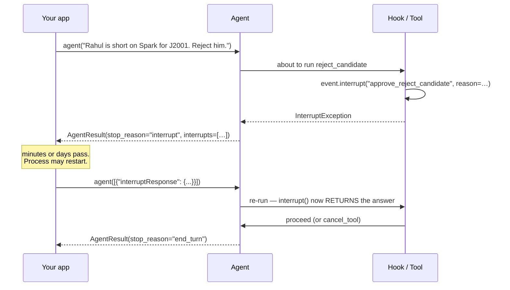

# 15 · Interrupts

> **Problem** — The agent is about to reject a candidate or send an offer two
> salary bands above the role. You want a human to approve first. But "wait for a
> recruiter" can take minutes or days — far longer than a request lives. Blocking
> the thread is not an option, and neither is losing the screening work already done.
>
> **Strands solves it** with interrupts: the loop **stops and returns**, carrying
> everything needed to resume. Approval becomes a normal request/response cycle.

---

## The flow



The key move: **`interrupt()` raises the first time and returns the answer the
second time.** Your code reads top-to-bottom as if the human replied instantly.

---

## Two places to ask

### From a hook — the tool stays unaware it is gated

```python
class ApprovalGate(HookProvider):
    def register_hooks(self, registry: HookRegistry, **_) -> None:
        registry.add_callback(BeforeToolCallEvent, self.approve)

    def approve(self, event: BeforeToolCallEvent) -> None:
        if event.tool_use["name"] not in RISKY_TOOLS:
            return
        answer = event.interrupt(
            f"approve_{event.tool_use['name']}",
            reason={"tool": event.tool_use["name"], "input": event.tool_use["input"]},
        )
        if answer != "yes":
            event.cancel_tool = "The recruiter denied this action. Explain that no record was changed."
```

This is the policy-layer pattern: one gate, every risky tool, zero tool changes.
`RISKY_TOOLS` here is the set that *writes to a person's record* — reading a
profile or scoring a match needs no gate, and gating them would make the agent
useless.

### From inside a tool — when only the tool knows it needs help

```python
@tool(context=True)
def send_offer(employee_id: str, job_id: str, band_jump: int, tool_context: ToolContext) -> str:
    """Send an internal offer. Jumping more than one band needs HR approval."""
    result = match(get_employee(employee_id), get_job(job_id))
    if result["blockers"]:
        return f"Cannot offer: missing mandatory {', '.join(result['blockers'])}."

    if band_jump > 1:
        code = tool_context.interrupt(
            "hr_approval_code",
            reason=f"Offer to {result['name']} jumps {band_jump} bands (match {result['score']}%). "
                   "Policy allows 1 without HR sign-off.",
        )
        if code != "HR-42":
            return "Offer declined: invalid HR approval code."
    return f"Offer sent to {result['name']} ({result['score']}% match)."
```

Two guards, two different mechanisms, and the ordering matters: the *blocker* check
is a hard rule that needs no human, so it returns immediately and never wastes a
recruiter's attention. Only the genuinely discretionary call becomes an interrupt.

Note the shape: **the check is inline**, and the tool continues from that exact
line when resumed.

---

## Handling the pause

```python
result = agent("Send E1002 an offer for J2001. It's a two-band jump.")

while result.stop_reason == "interrupt":
    for i in result.interrupts:
        print(i.name, i.reason)          # render this to the approver's queue

    payload = [
        {"interruptResponse": {"interruptId": i.id, "response": "HR-42"}}
        for i in result.interrupts
    ]
    result = agent(payload)              # resume
```

An `Interrupt` carries:

| Field | Meaning |
|---|---|
| `id` | stable identifier — send it back verbatim |
| `name` | your label; how you decide what to ask |
| `reason` | any JSON you attached — the payload for your UI |
| `response` | filled in on resume |

Resuming with a **list of `interruptResponse` blocks** is the only valid resume
input — passing a plain string raises `TypeError`. One interrupt per hook callback;
a resumed pass may raise new ones, and the loop above handles that naturally.

---

## Surviving a restart

Interrupt state is part of the session (lesson 11) and of `preset="session"`
snapshots (lesson 12). So this works:

```python
agent = Agent(session_manager=FileSessionManager(session_id="req-J2001"), hooks=[ApprovalGate()])
result = agent("Reject E1003 for J2001.")     # process A: returns interrupt, exits
# ... the recruiter approves on Thursday, in a different process ...
agent = Agent(session_manager=FileSessionManager(session_id="req-J2001"), hooks=[ApprovalGate()])
agent([{"interruptResponse": {"interruptId": saved_id, "response": "yes"}}])
```

Store the interrupt ids alongside your approval record and you have a durable
human-in-the-loop workflow with no queue of your own — and an audit trail that
names the person who approved, which is the artefact the process actually needs.

---

## Interrupt vs cancel vs limit

| Mechanism | Loop | Resumable |
|---|---|---|
| `event.interrupt(...)` | pauses | **yes**, from exactly where it stopped |
| `event.cancel_tool = "..."` | continues; model sees the refusal | n/a |
| `agent.cancel()` | stops | no |
| `limits={"turns": n}` | stops at a boundary | re-invoke, but state is not "paused" |

---

## Run it

```bash
uv run app/15_interrupts/main.py
```

Demo 1 denies the rejection — no record changes, and the model explains that.
Demo 2 supplies the HR code and the offer goes through. Both resume the same agent
object.

---

## Gotchas

- **Interrupt names must be unique per callback.** The id is derived from the name
  plus the tool-use id.
- **The hook re-runs on resume.** Everything before the `interrupt()` call executes
  twice — keep that code free of side effects.
- **You cannot call `structured_output_async` while interrupted.** It raises.
- **Always loop on `stop_reason == "interrupt"`**, do not assume one round.
- **`reason` should be JSON.** It crosses a process boundary into your UI.
- **An interrupt is not a rubber stamp.** If every screening pauses, approvers
  click "yes" without reading. Gate the tools that write to a person's record, and
  let reads and scores run free.

---

## Remember

> **`interrupt()` raises the first time, returns the answer the second. Resume with `interruptResponse` blocks.**
