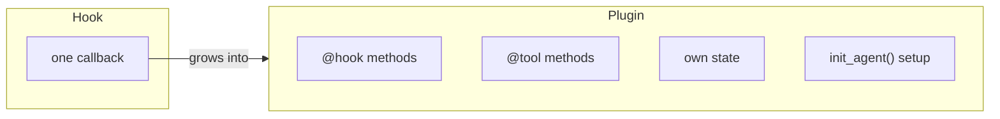
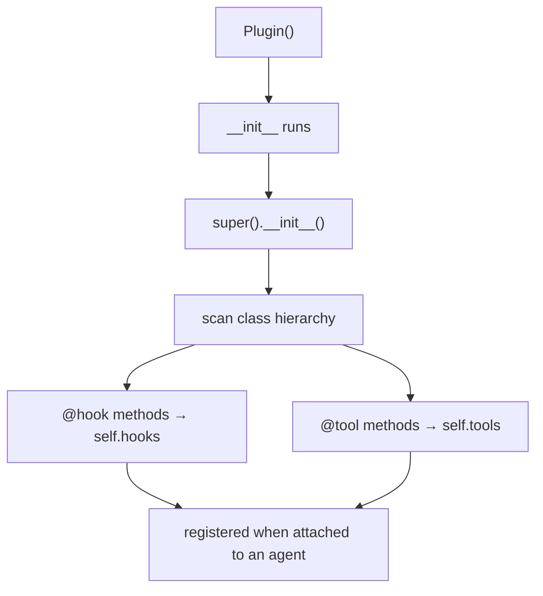

# 16 · Plugins

> **Problem** — Every agent in the company that touches employee data needs the
> same three things: a cap on how many profiles it may open, an audit trail, and a
> way to report its remaining quota. That is two hooks, a tool the model can query,
> per-request state, and some setup. Handing it to another team as "add these four
> callbacks, in this order, and don't forget the state key" does not survive
> contact with a second team.
>
> **Strands solves it** with `Plugin`: one class, decorated methods, auto-discovered.
> Installing it is `plugins=[ProfileAccessGuard(max_profiles=3)]`.

---

## Hook vs Plugin



A hook is a function. A plugin is a **feature** — and it is the unit you publish,
version, and reuse across projects.

---

## Anatomy

```python
from strands import tool
from strands.plugins import Plugin, hook

class ProfileAccessGuard(Plugin):
    name = "profile-access-guard"           # stable id — required

    def __init__(self, max_profiles: int = 3) -> None:
        self.max_profiles = max_profiles
        self.opened: list[str] = []
        super().__init__()                  # discovery — call this LAST

    @hook
    def _reset(self, event: BeforeInvocationEvent) -> None:
        self.opened.clear()                 # per-request, not per-agent

    @hook
    def _enforce(self, event: BeforeToolCallEvent) -> None:
        if event.tool_use["name"] != "read_profile":
            return
        raw = event.tool_use["input"].get("employee_id", "?")
        ids = [str(i) for i in raw] if isinstance(raw, list) else [str(raw)]   # count PEOPLE, not calls
        if len(self.opened) + len(ids) > self.max_profiles:
            event.cancel_tool = f"Profile access limit of {self.max_profiles} reached."
            return
        self.opened.extend(ids)                                      # charge BEFORE — see gotchas

    @tool
    def remaining_profile_quota(self) -> str:
        """Report how many more employee profiles may be opened in this request."""
        return f"{max(0, self.max_profiles - len(self.opened))} profile lookups remaining"

    def init_agent(self, agent: Agent) -> None:
        agent.state.set("profile_access_cap", self.max_profiles)
```

```python
agent = Agent(tools=[read_profile], plugins=[ProfileAccessGuard(max_profiles=3)])
agent.tool_names       # ['read_profile', 'remaining_profile_quota']  ← the plugin's tool is there
```

The cap is not a cost control. It is the difference between a helpful screening
assistant and a bulk PII export with a chat interface — `self.opened` doubles as
the audit trail of exactly whose records this request touched.

| Piece | What Strands does with it |
|---|---|
| `name` | stable identifier, used in logs and dedup |
| `@hook` | reads the **type hint** to find the event, registers the callback |
| `@tool` | registers a tool the model can call — and it can read plugin state |
| `init_agent(agent)` | runs once at attach time; may be `async` |

`@hook` supports unions: `def h(self, e: BeforeToolCallEvent | AfterToolCallEvent)`
registers for both.

---

## Discovery rules worth knowing



- **Declaration order is preserved**; parent-class methods register before child ones.
- **An override replaces the parent's** — only the child's version registers.
- **Call `super().__init__()` last**, after your attributes exist.

---

## The orchestrator counterpart

```python
from strands.plugins import MultiAgentPlugin, hook

class NodeTimer(MultiAgentPlugin):
    name = "node-timer"

    @hook
    def _done(self, event: AfterNodeCallEvent) -> None:
        print(f"node '{event.node_id}' finished")
```

```python
builder.set_plugins([NodeTimer()])      # Graph
Swarm(nodes=[...], plugins=[NodeTimer()])
```

`MultiAgentPlugin` supports `@hook` only — orchestrators have no tool registry.
A class can inherit **both** to work at either level.

---

## Plugins that ship with the SDK

Under `strands.vended_plugins`:

| Plugin | What it does |
|---|---|
| `ContextOffloader` | moves oversized tool results to storage, leaves a preview (lesson 14) |
| `ContextInjector` | injects context into the conversation on a schedule |
| `AgentSkills` / `Skill` | packages named skills an agent can load on demand |
| `Goal` | keeps a goal in view across a long run |
| `Steering` | mid-run course correction |

```python
from strands import AgentSkills, Skill
```

Read their source — they are the reference implementations of good plugin design.

---

## Run it

```bash
uv run app/16_plugins/main.py
```

The agent is asked to summarise five employees with a cap of three profiles:

```
tools now available: ['read_profile', 'remaining_profile_quota']
state seeded by the plugin: {'profile_access_cap': 3}
[access-guard] opened=[] blocked=['E1002', 'E1003', 'E1005', 'E1006', 'E1008']
```

That output is from a real run, and it is not the one this lesson was originally
written to show. llama3.2 did not make five calls — it made **one** call with a
*list* of five ids. The first version of this plugin counted invocations, saw
`1 <= 3`, and let all five through.

```python
# what the model actually sent
read_profile({'employee_id': ['E1002', 'E1003', 'E1005', 'E1006', 'E1008']})
```

**A quota that counts calls is bypassed by a model that batches.** Count the thing
the policy is about — people — and the cap holds however the model chooses to
phrase the request. With a model that makes one call per employee you get the
tidier `opened=['E1002','E1003','E1005'] blocked=['E1006','E1008']`; with this one
the whole batch is refused. Both are the guard working.

---

## Gotchas

- **`super().__init__()` must come last** in your `__init__`, or discovery runs
  before your attributes exist.
- **Charge in `Before`, not `After`.** Tools in one turn run concurrently, so
  *every* `BeforeToolCallEvent` fires before the first `AfterToolCallEvent`. A
  counter that only increments in `After` reads zero at every check and enforces
  nothing. This bites every quota, rate-limit and budget plugin — reserve up front,
  reconcile later.
- **Plugin instances are stateful.** One instance per agent unless you *want*
  shared counters across agents.
- **Reuse across invocations.** Reset per-request state on `BeforeInvocationEvent`,
  as `ProfileAccessGuard._reset` does — otherwise one request's quota leaks into
  the next, and a long-lived agent locks itself out on request two.
- **Plugin tools are real tools.** They consume context and can be called by the
  model. Name and document them accordingly.
- **Enforce on the unit the policy names.** "Three profiles" is a limit on people,
  not on function calls. Any quota keyed to a proxy for the real thing is one
  creative model away from being decorative.
- **Plugins are not persisted.** Re-attach them when restoring a session — a
  restored agent missing its access guard is uncapped, and nothing will tell you.

---

## Remember

> **Plugin = hooks + tools + state + setup, in one class. `@hook` infers the event from the type hint.**
