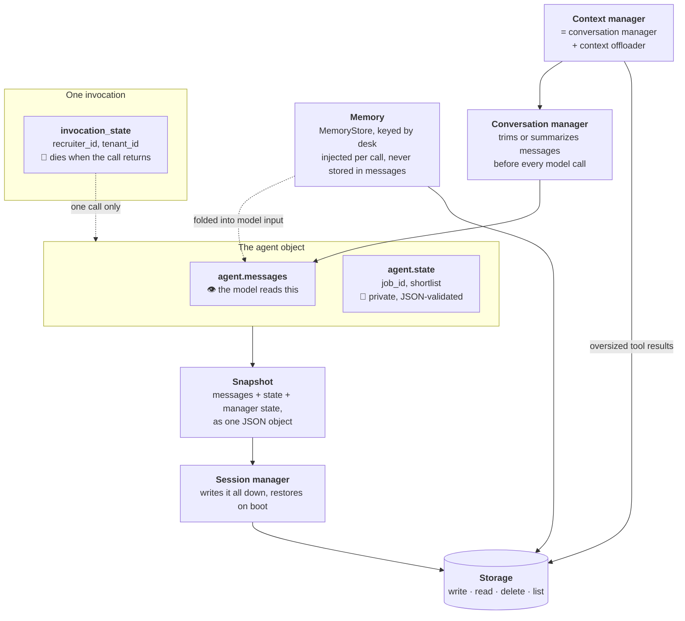
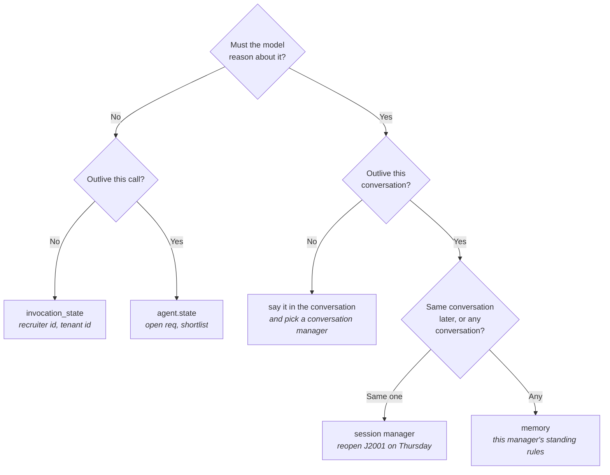

# 17 · Memory & persistence

> **Problem** — A requisition stays open for weeks. The recruiter states a hard
> rule on Monday, screens eleven people on Tuesday, closes the laptop, and comes
> back on Thursday asking "so who do I interview?". Somewhere in there the context
> window filled up, the process restarted, one screening turned out to be a bad
> idea, and the same manager opened a second requisition where Monday's rule still
> applies.
>
> **Strands solves it** with seven separate mechanisms. They are not
> interchangeable and they are not alternatives to each other — each one covers a
> different span of time, and the interesting bugs live in the seams between them.

---

## The one table

Every mechanism in this lesson answers the same question — *what survives?* — with
a different answer. Eight rows for seven mechanisms: **State** ships two stores
with very different lifetimes, and conflating them is the first bug.

| Layer | Survives | Model can read it | Where it lives |
|---|---|---|---|
| `invocation_state` | one `agent(...)` call | **no** | nowhere — a dict passed in |
| **State** (`agent.state`) | the conversation | **no** | in the agent, persisted by a session |
| **Conversation management** | the context window | **yes** — it *is* what the model reads | `agent.messages` |
| **Context management** | the context window, including oversized tool results | preview only | messages + a Storage backend |
| **Session** | a process restart | replayed into messages | a Storage backend |
| **Snapshots** | a decision you regret | replayed into messages | in memory, or a Storage backend |
| **Memory** | the requisition, the session, the agent | injected per call | a `MemoryStore` |
| **Storage** | — it *is* the disk | no | bytes under string keys |

Read that column of "survives" values top to bottom. That ordering is the lesson.

---

## The one diagram



**Everything bottoms out in `Storage`.** Sessions, snapshots, offloaded tool
results and memory are four different opinions about *what* to write down; they
all write it through the same four-method interface.

---

## 1 · State — the facts the model must not re-derive

Three stores, three lifetimes, and only one of them visible to the model.

```python
agent = Agent(state={"business_unit": "Data & Analytics", "max_shortlist": 3})

agent.state.set("job_id", "J2001")
agent.state.get("job_id")          # one key
agent.state.get()                  # the whole dict — a COPY
agent.state.delete("max_shortlist")
```

The canonical pattern is **the model extracts, the tool stores**:

```python
@tool(context=True)
def open_requisition(job_id: str, tool_context: ToolContext) -> str:
    job = get_job(job_id)
    if job is None:
        return f"No such requisition {job_id!r}."
    tool_context.agent.state.set("job_id", job["job_id"])
    return f"Now working {job['job_id']} — {job['title']} in {job['location']}."
```

A model is good at pulling *"we're filling J2001"* out of a sentence and bad at
still knowing it twenty turns later — especially once the conversation manager
has thrown those twenty turns away. Play to both strengths.

`invocation_state` is the third store: request scope, invisible to the model.

```python
agent("Screen E1002.", invocation_state={"tenant_id": "acme-prod", "recruiter_id": "R-8812"})
```

```python
recruiter = tool_context.invocation_state.get("recruiter_id", "unattributed")
```

**This is how you do multi-tenancy and attribution safely.** The model cannot see
the recruiter id, so it cannot leak it, confuse it, or be talked into changing it —
which matters when that id is what the audit trail blames the shortlist on.

> Full treatment in [lesson 09](../09_state/).

---

## 2 · Storage — four methods, and everything sits on them

```python
from strands.storage import InMemoryStorage, LocalFileStorage, S3Storage

storage = LocalFileStorage("./.run/lesson17/storage")
await storage.write("shortlists/J2001.json", blob)
await storage.read("shortlists/J9999.json")     # None, not an exception
await storage.list("shortlists/")
await storage.delete("shortlists/J2003.json")
```

Namespaces scope one deployment to many hiring desks:

```python
data_bu = storage.namespace("bu/data-analytics")
platform_bu = storage.namespace("bu/platform")
# Neither can list the other's candidates. Namespaces nest.
```

A custom backend is the four methods and nothing else — no base class to inherit.
A ~20-line wrapper that strips candidate emails before anything is persisted is a
real, shippable DPDP/GDPR control ([lesson 10](../10_storage/) builds one).

> Swap `LocalFileStorage` for `S3Storage` and sessions, snapshots, offloaded
> results and memory all move to S3 together. Nothing else changes.

---

## 3 · Session — the conversation survives the process

```python
from strands.session import FileSessionManager

agent = Agent(
    agent_id="resourcing-desk",                   # part of the key — keep it stable
    session_manager=FileSessionManager(session_id="req-J2001", storage_dir=".run/sessions"),
    ...
)
```

**`session_id` is a business key, not plumbing.** One conversation per open
requisition. `agent_id` identifies which agent inside that conversation, so a
screening agent and an outreach agent can share one session.

Two families ship:

| | `FileSessionManager` / `S3SessionManager` | `SnapshotSessionManager` |
|---|---|---|
| Unit of persistence | one file per message | one JSON blob per agent |
| Restores | messages replayed from the log | the whole agent, at once |
| History | the message log | addressable immutable checkpoints |
| Multi-agent orchestrators | yes | agent only |
| Backend | a `SessionRepository` | a unified `Storage` |

On restart, both restore `agent.messages` **and** `agent.state` **and** the
conversation manager's own state. There is nothing to re-seed by hand.

> Full treatment in [lesson 11](../11_session_management/).

---

## 4 · Conversation management — what survives a full context window

This is the only layer that **destroys** context rather than moving it somewhere.
It runs on `agent.messages` before each model call.

| Manager | Behaviour | Costs | Use when |
|---|---|---|---|
| `NullConversationManager` | never removes anything | overflows eventually | the transcript is the audit record |
| `SlidingWindowConversationManager` | drops oldest messages | nothing | chat where only recency matters |
| `...(window_size=n, pin_first=k)` | drops the middle, keeps the opening | nothing | **the opening turns carry the constraints** |
| `SummarizingConversationManager` | compresses old turns | an extra model call | long screenings where old detail still matters |

In a screening conversation the hard rule is stated in turn one and needed in turn
twenty, so a plain sliding window forgets *exactly* the wrong thing. Pinning the
opening costs nothing and fixes it — but **`pin_first` counts messages, not
turns**. One turn is a user message plus an assistant message, and more once tools
are involved, so pinning the first two turns is `pin_first=4`. Pin 2 and the
second turn is trimmed like anything else; part 4 of this lesson shows the agent
confidently answering with the wrong hard rule when you get this off by one turn.

```python
SlidingWindowConversationManager(window_size=20, pin_first=4)

SummarizingConversationManager(
    summary_ratio=0.5,
    preserve_recent_messages=2,
    proactive_compression={"compression_threshold": 0.6},  # compress before you overflow
)
```

> **The shortlist does not belong in the transcript.** Nothing in this table can
> lose a fact that lives in `agent.state`.
>
> Full treatment in [lesson 14](../14_conversation_management/).

---

## 5 · Context management — the strategy, not just the trimmer

A conversation manager shrinks the *dialogue*. It does nothing about the other
half of the problem: one tool result that does not fit at all. `candidate_dossier`
in this lesson returns ~2,000 tokens — a real screening API returning 200 profiles
returns far more.

```python
agent = Agent(context_manager="auto", ...)
```

That one string composes two things:

```python
SummarizingConversationManager(
    summary_ratio=0.3,
    proactive_compression={"compression_threshold": 0.85},
)
ContextOffloader(storage=InMemoryStorage(), max_result_tokens=1_500, preview_tokens=750)
```

The offloader intercepts any tool result over the threshold, writes each content
block to storage, and replaces it in context with a preview plus references:

```
[Offloaded: 1 blocks, ~2,092 tokens]
Tool result was offloaded to external storage due to size.
Use the preview below if it answers your question.
If you need more detail, use retrieve_offloaded_content with a reference and: ...
```

It also injects a `retrieve_offloaded_content` tool, so the full text is one tool
call away and costs nothing until the model asks. Check `agent.tool_names` — a
tool you never wrote is in the list.

`"agentic"` is the experimental sibling: no proactive compression, a higher
offload threshold (8,000 tokens), and the model drives context management itself
through injected tools.

> **The `"auto"` offloader is in-memory.** Pair it with a session and the
> references survive the restart while the blobs they point at do not. See the
> gotchas.

---

## 6 · Memory — what outlives the requisition

A session remembers **one conversation**. Open J2004 and Monday's rule from J2001
is unreachable, because it is in a different session. Memory is the store that is
not keyed by conversation.

```python
from strands.memory import MemoryManager
from strands.vended_memory_stores import TestMemoryStore

store = TestMemoryStore(name="hiring-desk", path=".run/memory/hiring-desk.json")

agent = Agent(
    memory_manager=MemoryManager(stores=[store], add_tool_config=True),
    ...
)
```

`MemoryManager` is a plugin that does four separable things:

| | What it does | Default |
|---|---|---|
| **Search tool** | registers `search_memory` so the model can look things up deliberately | on |
| **Add tool** | registers `add_memory` so the model can write things down | **off** — opt in |
| **Injection** | searches the store before every model call and folds the hits into the model input | on, 5 entries |
| **Extraction** | after N turns, distils the conversation into entries and writes them | off — per store |

Injection is the one people miss. Nothing in the conversation asks for it:

```python
agent("I'm opening J2004. Before I screen any candidate, what does this desk "
      "expect on total experience for senior roles?")
# -> the manager's 6-years rule, stated last week on a different requisition in a
#    different session, arrives anyway — no tool call, nothing in the transcript.
```

The default query is the latest user message, so what injection retrieves is
exactly what `manager.search(that_message)` returns. Print it when a demo does not
seem to work: with `TestMemoryStore`'s keyword ranking, a question that shares no
vocabulary with the stored fact retrieves nothing, and the agent answers "no
standing rules" with total confidence. Semantic stores are the fix.

Extraction is the desk writing its own notes:

```python
TestMemoryStore(
    name="hiring-desk",
    path=...,
    extraction={"trigger": IntervalTrigger(turns=5)},   # or InvocationTrigger()
)
```

A store that implements `add` gets client-side extraction — a model call that
distils facts. A store that implements `add_messages` (a managed backend) gets
server-side extraction with no model call at all. Fidelity tracks the model you
gave it; a 3B local model is not good at this.

`TestMemoryStore` is one JSON file, ranked by keyword overlap. Swap it for
`BedrockKnowledgeBaseStore` for real semantic search — the `MemoryStore` protocol
is `search` plus optionally `add` / `add_messages`, so a custom backend is small.

---

## 7 · Snapshots — a point in time you can return to

```python
checkpoint = agent.take_snapshot(preset="session", app_data={"label": "before-widening"})

agent("Widen the search: any location, drop the experience floor to 3 years.")
agent.load_snapshot(checkpoint)     # the widening never happened
```

`preset="session"` captures `messages`, `state`, `conversation_manager_state`,
`interrupt_state` and `model_state`. `include=` / `exclude=` pick exact fields.

A `Snapshot` is plain JSON, which is what makes it a transport:

```python
blob = json.dumps(agent.take_snapshot(preset="session").to_dict())
# ... a Postgres row, a Redis key, a queue message ...
receiving_agent.load_snapshot(Snapshot.from_dict(json.loads(blob)))
```

That is how a screening moves from the recruiter's process to the hiring manager's.

With a `SnapshotSessionManager`, snapshots become addressable history:

```python
checkpoint_id = await manager.save_snapshot(agent, is_latest=False)   # immutable
...
await manager.restore_snapshot(agent, snapshot_id=checkpoint_id)      # time travel
await manager.save_snapshot(agent, is_latest=True)                    # ← see gotchas
```

> Full treatment in [lesson 12](../12_snapshots/).

---

## How they fit together

Six facts that only make sense once you look at two layers at the same time.

### 1. A snapshot is what a session writes

`SnapshotSessionManager` has no separate serialization format — it captures the
same `Snapshot` you get from `take_snapshot(preset="session")` and writes it as
one blob. "Session" and "snapshot" are not two features that overlap; one is the
storage policy for the other.

### 2. The conversation manager's state is itself persisted — and restore respects it

A message-log session keeps **every** message on disk, including the ones the
sliding window dropped. On restore it replays from an offset:

```python
session_messages = repository.list_messages(
    ..., offset=agent.conversation_manager.removed_message_count
)
```

So the durable record stays complete for audit, while the agent comes back holding
only the untrimmed tail (plus the summarizer's prepended summary). Trimming is not
destructive on disk — it is destructive *to the model's view*, which is the point.

### 3. Memory injection never enters the transcript

Injected memories are folded into the model input for one call. They are not
appended to `agent.messages`, so they are not persisted by the session and the
conversation manager cannot trim them away. The consequence cuts both ways: your
standing rules can never be forgotten, and you pay for them on every single call.

### 4. State is JSON-validated because state is what gets persisted

```python
agent.state.set("seen", {"E1002", "E1003"})   # ValueError — a set is not JSON
```

The rejection happens at the point of the bug, not at save time three days later
when the session tries to serialize it.

### 5. `restore_snapshot` does not move `snapshot_latest`

Time-travelling an agent loads the old state into the object. The session's
"latest" pointer still points at the state you rewound *from*, so the next restart
comes back holding the mistake. Either run another invocation (which re-saves
latest) or say so explicitly:

```python
await manager.restore_snapshot(agent, snapshot_id=ids[0])
await manager.save_snapshot(agent, is_latest=True)
```

### 6. A rewind under a *message-log* session is not durable

`load_snapshot` shortens `agent.messages` in memory. It does not delete the
message files `FileSessionManager` already wrote, and restore replays them from
`removed_message_count` — so the abandoned branch comes back on the next boot. If
undo has to survive a restart, the session must be snapshot-based.

---

## Where does this fact go?



And one more, for the thing itself rather than the fact:

- Too big to sit in context? → **context offloader**
- Might need undoing? → **snapshot**
- Bytes have to land somewhere? → **storage**

---

## Run it

```bash
uv run app/17_memory_and_persistence/main.py        # asks which part; blank runs all
uv run app/17_memory_and_persistence/main.py 6      # just memory
uv run app/17_memory_and_persistence/main.py 8      # just the end-to-end story
uv run app/17_memory_and_persistence/main.py 3 4 5  # a range you care about
```

| Part | What it proves |
|---|---|
| 1 | State written by a tool, request scope, the copy rule, JSON validation |
| 2 | Four storage operations, namespaces, and who else uses them |
| 3 | A new process, the same `session_id`, the conversation back |
| 4 | Four conversation managers on the same six-turn screening |
| 5 | A 2,000-token dossier that never enters the context window |
| 6 | A rule stated on J2001 arriving in a J2004 conversation |
| 7 | Branch, rewind, serialize, and time-travel through checkpoints |
| 8 | Monday to next Tuesday on one desk, all seven layers wired together |

Everything lands under `.run/lesson17/`, whose four sub-directories are exactly the
four persistence subsystems:

```
.run/lesson17/
├── sessions/     FileSessionManager message logs
├── storage/      raw Storage + SnapshotSessionManager blobs
├── memory/       hiring-desk.json — the MemoryStore
└── offload/      oversized tool results
```

Reset with `rm -rf .run/lesson17`.

> **On the model.** This lesson is tool-call heavy, and `llama3.2` (3B) is weak at
> it. All eight parts run to completion on it, but you will still see it mangle an
> argument now and then — `screen_candidate({"c": "E1003", "j": "J2001"})`, or
> passing `'["hiring-desk"]'` as a string where the SDK's own `search_memory` wants
> a list. Those surface as validation errors in the transcript and the run carries
> on. The persistence layers do exactly what the printout says regardless; it is
> the prose that wobbles. For clean output:
>
> ```bash
> OLLAMA_MODEL=qwen2.5:7b uv run app/17_memory_and_persistence/main.py 8
> ```
>
> Note which of those two is *not* worth designing around. `find_candidates` was
> fixed because the model's framing was reasonable and the tool was wrong.
> Single-letter parameter names are not a frame worth accommodating — and
> `screen_candidate` deliberately keeps `employee_id` required, because a tool that
> **writes** should refuse an ambiguous call rather than guess.

---

## Every invocation is capped, and here is why

```
strands.types.exceptions.EventLoopException: maximum recursion depth exceeded
```

**The agent loop recurses once per cycle.** It does not spin in a `while` — each
turn calls `recurse_event_loop`, one Python stack frame deeper. So a model that
keeps calling tools does not politely churn; it walks off the stack a few hundred
useless model calls after the run stopped being productive.

### What a real loop looks like

This is `llama3.2` on the single prompt *"We're filling J2001. Open it."* — the
work it was asked for completes on cycle 1:

```
[1] open_requisition({"job_id": "J2001"})                          -> Now working J2001 …  ✅
[2] find_candidates({"job_id": "J2001", "location": "Bengaluru"})  -> ValidationError: skill required
[3] find_candidates({"job_title": "Senior Data Engineer", …})      -> ValidationError: skill required
[4] find_candidates({"job_title": "Senior Data Engineer"})         -> ValidationError: skill required
[5] find_candidates({"job_title": "Senior Data Engineer"})         -> ValidationError: skill required   ← identical
[6] find_candidates({"location": "Bengaluru"})                     -> ValidationError: skill required
…
```

Two defects compound, and neither is really "the model is dumb":

**The prompt read as a checklist.** *"Use open_requisition …, find_candidates …,
screen_candidate …, shortlist_summary …"* is a menu to a capable model and a
four-step procedure to a small one, so it kept going after the request was
satisfied. The fix is to say the quiet part out loud: *"Do only what the user
asked for. As soon as that is done, stop calling tools and reply."*

**The tool's parameters did not match how the model framed the task.** The
conversation is about a *requisition*, so the model reached for
`find_candidates(job_id=…, location=…)`. The tool only searches by `skill`, so it
got a raw pydantic validation error — which says what is missing but not what to
do. With no new information, the model reshuffles the same wrong guess forever;
cycle 5 above is byte-identical to cycle 4. **A tool whose arguments don't match
the model's frame is a loop generator, and a bare validation error is what makes
it unrecoverable.**

The fix is to make the tool answer the call it actually received:

```python
@tool(context=True)
def find_candidates(tool_context: ToolContext, skill: str = "", min_level: int = 3) -> str:
    if not canonical_skill(skill):
        job = get_job(tool_context.agent.state.get("job_id") or "")
        ...
        return (f"find_candidates searches by skill, not by requisition. "
                f"{job['job_id']} requires: {wanted}. Call it again with one of those skill names.")
```

`skill` became optional so the call cannot fail, and the miss now returns the one
fact that unblocks the model. Measured on the same prompt and model:

| | before | after |
|---|---|---|
| cycles | 8 (capped) | 2 |
| stop reason | `limit_turns` | `end_turn` |
| final answer | *(empty)* | "Job ID: J2001, Senior Data Engineer, Bengaluru" |

And the requisition-framed search that used to loop now self-corrects in one step:

```
[1] find_candidates({"skill": "", "job_id": "J2001"})  -> "…J2001 requires: Python (level 4+, mandatory), …"
[2] find_candidates({"skill": "Python", …})            -> E1002 Priya Raman — Python level 4, Bengaluru …
    stop_reason: end_turn
```

`limits` is the fix, and every invocation in this lesson goes through it:

```python
LIMITS = {"turns": 8}

result = agent(prompt, limits=LIMITS)
if result.stop_reason == "limit_turns":
    ...   # the model was looping; this is a normal result, not an exception
```

Caps are checked at the **top** of each cycle, which is what makes them safe next
to everything else in this lesson: tools the previous turn already requested run
to completion, so `agent.messages` is left in a re-invokable state, the session
persists a coherent conversation rather than a half-finished tool call, and the
next turn picks up normally. `Limits` also carries `output_tokens` and
`total_tokens` for spend caps; on a simultaneous trip the priority is
`turns` → `total_tokens` → `output_tokens`.

Two things that are *not* the fix:

- **Raising `sys.setrecursionlimit`.** It buys a deeper hole to fall into and
  spends real money on model calls all the way down.
- **Prompting harder.** Worth doing — the tools here return *"do not guess
  employee ids, call find_candidates first"* rather than a bare "not found",
  which ends the guessing loop — but a prompt is a request and a cap is a
  guarantee. Ship both.

---

## Gotchas

- **`state.get()` returns a deep copy.** `agent.state.get("shortlist").append(x)`
  does nothing at all. Read, mutate, `set()` back.
- **State is invisible to the model.** Setting it does not "tell" the agent
  anything. If the model needs the value, a tool has to return it.
- **State does not persist by itself.** Without a session manager it dies with the
  process, no matter how carefully you wrote it.
- **`agent_id` is part of every persistence key.** Rename it and the agent boots
  with an empty session and a straight face.
- **The `"auto"` context manager's offloader is in-memory.** With a session, the
  restored messages hold references to blobs that no longer exist. Pass an
  explicit `ContextOffloader(storage=LocalFileStorage(...))` in `plugins` — the
  `"auto"` resolver detects one and skips adding its own.
- **…and supplying that plugin resets its thresholds.** A bare
  `ContextOffloader(storage=...)` defaults to `max_result_tokens=2500`, not the
  `1500` `"auto"` would have used, so results between the two sail through
  un-offloaded and nothing warns you. Restate `max_result_tokens=1_500,
  preview_tokens=750` when you supply your own.
- **A zero-argument tool invites invented arguments.** Small models will call
  `shortlist_summary(candidate="...")` and get a validation error back. Keep tool
  signatures explicit, and make error messages directive: *"do not guess ids —
  call find_candidates first"* is a prompt, and it ends the guessing loop that
  *"not found"* starts.
- **A required parameter the model won't think to supply is a loop.** It gets a
  pydantic error carrying no new information, so it retries the same wrong shape.
  Prefer an optional parameter whose miss returns guidance over a required one
  whose miss returns a stack trace. See the section above.
- **Every tool result is a prompt.** It is the next thing the model reads, so it
  decides what happens next just as much as the system prompt does. Write returns —
  especially failures — as instructions, not as status.
- **Memory injection costs tokens on every call.** `max_entries` defaults to 5.
  With several stores, results are concatenated in registration order with no
  cross-store ranking, so an early store can crowd out a better later hit.
- **Extraction writes are at-least-once.** A store used with extraction must
  tolerate duplicate writes (`TestMemoryStore` deduplicates identical content).
- **Pinning caps how much you can reclaim.** Pin 4 messages of a 6-message window
  and the trimmer logs *"all messages in trim range are pinned, unable to reduce"*
  and the history grows past `window_size`. Pin a small fraction of a large window.
- **Keep state small.** Under some session strategies it is serialized on every
  save. It is a key-value store, not a database.

---

## Remember

> **`invocation_state` is a call. `state` is a conversation. A session is a
> requisition. Memory is the desk. Storage is the disk. The conversation manager
> decides what the model still gets to read, and a snapshot is how you take a
> decision back.**
